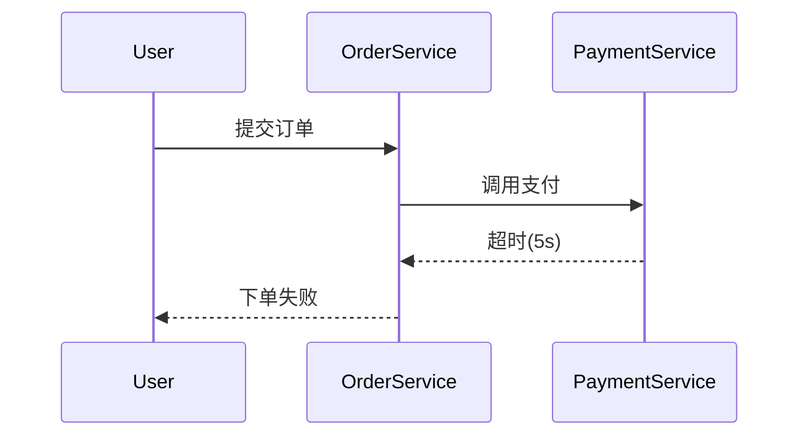

# Cassandra存储适配器

## 介绍

Cassandra存储适配器是Zipkin支持的一种后端存储方案，用于将分布式追踪数据持久化到Apache Cassandra数据库中。Cassandra因其**高可用性**、**线性扩展能力**和**分区容忍性**，成为存储海量追踪数据的理想选择。本节将详细介绍其工作原理、配置方法及最佳实践。

## 为什么选择Cassandra？

- **分布式架构**：天然支持多数据中心部署，适合微服务环境。
- **高性能写入**：LSM树结构优化了写入吞吐量，适合高频追踪数据。
- **灵活的数据模型**：通过宽表设计高效存储Span数据。

## 核心配置

### 1. 环境准备
确保已安装Cassandra（3.11.3+版本兼容），并创建Keyspace：
```sql
CREATE KEYSPACE zipkin 
WITH replication = {'class': 'SimpleStrategy', 'replication_factor': 1};
```

### 2. Zipkin服务配置
启动Zipkin时指定Cassandra存储：
```bash
java -jar zipkin-server.jar --STORAGE_TYPE=cassandra3 \
  --CASSANDRA_KEYSPACE=zipkin \
  --CASSANDRA_CONTACT_POINTS=localhost
```

:::note
生产环境建议设置 `replication_factor` ≥3，并使用 `NetworkTopologyStrategy`。
:::

### 3. 数据表结构
Zipkin自动创建以下表：
- `traces`：存储Span原始数据
- `trace_by_service_span`：服务名和Span名的索引
- `span_duration`：耗时统计索引

## 代码示例

### 查询特定Trace
通过Zipkin API查询Trace数据：
```bash
curl -s "http://localhost:9411/api/v2/trace/12345678" | jq .
```
输出示例：
```json
[{
  "traceId": "12345678",
  "id": "87654321",
  "name": "get-user",
  "timestamp": 1620000000000,
  "duration": 210,
  "localEndpoint": {"serviceName": "user-service"}
}]
```

## 实际应用场景

### 电商系统故障排查
当用户下单失败时：
1. 通过 `trace_by_service_span` 表快速定位到 `order-service` 的异常Span
2. 检查 `span_duration` 发现支付服务响应时间超过阈值
3. 结合 `traces` 表中的详细日志确认是第三方支付API超时



## 性能优化建议

1. **批量写入**：配置 `cassandra.max-connections=8` 提高并发
2. **TTL设置**：通过 `cassandra.ttl=259200` (3天) 自动清理旧数据
3. **压缩策略**：使用 `LZ4Compressor` 减少存储空间

## 总结

Cassandra存储适配器为Zipkin提供了可靠的分布式存储方案，特别适合：
- 需要长期保留追踪数据的场景
- 高吞吐量的微服务架构
- 多云/混合云部署环境

## 扩展学习

- 官方文档：[Zipkin Cassandra Storage](https://zipkin.io/zipkin/#storage-component)
- 实践练习：
  1. 部署Cassandra集群并配置多节点复制
  2. 使用 `zipkin-dependencies` 生成服务依赖图
  3. 模拟高负载场景观察Cassandra的写入性能