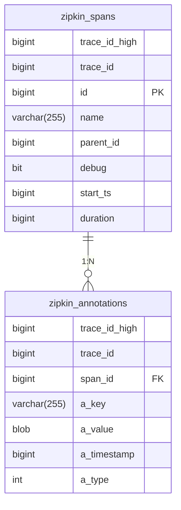

# 存储模式与表结构

## 介绍

Zipkin作为分布式追踪系统，其数据存储设计直接影响查询性能和系统扩展性。本节将详细介绍Zipkin支持的存储模式、核心表结构设计以及不同存储后端（如MySQL、Elasticsearch）的实现差异。初学者将通过实际表结构示例理解Zipkin如何组织追踪数据。

## 存储模式概述

Zipkin支持多种存储后端，主要分为三类：

1. **内存存储（In-Memory）**  
   - 默认用于开发环境，重启后数据丢失
   - 示例配置：`zipkin.storage.type=mem`

2. **关系型数据库**  
   - 支持MySQL、PostgreSQL等
   - 示例配置：`zipkin.storage.type=mysql`

3. **NoSQL/搜索引擎**  
   - 支持Elasticsearch、Cassandra
   - 示例配置：`zipkin.storage.type=elasticsearch`

:::tip 生产环境建议
生产环境推荐使用Elasticsearch或Cassandra，它们更适合处理高并发的追踪数据写入和复杂查询。
:::

## 核心表结构

以MySQL为例，以下是Zipkin的核心表结构设计：

### 1. `zipkin_spans` 表 - 存储Span基本信息
```sql
CREATE TABLE IF NOT EXISTS zipkin_spans (
  `trace_id_high` BIGINT NOT NULL DEFAULT 0,
  `trace_id` BIGINT NOT NULL,
  `id` BIGINT NOT NULL,
  `name` VARCHAR(255) NOT NULL,
  `parent_id` BIGINT,
  `debug` BIT(1),
  `start_ts` BIGINT,
  `duration` BIGINT,
  PRIMARY KEY (`trace_id_high`, `trace_id`, `id`)
) ENGINE=InnoDB ROW_FORMAT=COMPRESSED;
```

### 2. `zipkin_annotations` 表 - 存储时间点事件
```sql
CREATE TABLE IF NOT EXISTS zipkin_annotations (
  `trace_id_high` BIGINT NOT NULL DEFAULT 0,
  `trace_id` BIGINT NOT NULL,
  `span_id` BIGINT NOT NULL,
  `a_key` VARCHAR(255) NOT NULL,
  `a_value` BLOB,
  `a_timestamp` BIGINT,
  `a_type` INT NOT NULL,
  FOREIGN KEY (`trace_id_high`, `trace_id`, `span_id`) REFERENCES zipkin_spans(`trace_id_high`, `trace_id`, `id`)
) ENGINE=InnoDB ROW_FORMAT=COMPRESSED;
```

### 3. `zipkin_dependencies` 表 - 存储服务依赖关系
```sql
CREATE TABLE IF NOT EXISTS zipkin_dependencies (
  `day` DATE NOT NULL,
  `parent` VARCHAR(255) NOT NULL,
  `child` VARCHAR(255) NOT NULL,
  `call_count` BIGINT,
  PRIMARY KEY (`day`, `parent`, `child`)
) ENGINE=InnoDB ROW_FORMAT=COMPRESSED;
```

## 数据关系图示



## 存储模式对比

| 特性               | 内存存储 | MySQL       | Elasticsearch |
|--------------------|----------|-------------|----------------|
| 持久性             | 临时     | 持久        | 持久           |
| 查询性能           | 快       | 中等        | 快（全文检索） |
| 适合数据量         | `<1GB`     | `<10GB`       | 无限制         |
| 依赖分析支持       | 无       | 需要定时Job | 实时           |

## 实际案例

### 案例：电商系统的订单追踪
假设一个订单处理流程涉及以下服务：
1. 前端服务创建追踪ID `trace_id=123`
2. 订单服务记录Span（ID=1）
3. 支付服务记录子Span（ID=2，parent_id=1）

在数据库中会这样存储：
```sql
-- zipkin_spans 表
INSERT INTO zipkin_spans VALUES
(0, 123, 1, 'create-order', NULL, 0, 1625097600000, 150),
(0, 123, 2, 'process-payment', 1, 0, 1625097600150, 80);

-- zipkin_annotations 表
INSERT INTO zipkin_annotations VALUES
(0, 123, 1, 'http.path', '/orders', 1625097600000, -1),
(0, 123, 2, 'rpc.method', 'Charge', 1625097600150, -1);
```

## 总结

- Zipkin支持多种存储后端，各有适用场景
- 核心数据模型围绕`trace-span-annotation`三级结构
- 关系型数据库方案适合中小规模部署
- 生产环境建议使用Elasticsearch等分布式存储

## 扩展练习

1. 在本地启动Zipkin服务，尝试切换不同的存储后端
2. 使用以下命令初始化MySQL表结构：
```bash
curl -sSL https://zipkin.io/quickstart.sh | bash -s io.zipkin:zipkin-storage-mysql:2.23.2:module schema | mysql -u root -p zipkin
```

## 附加资源

- [Zipkin官方存储文档](https://zipkin.io/zipkin/#storage-component)
- [MySQL存储配置示例](https://github.com/openzipkin/zipkin/tree/master/zipkin-storage/mysql-v1)