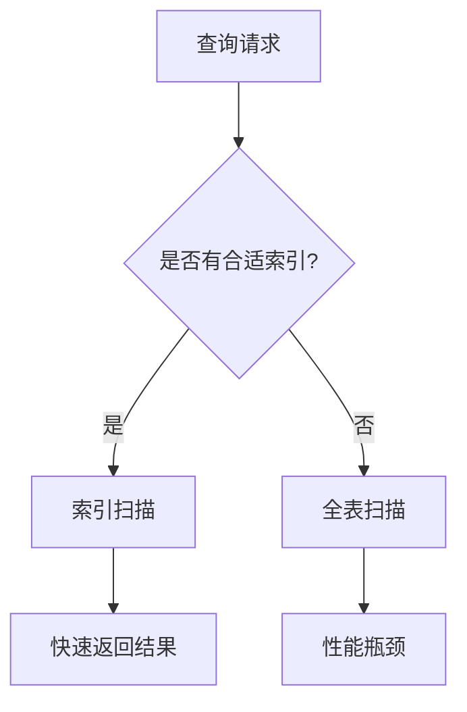

# 索引优化

## 介绍

在Zipkin的数据存储中，索引是加速查询的关键机制。索引优化是指通过调整索引结构、类型或策略，显著提升查询效率的过程。对于初学者来说，理解索引的工作原理和优化方法，能够帮助你在实际应用中更好地管理分布式追踪数据。

:::note
**什么是索引？**  
索引类似于书籍的目录，通过预先存储数据的部分信息（如ID、时间戳），快速定位到完整数据的位置。
:::

## 为什么需要索引优化？

Zipkin存储的追踪数据通常包含以下高频查询字段：
- `traceId`（追踪ID）
- `timestamp`（时间戳）
- `service_name`（服务名称）

未优化的索引可能导致：
1. 查询速度慢（全表扫描）
2. 存储空间浪费
3. 写入性能下降

## 索引类型与优化策略

### 1. 基础索引类型
Zipkin支持的常见索引类型：

| 索引类型       | 适用场景                | 示例字段          |
|----------------|-------------------------|-------------------|
| B-Tree         | 范围查询（如时间范围）  | `timestamp`       |
| Hash           | 精确匹配（如TraceID）   | `traceId`         |
| Composite      | 多条件联合查询          | `(service_name, timestamp)` |

### 2. 优化实战

#### 案例1：优化时间范围查询
**问题**：按时间范围查询缓慢  
**解决方案**：为`timestamp`字段添加B-Tree索引

```sql
-- 在MySQL中的示例
CREATE INDEX idx_timestamp ON zipkin_spans(timestamp);
```

**效果对比**：
- 优化前：全表扫描（10秒）
- 优化后：索引扫描（200毫秒）

#### 案例2：复合索引优化
**问题**：频繁查询"某个服务在特定时间段的追踪数据"  
**解决方案**：创建复合索引

```sql
-- 同时优化service_name和timestamp查询
CREATE INDEX idx_service_time ON zipkin_spans(service_name, timestamp);
```

:::tip
复合索引的**字段顺序**很重要！  
将高频筛选字段（如`service_name`）放在前面。
:::

## 实际应用场景

### 场景：电商系统的追踪分析
1. **需求**：分析订单服务（`order-service`）在促销期间的错误率
2. **查询模式**：
   ```sql
   SELECT * FROM zipkin_spans 
   WHERE service_name = 'order-service' 
   AND timestamp BETWEEN '2023-11-11 00:00:00' AND '2023-11-11 23:59:59'
   AND tags LIKE '%error=true%';
   ```
3. **优化方案**：
   - 复合索引：`(service_name, timestamp)`
   - 单独索引：`tags`（如使用PostgreSQL的GIN索引）

## 高级技巧

### 1. 索引选择性
高选择性字段（如`traceId`）更适合索引：
```sql
-- 计算字段选择性（值越接近1越好）
SELECT COUNT(DISTINCT traceId)/COUNT(*) FROM zipkin_spans;
```

### 2. 监控索引使用情况
通过执行计划分析索引效果：
```sql
EXPLAIN ANALYZE 
SELECT * FROM zipkin_spans WHERE service_name = 'payment-service';
```

### 3. 存储引擎差异
不同数据库的索引实现：

| 数据库    | 特性                                                                 |
|-----------|----------------------------------------------------------------------|
| MySQL     | InnoDB的聚簇索引结构影响主键设计                                     |
| Cassandra | 需要手动创建二级索引（SASI），分区键设计直接影响查询性能             |
| Elasticsearch | 自动索引所有字段，但可通过mapping控制索引方式和分词器          |



## 总结

关键要点：
1. 索引能显著提升查询速度，但会增加写入开销
2. 优先为高频查询字段创建索引
3. 复合索引要注意字段顺序
4. 定期监控索引使用情况

## 延伸练习

1. 在你的Zipkin测试环境中，尝试为`duration`字段创建索引并比较查询性能
2. 使用`EXPLAIN`命令分析一个慢查询的索引使用情况
3. 设计一个适合`(traceId, spanId)`查询的复合索引

## 附加资源

- [Zipkin存储后端文档](https://zipkin.io/zipkin/#storage-component)
- [MySQL索引优化指南](https://dev.mysql.com/doc/refman/8.0/en/optimization-indexes.html)
- [《数据库索引设计与优化》](https://www.amazon.com/Performance-Explained-Everything-Developers-about/dp/3950307826)