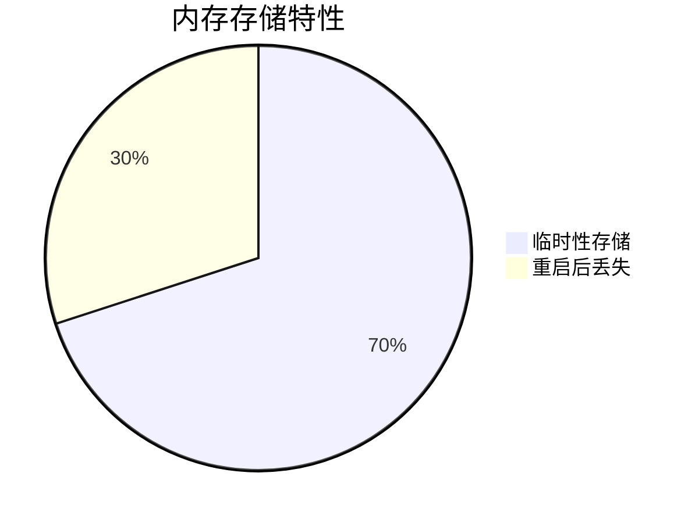

# 数据保留策略

## 介绍

在分布式系统中，Zipkin收集的追踪数据会随时间增长占用大量存储空间。**数据保留策略**决定了这些数据的存储时长和清理规则，是平衡存储成本与调试需求的关键配置。本节将详细介绍Zipkin支持的策略类型、配置方法以及最佳实践。

## 存储后端与保留机制

Zipkin支持多种存储后端，不同后端的保留策略实现方式各异：

### 1. 内存存储（默认）


- **无持久化**：服务重启后数据丢失
- **自动清理**：默认保留15分钟的追踪数据
- 适用于快速演示和开发环境

### 2. 持久化存储（ES/MySQL/Cassandra）

:::note
持久化存储需要显式配置保留策略，否则数据会无限期保存
:::

#### 配置示例（通过环境变量）：
```bash
# Elasticsearch保留7天
STORAGE_TYPE=elasticsearch ES_TTL=7d

# Cassandra保留3天
STORAGE_TYPE=cassandra CASSANDRA_TTL=259200
```

## 详细配置指南

### Elasticsearch 策略
通过`ES_TTL`设置生存时间（Time To Live）：
```yaml
# docker-compose.yml示例
environment:
  STORAGE_TYPE: elasticsearch
  ES_TTL: 30d  # 保留30天
```

### Cassandra 策略
使用`CASSANDRA_TTL`（单位：秒）：
```properties
# 启动参数示例
java -jar zipkin.jar --STORAGE_TYPE=cassandra --CASSANDRA_TTL=604800
```

## 实际应用场景

**电商系统案例**：
- 生产环境：保留7天数据（满足每周问题排查）
- 预发环境：保留48小时（节省存储成本）
- 开发环境：使用内存存储（无需历史数据）

:::tip 性能考虑
过短的TTL会增加存储后端删除操作频率，建议根据实际数据量调整：
- 高流量系统：每日清理（凌晨低峰期执行）
- 中小系统：每周清理
:::

## 总结

关键要点：
1. 内存存储仅适合临时调试
2. 持久化存储必须显式配置TTL
3. 不同后端使用不同时间单位（天/秒）
4. 根据业务需求和数据量选择保留周期

## 扩展练习

1. 尝试在本地Zipkin中配置Elasticsearch保留24小时数据
2. 使用以下命令验证Cassandra的TTL设置：
```sql
SELECT TTL(trace_id) FROM zipkin.traces LIMIT 1;
```

## 附加资源

- [Zipkin官方存储文档](https://zipkin.io/zipkin/#storage-component)
- [Elasticsearch索引生命周期管理](https://www.elastic.co/guide/en/elasticsearch/reference/current/index-lifecycle-management.html)