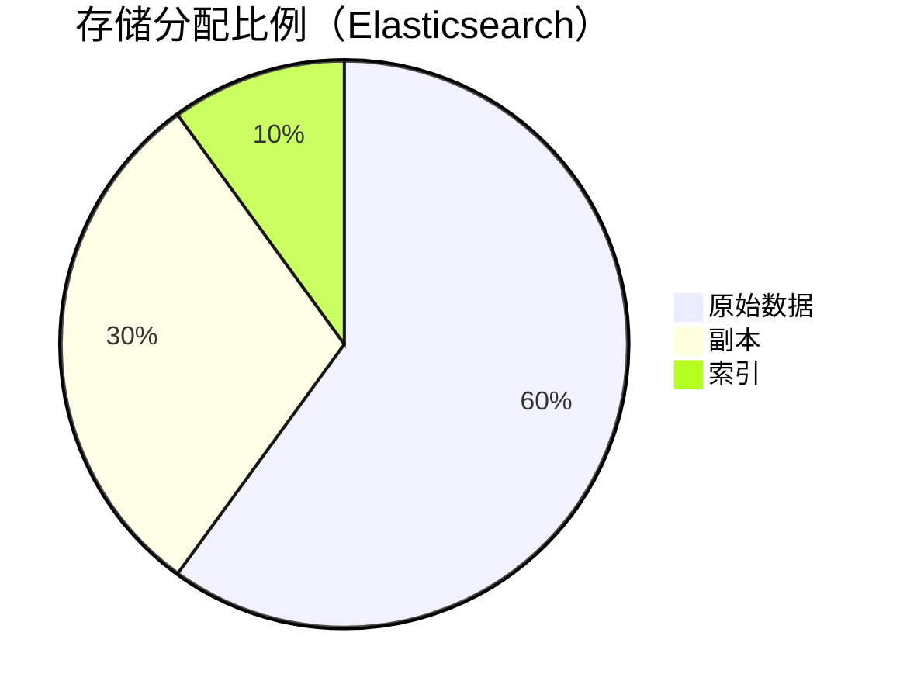

# 存储容量规划

## 介绍

在分布式系统中，Zipkin作为链路追踪工具会收集大量跨度（Span）数据，合理的存储容量规划是保证系统稳定运行的关键。存储容量规划需要根据**数据量**、**保留周期**和**存储类型**等因素综合计算，避免因容量不足导致数据丢失或查询性能下降。

:::note 关键概念
- **Span**：Zipkin中的基本追踪单元，代表一个独立操作（如API调用）。
- **存储后端**：Zipkin支持Elasticsearch、MySQL、Cassandra等存储方案。
:::

---

## 影响因素

### 1. 数据量估算
单个Span的存储大小取决于：
- **元数据**：Trace ID、Span ID、服务名等（约200-500字节）。
- **标签（Tags）和日志（Logs）**：可变部分，可能增加1-2KB/Span。

计算公式：
```plaintext
每日数据量 = 平均Span大小 × Span数量/秒 × 86400秒
```

### 2. 保留周期
根据业务需求决定数据保留时长（如7天、30天）。例如：
```plaintext
总存储量 = 每日数据量 × 保留天数
```

### 3. 存储类型特性
- **Elasticsearch**：适合大规模数据，需预留20%空间用于索引。
- **Cassandra**：线性扩展，但需考虑副本因子（默认3副本）。

---

## 实战案例

### 场景描述
假设一个电商系统：
- 每秒生成1000个Span（QPS=1000）。
- 平均Span大小为1KB。
- 需要保留30天数据。

### 计算步骤
1. **每日数据量**：
   ```plaintext
   1KB × 1000 × 86400 = 86.4 GB/天
   ```
2. **总存储量**（无副本）：
   ```plaintext
   86.4 GB × 30 = 2.59 TB
   ```
3. **Elasticsearch实际需求**（含副本和索引）：
   ```plaintext
   2.59 TB × 1.5（副本+索引） ≈ 3.89 TB
   ```



---

## 优化建议

:::tip 降低存储成本的技巧
1. **采样率**：仅收集部分Span（如`50%`）。
   ```java
   // 在Zipkin配置中设置采样率
   sampler = CountingSampler.create(0.5); // 50%采样
   ```
2. **数据清理**：定期删除低价值Span（如错误率`<1%`的请求）。
3. **压缩存储**：启用Elasticsearch的`_source`压缩。

---

## 总结

- 存储容量规划需结合**数据量**、**保留周期**和**存储类型**。
- 通过采样率和数据清理可显著降低成本。
- 始终预留20%-30%缓冲空间应对流量峰值。

## 扩展练习
1. 若你的系统QPS为500，Span大小为0.8KB，保留7天，计算所需的Elasticsearch存储空间。
2. 尝试在本地Zipkin中配置采样率，观察存储变化。

:::caution 注意
生产环境建议监控存储使用率，并设置告警阈值（如85%）。
:::