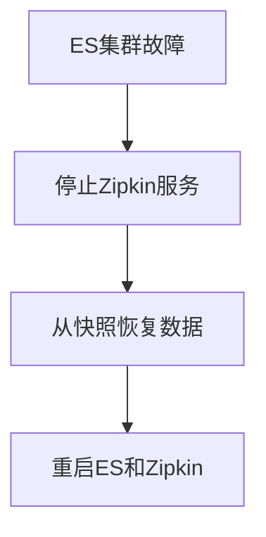

# Zipkin 数据存储：存储备份恢复

## 介绍

在分布式系统中，Zipkin作为链路追踪工具，其存储的数据对于问题诊断和系统优化至关重要。**存储备份恢复**是指通过定期备份Zipkin的追踪数据，并在数据丢失或损坏时恢复数据的过程。本指南将介绍Zipkin支持的存储后端（如MySQL、Elasticsearch等）的备份与恢复方法，帮助初学者掌握数据保护的实践技巧。

## 为什么需要备份Zipkin数据？

- **数据持久性**：防止因硬件故障或人为误操作导致数据丢失。<br />
- **灾难恢复**：在系统崩溃后快速恢复监控能力。<br />
- **合规要求**：某些行业要求保留特定时长的日志和追踪数据。

---

## 备份与恢复方法

### 1. 基于MySQL的备份恢复

#### 备份步骤
Zipkin若使用MySQL作为存储后端，可通过`mysqldump`工具备份数据：
```bash
# 备份Zipkin数据库
mysqldump -u [用户名] -p[密码] zipkin > zipkin_backup.sql
```

#### 恢复步骤
```bash
# 恢复数据到MySQL
mysql -u [用户名] -p[密码] zipkin < zipkin_backup.sql
```

:::note
确保备份时Zipkin服务已停止，避免数据不一致。
:::

---

### 2. 基于Elasticsearch的备份恢复

Elasticsearch提供快照（Snapshot）功能，需先配置存储仓库：

#### 配置快照仓库
```json
PUT /_snapshot/zipkin_backup
{
  "type": "fs",
  "settings": {
    "location": "/path/to/backup"
  }
}
```

#### 创建快照
```bash
PUT /_snapshot/zipkin_backup/snapshot_1?wait_for_completion=true
```

#### 恢复快照
```bash
POST /_snapshot/zipkin_backup/snapshot_1/_restore
```

:::warning
Elasticsearch版本必须一致，否则可能导致恢复失败。
:::

---

### 3. 基于Cassandra的备份恢复

使用`nodetool`工具备份Cassandra数据：

#### 备份Keyspace
```bash
nodetool snapshot -t zipkin_backup zipkin
```

#### 恢复数据
将备份文件复制到Cassandra的`data`目录，并执行`refresh`操作。

---

## 实际案例

**场景**：某电商系统使用Zipkin（存储后端为Elasticsearch）追踪订单流程。某天ES集群故障，导致最近3天的数据丢失。<br />
**解决方案**：
1. 从最近的快照`zipkin_backup/snapshot_1`恢复数据。<br />
2. 重启Zipkin服务后，历史追踪数据恢复可用。



---

## 总结

- **定期备份**：根据业务需求设置备份频率（如每日/每周）。<br />
- **验证备份**：定期测试备份文件是否可恢复。<br />
- **多存储支持**：Zipkin的备份方法因存储后端而异，需针对性操作。

## 扩展练习

1. 在本地部署Zipkin+MySQL，尝试备份并模拟数据恢复。<br />
2. 阅读Elasticsearch官方文档，了解增量备份配置方法。

## 附加资源

- [Zipkin存储配置文档](https://zipkin.io/)<br />
- [Elasticsearch快照与恢复指南](https://www.elastic.co/guide/en/elasticsearch/reference/current/snapshot-restore.html)