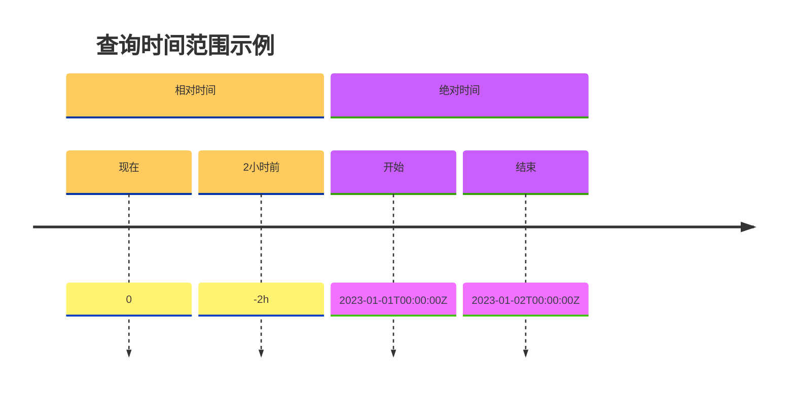

# Zipkin 高级查询语法

## 介绍

在Zipkin的分布式追踪系统中，**高级查询语法**能帮助你精确筛选和分析追踪数据。通过组合不同的查询条件，你可以快速定位特定服务、耗时过长的请求或错误轨迹。本章将详细介绍Zipkin支持的查询操作符、语法结构以及实际应用场景。

:::tip 关键概念
Zipkin查询语法基于URL参数，所有条件通过`key=value`形式传递，多个条件用`&`连接
:::

## 基础查询参数

Zipkin支持以下核心查询参数：

| 参数名       | 示例值              | 说明                      |
|--------------|---------------------|-------------------------|
| `serviceName`| `userservice`       | 按服务名称过滤            |
| `spanName`   | `/api/v1/user`      | 按接口路径过滤            |
| `minDuration`| `100ms`             | 最小持续时间(单位: ms/μs/s)|
| `endTs`      | `1625097600000`     | 截止时间戳(毫秒)          |
| `lookback`   | `2h`               | 查询时间范围(如: 24h/30m) |

## 高级查询操作符

### 1. 精确匹配与通配符

```plaintext
# 精确匹配span名称
spanName=GET /api/v1/user

# 使用通配符(*)
spanName=GET /api/v1/user/*
```

### 2. 持续时间范围查询

```plaintext
# 查询耗时100ms-1s的请求
minDuration=100ms&maxDuration=1s

# 查询超过5秒的慢请求
minDuration=5s
```

### 3. 标签过滤

使用`annotationQuery`参数进行标签级过滤：

```plaintext
# 查找包含特定标签的span
annotationQuery=http.status_code=500

# 多条件组合(AND关系)
annotationQuery=error AND http.path=/api/v1/payment
```

支持的操作符包括：
- `key=value` 精确匹配
- `key` 存在性检查
- `error` 错误标记
- `AND`/`OR` 逻辑运算

### 4. 时间范围控制



```plaintext
# 相对时间(最近30分钟)
lookback=30m&endTs=now

# 绝对时间(UTC时间戳)
endTs=1672531200000&lookback=86400000
```

## 实际案例

### 案例1：定位服务错误

```plaintext
# 查询user-service服务在过去1小时内返回500错误的请求
serviceName=user-service&annotationQuery=http.status_code=500&lookback=1h
```

### 案例2：分析慢查询

```plaintext
# 查询order-service中耗时超过2秒的数据库操作
serviceName=order-service&spanName=executeQuery&minDuration=2s
```

## 最佳实践

1. **组合查询**：通过`AND`连接多个条件缩小范围
   ```plaintext
   serviceName=payment-service&spanName=process*&minDuration=1s
   ```

2. **时间窗口**：根据业务特点选择合适的时间粒度
   - 高频服务：`lookback=15m`
   - 低频批处理：`lookback=24h`

3. **保存常用查询**：将复杂查询保存为书签或通过API调用

## 总结

Zipkin的高级查询语法提供了强大的数据筛选能力，主要特点包括：

- 支持服务/接口名称的精确匹配和通配符查询
- 通过持续时间范围定位性能问题
- 利用标签系统进行多维过滤
- 灵活的时间范围控制机制

:::note 练习建议
尝试在Zipkin UI中组合以下查询条件：
1. 查找网关服务(gateway)中耗时超过1秒且包含`timeout`标签的请求
2. 查询过去24小时内所有返回4xx状态码的API调用
:::

## 扩展阅读

- [Zipkin官方查询API文档](https://zipkin.io/zipkin-api/#/default/get_traces)
- [分布式追踪数据分析模式](https://github.com/openzipkin/zipkin/issues/1313)
- [实战：使用ELK分析Zipkin数据](https://medium.com/distributed-tracing-tips)