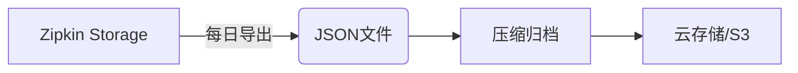

# 追踪数据导出

## 介绍

在分布式系统中，Zipkin作为流行的分布式追踪工具，收集了大量服务间调用的链路数据。**追踪数据导出**是指将这些数据以结构化格式（如JSON）从Zipkin中提取出来的过程，通常用于：

- 长期存储（超过Zipkin默认保留期限）
- 与第三方监控/分析工具集成
- 自定义报表生成
- 离线数据分析

:::note
Zipkin默认使用内存存储时数据仅保留7天，即使使用ES/Cassandra等后端，官方也不建议无限期存储。
:::

## 基础导出方法

### 1. 通过Zipkin API导出

Zipkin提供REST API直接获取原始追踪数据：

```bash
# 获取特定追踪ID的数据
curl -X GET "http://your-zipkin-server:9411/api/v2/trace/{traceId}"

# 按时间范围查询（示例：最近30分钟）
curl -X GET "http://your-zipkin-server:9411/api/v2/traces?endTs=$(date +%s)000000&lookback=1800000"
```

**输出示例**：
```json
[{
  "traceId": "4a441f69d5ce343b",
  "id": "4a441f69d5ce343b",
  "kind": "SERVER",
  "name": "get /api/users",
  "timestamp": 1678901234560000,
  "duration": 123000,
  "localEndpoint": {
    "serviceName": "user-service"
  }
}]
```

### 2. 使用Zipkin依赖库

在Java应用中，可以使用`zipkin2.reporter`库主动推送数据到其他系统：

```java
// 示例：将追踪数据转发到Kafka
Sender kafkaSender = KafkaSender.newBuilder()
    .bootstrapServers("kafka-host:9092")
    .topic("zipkin-traces")
    .build();

Span span = Span.newBuilder()
    .traceId("4a441f69d5ce343b")
    .id("4a441f69d5ce343b")
    .name("get /api/users")
    .build();

kafkaSender.sendSpans(Collections.singletonList(span)).execute();
```

## 高级导出方案

### 批量导出与定时任务

结合`zipkin-dependencies`和cron实现定期数据归档：



```bash
#!/bin/bash
# 每日数据导出脚本
END_TS=$(date +%s)000000
START_TS=$(date -d "yesterday" +%s)000000

curl -X GET "http://zipkin:9411/api/v2/traces?endTs=$END_TS&lookback=$((END_TS-START_TS))" \
  | gzip > traces-$(date +%Y%m%d).json.gz
```

### 与ELK集成

将Zipkin数据导入Elasticsearch的完整流程：

1. 通过API获取数据
2. 使用Logstash转换格式
3. 写入Elasticsearch索引

**Logstash配置示例**：
```ruby
input {
  http_poller {
    urls => {
      zipkin => "http://zipkin:9411/api/v2/traces"
    }
    schedule => { every => "1h" }
  }
}

filter {
  split {
    field => "traces"
  }
}

output {
  elasticsearch {
    hosts => ["es-host:9200"]
    index => "zipkin-traces-%{+YYYY.MM.dd}"
  }
}
```

## 实际案例

### 电商系统的数据分析

**场景需求**：
- 分析黑五促销期间的服务性能
- 需要保留完整追踪数据6个月
- 生成自定义服务依赖报表

**解决方案**：
1. 每天凌晨导出JSON数据到S3
2. 使用AWS Athena直接查询JSON文件
3. 通过Jupyter Notebook进行数据分析

```python
# 示例分析代码（PySpark）
df = spark.read.json("s3://zipkin-archive/2023-11-25/*.json")
slow_requests = df.filter(df.duration > 1000).groupBy("name").count()
```

## 总结

关键要点：
- 通过API导出是最简单直接的方式
- 定时任务适合长期归档需求
- 与大数据系统集成时需要格式转换

:::tip 练习建议
1. 尝试用curl从本地Zipkin实例导出一小时内的数据
2. 编写Python脚本将导出的JSON转换为CSV格式
3. 设置一个每日自动压缩归档的cron任务
:::

## 扩展资源

- [Zipkin API官方文档](https://zipkin.io/zipkin-api/)
- [OpenTelemetry导出器模式](https://opentelemetry.io/docs/concepts/exporters/)
- 《分布式系统观测》第5章 - 追踪数据持久化