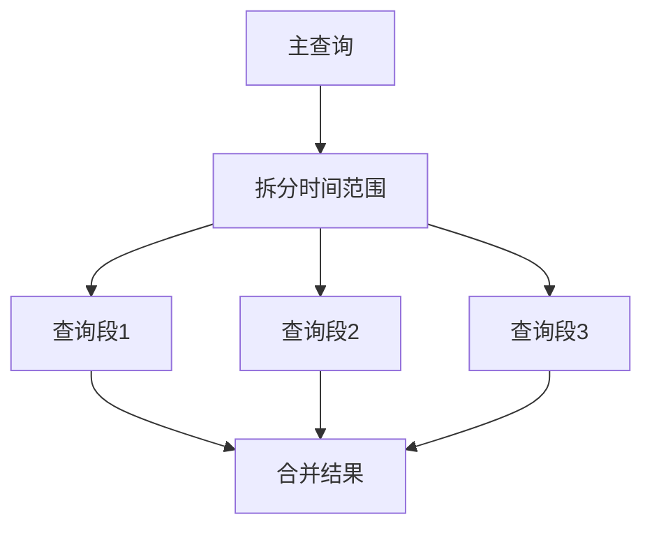

# 批量查询处理

## 介绍

在分布式系统监控中，Zipkin的批量查询处理能力能显著提高数据分析效率。批量查询允许您一次性获取多个跟踪数据，而不是逐条请求，特别适合以下场景：

- 同时分析多个相关请求的调用链
- 统计特定时间段内的错误率
- 批量导出数据用于离线分析

## 基础批量查询

Zipkin提供两种主要批量查询方式：

### 1. 通过API批量获取跟踪数据

使用Zipkin的API，您可以传递多个跟踪ID进行批量查询：

```bash
curl -X GET "http://your-zipkin-server/api/v2/traces?traceIds=id1,id2,id3"
```

响应将返回JSON格式的所有请求跟踪数据：

```json
[
  {
    "traceId": "id1",
    "spans": [...]
  },
  {
    "traceId": "id2",
    "spans": [...]
  }
]
```

### 2. 使用条件批量查询

更常见的做法是通过服务名、时间范围等条件批量查询：

```bash
curl -X GET "http://your-zipkin-server/api/v2/traces?serviceName=frontend&endTs=1625097600000&lookback=3600000"
```

参数说明：
- `serviceName`: 要查询的服务名称
- `endTs`: 查询截止时间戳(毫秒)
- `lookback`: 回溯时间范围(毫秒)

:::tip 时间戳转换
可以使用 `date +%s000` 命令获取当前时间的毫秒时间戳
:::

## 高级批量处理技术

### 批量查询分页

当结果集很大时，需要使用分页：

```bash
curl -X GET "http://your-zipkin-server/api/v2/traces?serviceName=backend&limit=100&endTs=1625097600000"
```

添加 `limit` 参数限制返回结果数量。

### 并行批量查询

对于大规模查询，可以并行执行多个查询请求：



## 实际应用案例

### 案例：分析微服务调用链

假设我们需要分析用户下单流程中 `order-service` 与其他服务的交互情况：

1. 首先批量查询所有包含 `order-service` 的跟踪
2. 然后筛选出特定业务场景的跟踪
3. 最后统计各服务调用耗时

```python
import requests
import pandas as pd

# 批量查询order-service的跟踪
response = requests.get(
    "http://zipkin-server/api/v2/traces",
    params={
        "serviceName": "order-service",
        "endTs": int(time.time()*1000),
        "lookback": 86400000  # 24小时
    }
)

# 处理结果并统计
traces = response.json()
stats = []
for trace in traces:
    for span in trace:
        if span['kind'] == 'SERVER':
            stats.append({
                'service': span['localEndpoint']['serviceName'],
                'duration': span['duration']
            })

df = pd.DataFrame(stats)
print(df.groupby('service').duration.describe())
```

## 性能优化建议

:::caution 注意
大规模批量查询可能影响Zipkin服务器性能，建议：
:::

1. 合理设置时间范围，避免查询过大时间跨度
2. 在非高峰期执行批量查询
3. 考虑使用Zipkin的存储后端直接查询（如Elasticsearch）
4. 对于定期分析任务，可以预先导出数据到分析数据库

## 总结

批量查询处理是Zipkin数据分析的核心技能，您已经学习了：

- 基础批量查询API的使用方法
- 高级分页和并行查询技术
- 实际应用案例和性能优化建议

## 扩展练习

1. 尝试编写脚本批量查询最近1小时内所有失败的请求（状态码≥500）
2. 比较并行查询与串行查询的性能差异
3. 将批量查询结果可视化展示调用关系图

## 附加资源

- [Zipkin API官方文档](https://zipkin.io/zipkin-api/)
- [Zipkin存储后端配置指南](https://github.com/openzipkin/zipkin#storage-component)
- [分布式跟踪分析最佳实践](https://zipkin.io/pages/tracing.html)