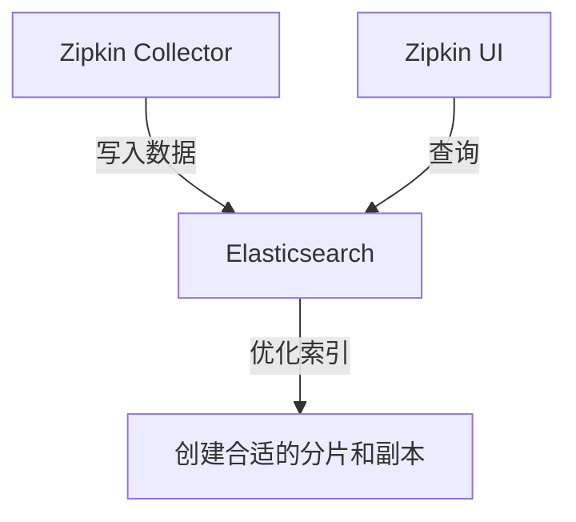

# Zipkin 数据查询与分析：查询优化技巧

## 介绍

在分布式系统中，Zipkin作为一款流行的追踪工具，帮助我们收集和分析请求链路数据。但随着数据量增长，查询性能可能成为瓶颈。本章将介绍Zipkin数据查询的优化技巧，帮助初学者提升查询效率。

## 基础优化策略

### 1. 合理设置时间范围

Zipkin默认查询时间范围是最近15分钟。对于大数据量环境，建议：

- 精确缩小时间范围（如从1小时调整为10分钟）
- 避免使用"All time"查询

:::tip
示例：查询特定服务的错误追踪
```bash
# 低效查询（时间范围过大）
curl "http://zipkin-server:9411/api/v2/traces?serviceName=payment-service&limit=10"

# 优化后（精确时间范围）
curl "http://zipkin-server:9411/api/v2/traces?serviceName=payment-service&limit=10&lookback=600000"  # 10分钟
```
:::

### 2. 利用标签过滤

Zipkin支持通过标签(tags)过滤数据，这比全量扫描高效得多：

```bash
# 查询包含特定错误码的追踪
curl "http://zipkin-server:9411/api/v2/traces?serviceName=order-service&tags=http.status_code=500"
```

## 高级优化技术

### 3. 索引优化

Zipkin存储支持多种后端（如Elasticsearch、Cassandra）。以Elasticsearch为例：



优化建议：
- 为常用查询字段（如`serviceName`、`duration`）创建索引
- 调整分片数量（通常建议：节点数 × 1.5）

### 4. 采样率调整

高流量系统可调整采样率，减少存储压力：

```java
// Spring Boot示例：配置10%采样率
@Bean
public Sampler defaultSampler() {
    return Sampler.create(0.1);
}
```

## 实际案例

**电商平台性能问题排查**

场景：某电商平台在促销期间出现支付延迟，需要快速定位瓶颈。

优化前：
- 全量查询所有支付服务追踪（约20万条）
- 查询耗时15秒+

优化后：
1. 将时间范围缩小到问题发生时段（5分钟窗口）
2. 添加`tags=phase=payment_processing`过滤
3. 按`duration`降序排序
4. 查询耗时降至800ms

```bash
# 最终优化查询
curl "http://zipkin-server:9411/api/v2/traces?serviceName=payment-service&lookback=300000&tags=phase=payment_processing&limit=20&sortOrder=duration"
```

## 总结与练习

### 总结
- 精确时间范围能显著提升查询速度
- 善用标签过滤减少扫描数据量
- 根据存储后端特点优化索引配置
- 合理调整采样率平衡数据量与准确性

### 练习建议
1. 对您的Zipkin实例执行一次宽时间范围查询，记录耗时
2. 逐步缩小时间范围，观察性能变化
3. 尝试添加不同的标签组合进行过滤
4. 比较不同排序方式对查询速度的影响

### 扩展阅读
- Zipkin官方文档：存储后端配置指南
- Elasticsearch索引优化白皮书
- 分布式追踪系统性能调优案例集