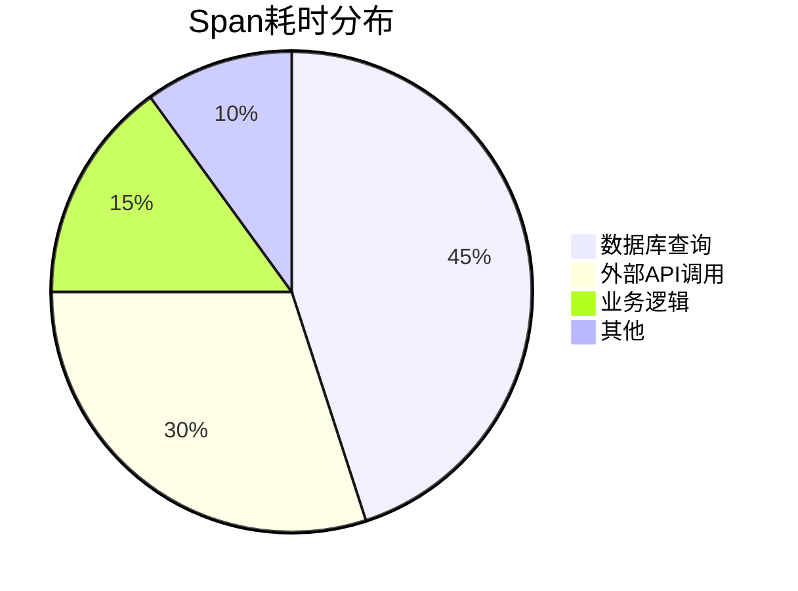

# 数据分析最佳实践

## 介绍

在分布式系统中，Zipkin作为一款开源的分布式追踪系统，能够帮助开发者收集和分析服务间的调用链路数据。然而，仅仅收集数据是不够的——如何高效地查询和分析这些数据，才是提升系统可观测性的关键。本章将介绍Zipkin数据查询与分析的最佳实践，帮助初学者快速掌握核心技巧。

---

## 1. 理解Zipkin数据模型

在开始查询和分析之前，首先需要了解Zipkin的数据模型。Zipkin的核心数据结构包括：
- **Trace（追踪）**：一次完整的请求链路，由多个Span组成。
- **Span（跨度）**：单个服务或组件的操作记录，包含开始时间、结束时间、标签（Tags）和注解（Annotations）。
- **Annotation（注解）**：记录Span中的关键事件（如请求开始、结束）。
- **Tag（标签）**：键值对形式的元数据，用于描述Span的附加信息（如HTTP状态码、错误信息）。

:::tip
标签（Tags）是数据分析的重要依据，合理设置标签可以显著提升查询效率。例如，为HTTP请求添加 `http.method=GET` 和 `http.status_code=200` 标签。
:::

---

## 2. 高效查询技巧

### 2.1 使用Zipkin UI的基础查询
Zipkin UI提供了简单的查询界面，支持按以下条件过滤：
- **服务名称**：筛选特定服务的追踪数据。
- **Span名称**：定位具体的操作（如 `GET /api/users`）。
- **时间范围**：限制查询的时间窗口。
- **标签过滤**：通过键值对精确匹配（如 `error=true`）。

示例：查询过去1小时内所有失败的HTTP请求：
```
serviceName=frontend AND http.status_code=500 AND timestamp>=now-1h
```

### 2.2 高级查询API
对于复杂场景，可以直接调用Zipkin的API。例如，使用 `curl` 查询特定Trace：

```bash
curl "http://localhost:9411/api/v2/trace/1234567890abcdef"
```

输出示例（JSON格式）：
```json
[
  {
    "traceId": "1234567890abcdef",
    "id": "abcdef123456",
    "name": "get-user",
    "timestamp": 1620000000000,
    "duration": 150,
    "tags": {
      "http.method": "GET",
      "http.status_code": "200"
    }
  }
]
```

---

## 3. 数据分析实践

### 3.1 识别性能瓶颈
通过分析Span的 `duration` 字段，可以快速定位耗时较长的操作。例如，以下Mermaid图表展示了一个Trace的调用链耗时分布：



### 3.2 错误分析与聚合
利用标签过滤错误（如 `error=true`），统计高频错误类型。例如：
- 查询所有数据库超时错误：
  ```
  error=true AND db.timeout=1
  ```
- 按服务聚合错误计数：
  ```sql
  SELECT serviceName, COUNT(*) 
  FROM spans 
  WHERE error=true 
  GROUP BY serviceName
  ```

---

## 4. 实际案例

### 案例：电商系统的支付超时问题
1. **现象**：用户反馈支付接口响应慢。
2. **分析步骤**：
   - 查询支付服务的Trace数据，筛选 `duration>1000ms` 的Span。
   - 发现 `payment-gateway` 服务的 `call-bank-api` Span耗时占比80%。
   - 进一步检查标签，发现 `bank.timeout=5000ms` 频繁出现。
3. **结论**：第三方银行接口超时是主要原因，需优化重试机制或切换备用渠道。

---

## 5. 总结与练习

### 总结
- **合理设置标签**：为Span添加有意义的标签（如HTTP状态码、错误类型）。
- **善用时间范围**：缩小查询窗口以提高效率。
- **结合可视化工具**：利用Zipkin UI或第三方工具（如Grafana）分析数据趋势。

### 练习
1. 在Zipkin中查询过去30分钟内所有 `error=true` 的Span，并统计服务分布。
2. 编写一个脚本，通过Zipkin API导出耗时超过1秒的Trace数据。
3. 为你的服务添加自定义标签（如 `user.id`），并尝试按用户ID查询Trace。

---

通过本章的学习，你应该已经掌握了Zipkin数据分析的核心方法。接下来，可以进一步探索Zipkin的聚合分析功能或与其他监控工具（如Prometheus）集成！