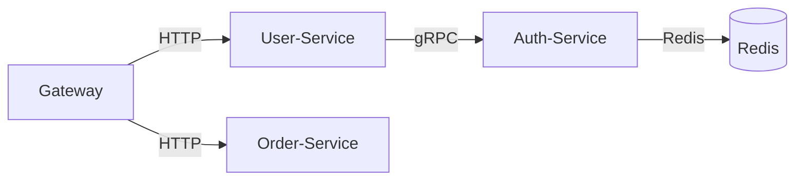

# 服务依赖分析

## 介绍

在微服务架构中，服务之间的调用关系错综复杂。**服务依赖分析**通过可视化这些调用链路，帮助开发者理解系统拓扑、定位性能瓶颈或故障传播路径。Zipkin 提供的依赖图谱（Dependency Graph）功能，能够自动聚合追踪数据，生成服务间的调用关系图。

## 核心概念

### 1. 依赖图谱的生成原理
Zipkin 通过以下步骤构建依赖图谱：
1. **收集跨度（Spans）**：每个微服务调用生成包含父子关系的跨度数据。
2. **聚合调用关系**：根据 `serviceName`、`parentId` 和 `spanId` 字段关联调用链。
3. **计算统计指标**：如请求量、错误率和延迟百分位数。

### 2. 关键术语
- **节点（Node）**：代表一个独立服务（如 `user-service`）
- **边（Edge）**：表示服务间的调用方向（如 `gateway → user-service`）
- **权重（Weight）**：边的粗细反映调用频率或错误率

## 实战操作

### 1. 访问依赖图谱
在 Zipkin UI 中导航到 `Dependencies` 标签页，系统会自动展示最近24小时的依赖关系。时间范围可通过顶部工具栏调整。



### 2. 解读图谱示例
上图表示：
1. 所有流量从 `Gateway` 进入
2. `User-Service` 依赖 `Auth-Service` 完成鉴权
3. `Auth-Service` 使用 Redis 缓存令牌
4. 订单业务与用户业务独立平行

:::tip 交互技巧
- 鼠标悬停节点/边查看详细指标
- 使用右上角 `Layout` 切换力导向图或层级布局
- 拖动节点可手动调整布局
:::

## 代码级分析

### 1. 查询特定依赖
通过 Zipkin API 获取服务间的调用数据（示例使用 `curl`）：

```bash
# 获取 user-service 调用的下游服务
curl "http://localhost:9411/api/v2/dependencies?endTs=$(date +%s)000&lookback=86400000"
```

示例响应：
```json
[
  {
    "parent": "user-service",
    "child": "auth-service",
    "callCount": 1428,
    "errorCount": 12
  }
]
```

### 2. 识别异常依赖
以下 Python 脚本分析错误率超阈值的依赖：

```python
import requests

def check_dependency_health():
    response = requests.get("http://zipkin:9411/api/v2/dependencies")
    for dep in response.json():
        error_rate = dep['errorCount'] / dep['callCount']
        if error_rate > 0.05:  # 5%错误率阈值
            print(f"警告！{dep['parent']} -> {dep['child']} 错误率 {error_rate:.2%}")
```

## 真实案例

### 电商平台故障排查
**场景**：订单提交成功率突然下降至80%  
**分析过程**：
1. 发现 `order-service` 到 `inventory-service` 的边变为红色
2. 错误率显示42%的调用失败
3. 下钻查看相关追踪，发现超时集中在 `checkStock` 操作
4. 最终定位到库存服务的数据库连接池耗尽

:::note 优化效果
扩容连接池后：
- 错误率降至0.3%
- 整体订单成功率恢复至99.8%
:::

## 总结

服务依赖分析的价值：
- **系统可视化**：快速掌握全局架构
- **根因定位**：通过异常边缩小排查范围
- **容量规划**：识别高频调用需要优化的路径

## 延伸学习

1. **进阶练习**：
   - 在本地启动多个微服务，故意制造循环依赖并观察图谱变化
   - 使用 Zipkin 的 `/api/v2/services` 端点获取服务列表

2. **相关主题**：
   - 分布式追踪的采样策略
   - 服务网格（如 Istio）与 Zipkin 的集成
   - 对比其他工具（如 Jaeger）的依赖分析功能