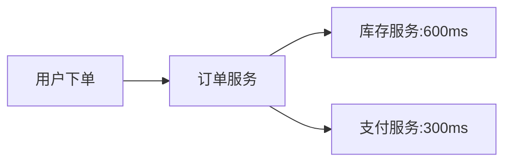

# 调用延迟分析

## 介绍

在分布式系统中，调用延迟（Latency）是指一个请求从发出到收到响应所经历的时间。通过Zipkin的调用延迟分析，开发者可以追踪请求在微服务架构中的流转路径，识别高延迟的服务或接口，从而优化系统性能。本章将介绍Zipkin的延迟分析原理、工具使用方法和实际案例。

:::note 关键概念
- **Span（跨度）**：代表一个独立的工作单元（如一次API调用），包含开始/结束时间戳。
- **Trace（追踪）**：由多个Span组成的调用链，代表一个完整请求的路径。
- **延迟（Latency）**：Span的持续时间（`Span.duration`）。
:::

---

## 延迟分析基础

### 1. 查看Span延迟
在Zipkin UI中，每个Span的详情页会显示其延迟（单位：微秒）。例如：
```json
{
  "id": "abc123",
  "name": "GET /api/users",
  "duration": 45000,
  "timestamp": 1625097600000
}
```
表示该接口调用耗时45毫秒。

### 2. 延迟统计视图
Zipkin提供两种延迟分析视图：
1. **全局延迟分布**：展示所有请求的延迟百分位数（P50/P95/P99）。
2. **服务级延迟**：按服务名称聚合延迟数据。

---

## 实战步骤

### 步骤1：定位高延迟服务
1. 打开Zipkin UI，进入"依赖关系图"（Dependencies）。
2. 观察连线粗细（表示延迟高低）。
3. 点击高延迟服务，查看详细Span列表。

### 步骤2：分析延迟原因
常见延迟原因：
- 数据库查询慢（检查SQL语句或索引）
- 网络延迟（跨机房调用）
- 外部API响应慢（第三方服务瓶颈）

:::tip 示例：慢查询分析
```java
// 假设发现一个耗时200ms的数据库查询Span
@GetMapping("/orders")
public List<Order> getOrders() {
  // 高延迟SQL查询（缺少索引）
  return jdbcTemplate.query("SELECT * FROM orders WHERE status = 'PENDING'");
}
```
优化方案：为`status`字段添加索引。
:::

---

## 实际案例

### 案例：电商订单延迟分析
**问题现象**：下单接口平均延迟超过1秒。

**分析过程**：
1. 在Zipkin中筛选`POST /orders`的Trace。
2. 发现延迟集中在两个Span：
   - `库存服务.check`（平均600ms）
   - `支付服务.create`（平均300ms）
3. 进一步检查发现：
   - 库存服务使用了同步锁导致排队
   - 支付服务调用了慢速的银行API

**优化方案**：
- 库存服务改用分布式缓存
- 支付服务添加异步重试机制



---

## 高级技巧

### 1. 使用Zipkin API获取延迟数据
通过Zipkin的API编程查询延迟：
```bash
curl "http://zipkin-server:9411/api/v2/traces?serviceName=payment-service&limit=10"
```

### 2. 告警配置
结合Prometheus设置延迟告警规则：
```yaml
alert: HighLatency
expr: histogram_quantile(0.95, sum(rate(zipkin_latency_bucket[1m])) by (le)) > 1000
```

---

## 总结

- 调用延迟分析是性能优化的核心手段。
- 通过Zipkin可以快速定位延迟瓶颈服务。
- 结合业务代码和架构设计进行针对性优化。

**延伸学习**：
- [Zipkin官方文档：延迟筛选](https://zipkin.io/pages/tracelens.html)
- 练习：在本地环境中模拟高延迟场景并尝试诊断。

:::warning 注意
生产环境中需考虑采样率对延迟数据准确性的影响。
:::