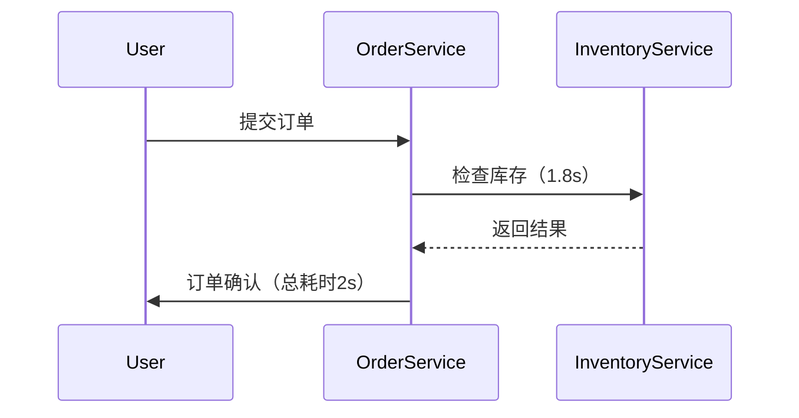

# 性能瓶颈识别

## 介绍

性能瓶颈是系统中导致响应延迟或吞吐量下降的关键点。在分布式系统中，由于服务间依赖复杂，瓶颈可能隐藏在某个微服务、数据库查询或网络调用中。Zipkin通过可视化请求的完整调用链（Trace），帮助开发者快速定位耗时最长的操作（Span），从而识别性能瓶颈。

## 核心概念

### 1. 关键指标
- **延迟（Latency）**：单个Span的耗时，通常反映特定操作的性能。
- **关键路径（Critical Path）**：Trace中所有串行Span的耗时总和，决定请求的总延迟。
- **扇出（Fan-out）**：并行调用的数量，可能引发资源竞争。

### 2. 分析方法
1. **最长Span定位**：在Zipkin UI中按耗时排序Span。
2. **依赖分析**：检查高延迟Span的上下游依赖。
3. **对比基线**：与历史正常Trace对比异常Span。

## 实战案例

### 场景：电商订单提交延迟
用户反馈下单接口变慢，通过Zipkin发现：
- 订单服务总延迟为2秒，其中库存检查Span占1.8秒。



### 解决方案
检查库存服务的数据库查询，发现未对 `product_id` 字段建立索引：
```sql
-- 优化前
SELECT stock FROM inventory WHERE product_id = '123';

-- 优化后（添加索引）
CREATE INDEX idx_product_id ON inventory(product_id);
```
优化后，该Span延迟降至200ms，总延迟减少80%。

## 代码示例

### 识别高延迟Span（Zipkin UI）
1. 在Trace详情页点击 **"按耗时排序"** 按钮。
2. 观察红色标记的长Span（示例输出）：
```
Span Name            Duration
-----------------------------
checkInventory      1800ms
processPayment      150ms
updateOrderDB       50ms
```

### 使用Zipkin API查询瓶颈
```python
import requests

# 查询最近10条高延迟Trace
response = requests.get(
    "http://zipkin-server:9411/api/v2/traces",
    params={"limit": 10, "minDuration": 1000}
)

for trace in response.json():
    longest_span = max(trace[0], key=lambda s: s["duration"])
    print(f"Service: {longest_span['localEndpoint']['serviceName']}")
    print(f"Duration: {longest_span['duration']}μs")
```

## 常见瓶颈模式

:::tip 典型模式
1. **数据库瓶颈**：
   - 特征：单个SQL查询Span耗时突增
   - 解决：优化查询/添加索引/分库分表

2. **外部API瓶颈**：
   - 特征：HTTP调用Span出现超时或高延迟
   - 解决：增加重试/缓存结果/降级策略

3. **资源竞争**：
   - 特征：并行Span同时变慢
   - 解决：限制并发/扩容资源
:::

## 总结

通过Zipkin识别性能瓶颈的关键步骤：
1. 定位Trace中的最长Span
2. 分析该Span的上下文依赖
3. 对比历史数据确认异常
4. 结合业务代码实施优化

## 扩展练习
1. 在Zipkin中找出一个包含 `redis` 操作的Trace，分析缓存命中率。
2. 对比白天和夜晚的API延迟差异，推测可能原因。

## 附加资源
- [Zipkin官方文档：追踪数据分析](https://zipkin.io/pages/tracers_instrumentation.html)
- 《分布式系统观测：从追踪到优化》第三章