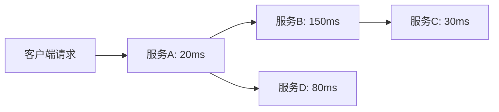

# 关键路径分析

## 介绍
关键路径分析（Critical Path Analysis）是分布式系统性能优化的核心技术之一，它通过识别请求在服务调用链中最耗时的环节（即"关键路径"），帮助开发者定位性能瓶颈。在Zipkin中，关键路径表现为Trace数据中跨度（Span）耗时最长的连续路径。

:::tip 为什么需要关键路径分析？
- 80%的性能问题通常由20%的关键路径引起
- 优化关键路径能带来最大的性能提升收益
- 避免盲目优化非关键路径造成的资源浪费
:::

## 基础概念

### 关键路径的组成
1. **同步依赖**：必须顺序执行的Span
2. **最长耗时**：单个Span或连续Span的总耗时决定整体延迟
3. **资源瓶颈**：可能涉及数据库查询、外部API调用等



上图中，关键路径为 `A → B → C → D`（总耗时200ms），而非 `A → B → E`（100ms）。

## Zipkin 中的实践

### 1. 识别关键路径
在Zipkin UI中：
1. 打开Trace详情视图
2. 查找最长的连续Span序列
3. 注意红色高亮的Span（通常表示异常或超长耗时）

### 2. 分析示例
假设我们有以下订单处理Trace：

```json
{
  "traceId": "abc123",
  "spans": [
    {
      "name": "check-inventory",
      "duration": 50,
      "parentId": null
    },
    {
      "name": "process-payment",
      "duration": 200,
      "parentId": "check-inventory"
    },
    {
      "name": "update-database",
      "duration": 120,
      "parentId": "process-payment"
    },
    {
      "name": "send-notification",
      "duration": 30,
      "parentId": "update-database"
    },
    {
      "name": "log-audit",
      "duration": 80,
      "parentId": "process-payment"
    }
  ]
}
```

关键路径分析结果：
```
check-inventory (50ms)
  → process-payment (200ms)
    → update-database (120ms)
      → send-notification (30ms)
总耗时：400ms
```

### 3. 优化策略
针对上例中的 `process-payment`（200ms）：
- 检查支付网关连接池配置
- 优化支付处理算法
- 考虑异步处理非关键步骤（如审计日志）

## 实际案例：电商系统优化

**场景**：某电商平台发现结账流程平均响应时间从500ms恶化到1200ms。

**分析步骤**：
1. 在Zipkin中筛选 `/checkout` 接口的Trace
2. 发现关键路径变化：
   - 旧版：库存检查(80ms) → 支付(300ms) → 订单创建(100ms)
   - 新版：增加了风控服务调用(700ms)

**解决方案**：
- 将风控服务改为异步执行
- 实现风控结果缓存
- 优化后关键路径耗时恢复至450ms

## 总结

关键路径分析的核心要点：
1. 关键路径 = Trace中最长的连续Span序列
2. 优化关键路径能带来最大的性能提升
3. Zipkin的可视化工具极大简化了分析过程

## 扩展练习
1. 在Zipkin中找一个实际Trace，手动计算其关键路径
2. 对比不同Trace的关键路径差异
3. 尝试在代码中添加自定义Tag标记潜在关键路径

## 附加资源
- [Zipkin官方文档 - Trace分析](https://zipkin.io/pages/traces.html)
- 《分布式系统观测》第5章 - 性能分析技术
- OpenTelemetry关键路径分析白皮书