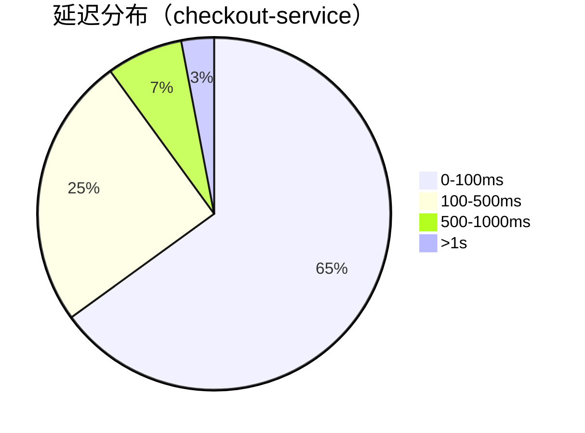

# 服务健康状态分析

## 介绍

在分布式系统中，服务的健康状态直接影响整体系统的稳定性。Zipkin作为分布式追踪工具，不仅能帮助定位请求链路问题，还能通过分析追踪数据评估服务的健康状态。本章将介绍如何利用Zipkin的查询接口和可视化工具，识别服务异常、分析延迟分布，并制定健康指标。

## 关键健康指标

通过Zipkin数据可监控以下核心指标：

1. **请求成功率**：HTTP状态码分布（如2xx/4xx/5xx比例）
2. **延迟百分位**：P50/P95/P99响应时间
3. **依赖服务健康度**：下游服务调用失败率
4. **异常拓扑**：服务间错误传播路径

## 数据查询方法

### 1. 基础查询示例

使用Zipkin API查询特定服务的错误请求（状态码≥400）：

```bash
curl -s "http://localhost:9411/api/v2/traces?serviceName=checkout-service&annotationQuery=http.status_code>=400"
```

典型输出结构（简化）：
```json
[
  {
    "traceId": "abcd1234",
    "duration": 450,
    "tags": {
      "http.status_code": "500",
      "error": "Database connection timeout"
    }
  }
]
```

### 2. 延迟分析



## 实际案例分析

### 场景：电商平台订单失败率上升

1. **现象**：仪表盘显示 `order-service` 的5xx错误率从1%升至15%
2. **诊断步骤**：
   - 查询最近1小时错误追踪：`/api/v2/traces?serviceName=order-service&lookback=3600000&annotationQuery=error`
   - 发现共同特征：所有失败请求都调用了 `payment-service`
   - 检查payment-service的P99延迟：从200ms恶化到2.3秒

:::tip 快速定位技巧
在Zipkin UI中使用「依赖关系图」模式，红色连线表示异常调用路径
:::

## 自动化监控方案

建议结合Prometheus实现自动化报警规则：

```yaml
# prometheus-alerts.yml
groups:
- name: service-health
  rules:
  - alert: HighErrorRate
    expr: sum(rate(zipkin_http_requests_total{status_code=~"5.."}[5m])) by (service) / sum(rate(zipkin_http_requests_total[5m])) by (service) > 0.05
    for: 10m
    labels:
      severity: critical
    annotations:
      summary: "High error rate on {{ $labels.service }}"
```

## 总结与练习

### 核心要点
- Zipkin数据可转化为服务健康指标
- 错误率、延迟分布是关键预警信号
- 结合拓扑分析能快速定位问题根源

### 实践练习
1. 使用Zipkin API查询你的服务最近10分钟的慢请求（>1s）
2. 对比生产环境和测试环境的P99延迟差异
3. 设计一个简单的健康度评分公式（建议权重：错误率50%，延迟30%，依赖健康20%）

### 扩展阅读
- [Zipkin Query API官方文档](https://zipkin.io/zipkin-api/)
- 《分布式系统观测》第三章：健康指标设计
- OpenTelemetry服务健康指标规范