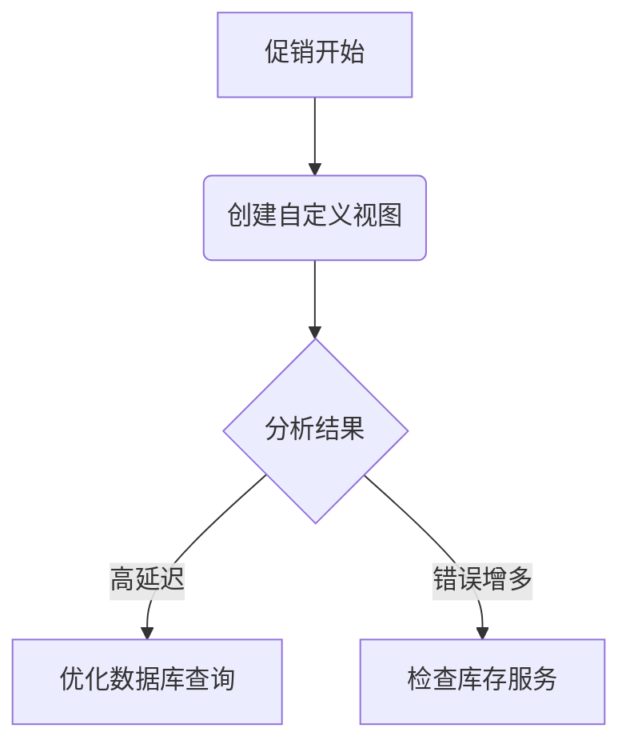

# 自定义分析视图

## 介绍

在Zipkin中，自定义分析视图允许你根据特定需求创建个性化的数据展示方式，帮助你更高效地分析分布式追踪数据。通过自定义视图，你可以：

- 聚焦于特定服务或端点
- 组合多个查询条件
- 创建可重复使用的分析模板
- 可视化关键性能指标

对于初学者来说，掌握自定义视图功能可以显著提升分布式系统调试和性能分析的效率。

## 基本概念

### 什么是自定义分析视图？

自定义分析视图是Zipkin中保存的查询配置，包含：
1. 服务/端点筛选条件
2. 时间范围设置
3. 特定的标签或注解过滤
4. 可视化选项

### 为什么需要自定义视图？

- **效率**：避免重复输入相同的查询条件
- **一致性**：团队使用相同的分析标准
- **专注**：针对特定问题创建专用视图

## 创建自定义视图

### 步骤1：构建基础查询

首先在Zipkin UI的查询界面设置基本条件：

1. 选择服务名称（如 `backend-service`）
2. 可选：指定端点名称（如 `/api/users`）
3. 设置时间范围（如最近1小时）

```json
// 对应的API查询参数示例
{
  "serviceName": "backend-service",
  "spanName": "/api/users",
  "lookback": 3600000,
  "endTs": 1625097600000
}
```

### 步骤2：添加高级过滤

使用标签（tags）或注解（annotations）进一步细化查询：

- 添加错误标签：`error=true`
- 过滤特定HTTP状态码：`http.status_code=500`
- 按自定义业务ID筛选：`order_id=12345`

:::tip
使用 `AND`/`OR` 逻辑组合多个条件可以创建更精确的查询
:::

### 步骤3：保存视图

在Zipkin UI右上角点击"Save"按钮，输入视图名称和描述：

```
名称: "Backend-Errors"
描述: "显示backend-service中所有错误请求"
```

## 实际案例

### 案例：电商网站性能分析

**场景**：你的电商网站在促销期间响应变慢，需要分析`checkout`服务的性能。

1. 创建名为`Checkout-Performance`的视图
2. 设置条件：
   - 服务：`checkout-service`
   - 端点：`/POST checkout`
   - 时间范围：促销开始至今
3. 添加排序：按持续时间降序
4. 保存视图



## 高级用法

### 使用API创建视图

除了UI，你还可以通过Zipkin API以编程方式创建视图：

```bash
curl -X POST http://your-zipkin-server/api/v2/views \
  -H "Content-Type: application/json" \
  -d '{
    "name": "API-Errors",
    "query": {
      "serviceName": "api-gateway",
      "tags": {"error": "true"},
      "lookback": 86400000
    }
  }'
```

### 共享视图

团队协作时，可以通过以下方式共享视图：
1. 导出视图配置（JSON格式）
2. 通过版本控制系统管理
3. 在团队文档中记录常用视图

## 最佳实践

1. **命名规范**：使用`服务-用途`格式（如`Payment-Timeouts`）
2. **定期审查**：清理不再使用的旧视图
3. **分层设计**：
   - 顶层：全局视图（如所有错误）
   - 中层：服务级视图
   - 底层：特定问题视图

:::caution
避免创建过多相似视图，这会导致管理困难。定期合并或删除冗余视图。
:::

## 总结

自定义分析视图是Zipkin中提升工作效率的强大工具。通过本指南，你学会了：

✓ 创建和保存自定义视图的基本步骤<br />
✓ 高级过滤和查询技巧<br />
✓ 实际应用案例分析<br />
✓ 通过API管理视图的方法<br />
✓ 团队协作的最佳实践

## 延伸学习

- 练习：为你的项目创建三个不同层级的自定义视图
- 探索Zipkin官方文档中的[查询语法](https://zipkin.io/zipkin-api/#/default/get_traces)
- 尝试结合Grafana等工具可视化Zipkin数据

:::note 思考题
如果你的自定义视图返回结果过多，有哪些方法可以进一步细化查询条件？
:::