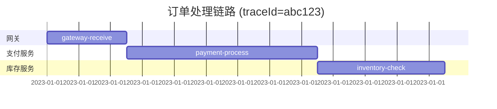

## 介绍

Zipkin UI 是 Zipkin 分布式跟踪系统的可视化界面，用于分析和排查微服务架构中的延迟问题。通过直观的图表和交互式工具，开发者可以快速定位请求链路中的性能瓶颈。本章将详细介绍 Zipkin UI 的核心功能及其使用方法。

## 功能概览

### 1. 跟踪查询（Trace Search）
通过服务名、时间范围等条件筛选跟踪数据。例如：
- **服务名过滤**：输入 `payment-service` 查找特定服务的跟踪记录。
- **时间范围选择**：支持按小时/天/周快速筛选。

:::tip
使用 `spanName` 参数可进一步缩小搜索范围，例如 `spanName=processOrder`。
:::

### 2. 跟踪详情（Trace Details）
点击单个跟踪记录后，会展示以下信息：
- **时间线瀑布图**：显示各 Span 的耗时和层级关系。
- **Span 元数据**：包括标签（Tags）、日志（Logs）和耗时统计。



### 3. 依赖关系图（Dependency Graph）
可视化服务间的调用关系，帮助理解系统架构：
- 节点大小反映请求量。
- 连线颜色表示错误率（红色高/绿色低）。

### 4. 延迟分析（Latency Analysis）
通过直方图展示不同百分位的延迟数据（P50/P95/P99）：
```text
/api/checkout 延迟统计：
- P50: 45ms
- P95: 210ms
- P99: 450ms
```

## 实际案例

### 场景：订单提交延迟
1. **现象**：用户反馈下单接口响应慢。
2. **排查步骤**：
   - 在 Zipkin UI 中搜索 `traceName:/api/submitOrder`。
   - 发现 `inventory-service` 的一个 Span 耗时 2s。
   - 检查该 Span 的标签，显示 `SQL_QUERY=SELECT * FROM stock`。
3. **结论**：数据库查询未使用索引导致延迟。

## 总结

Zipkin UI 通过四大核心功能帮助开发者：
1. **快速定位问题**：通过筛选和可视化缩短排查时间。
2. **架构治理**：依赖图辅助优化服务拓扑。
3. **性能优化**：延迟统计指导关键路径改进。

## 扩展练习
1. 在本地启动 Zipkin，发送一条包含多个 Span 的跟踪数据。
2. 使用 UI 查询该跟踪，并尝试添加 `error=true` 标签过滤。
3. 根据依赖关系图，绘制你的微服务调用链路草图。

## 附加资源
- [Zipkin 官方文档](https://zipkin.io/)
- 《分布式跟踪：原理与实践》第 4 章
``` 

注意：实际使用时请移除最外层的 