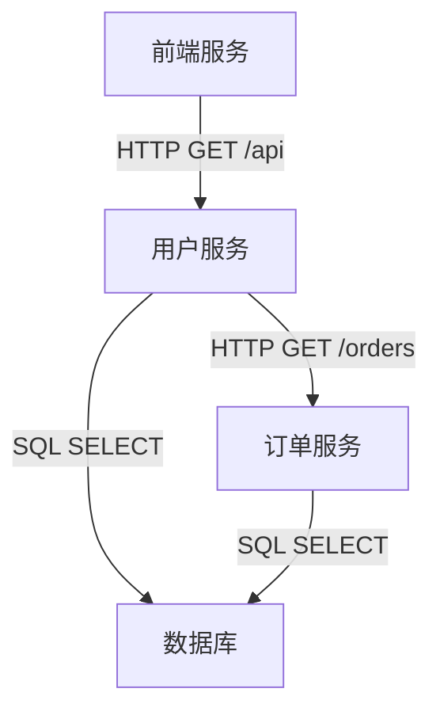

# 追踪查询界面

## 介绍

Zipkin的追踪查询界面是Zipkin UI的核心功能之一，它允许开发者查看和分析分布式系统中的请求链路信息。通过这个界面，你可以查询特定请求的完整调用链，包括各个服务的调用顺序、耗时以及可能出现的错误。对于初学者来说，掌握追踪查询界面的使用是理解分布式系统行为的重要一步。

## 访问追踪查询界面

在Zipkin UI的主页，你可以通过导航栏找到"追踪查询"（Trace Query）选项。点击后，你将进入追踪查询界面。该界面通常包含以下主要部分：

1. **查询条件区域**：用于设置查询条件，如服务名称、Span名称、时间范围等。
2. **结果列表区域**：显示符合查询条件的追踪列表。
3. **追踪详情区域**：点击某个追踪后，显示该追踪的详细信息。

## 查询条件设置

在查询条件区域，你可以设置以下参数来筛选追踪：

- **服务名称（Service Name）**：选择要查询的服务。
- **Span名称（Span Name）**：指定具体的Span名称。
- **时间范围（Time Range）**：设置查询的时间范围。
- **标签（Tags）**：通过标签进一步筛选，如 `http.method=GET`。
- **最小/最大持续时间（Duration）**：筛选耗时在指定范围内的追踪。

:::tip
使用标签查询时，可以输入键值对，如 `error=true` 来查找所有出错的请求。
:::

## 结果列表

查询结果以列表形式展示，每条记录包含以下信息：

- **追踪ID（Trace ID）**：唯一标识一个追踪。
- **服务名称（Service Name）**：发起请求的服务。
- **Span名称（Span Name）**：Span的名称，通常是方法或接口名。
- **持续时间（Duration）**：请求的总耗时。
- **时间戳（Timestamp）**：请求发生的时间。

点击某条记录可以查看该追踪的详细信息。

## 追踪详情

追踪详情页面展示了请求的完整调用链。以下是关键组成部分：

1. **时间线视图（Timeline）**：以时间轴形式展示各个Span的开始和结束时间。
2. **树形结构（Tree）**：以树形结构展示Span之间的父子关系。
3. **Span详情（Span Details）**：点击某个Span后，显示该Span的详细信息，包括标签、日志和耗时。

上图展示了一个简单的调用链示例：前端服务调用用户服务，用户服务又调用了数据库和订单服务。

## 实际案例

假设你有一个电商系统，用户反馈下单时偶尔出现延迟。你可以通过以下步骤排查问题：

1. 在Zipkin UI中，设置查询条件：
   - 服务名称：`order-service`
   - Span名称：`createOrder`
   - 时间范围：最近1小时
   - 最小持续时间：`1000ms`（筛选耗时超过1秒的请求）

2. 在结果列表中找到耗时较长的追踪，点击查看详情。

3. 在追踪详情中，发现 `createOrder` Span调用了 `payment-service`，且 `payment-service` 的耗时占了大头。

4. 进一步查看 `payment-service` 的Span详情，发现其调用的外部支付网关响应缓慢。

通过这种方式，你快速定位到了性能瓶颈所在。

## 总结

Zipkin的追踪查询界面是分析和排查分布式系统问题的强大工具。通过合理设置查询条件，你可以快速定位到问题追踪，并通过详情页面深入分析调用链中的每个环节。对于初学者来说，多实践、多观察是掌握这一工具的关键。

## 附加资源

- [Zipkin官方文档](https://zipkin.io/)
- 练习：尝试在你的本地Zipkin实例中查询一些追踪，观察不同服务的调用关系。