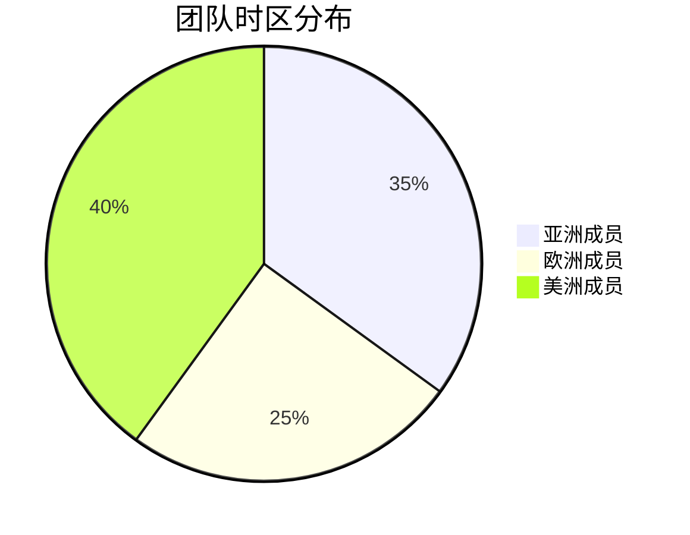

## 介绍

Zipkin UI默认采用浅色主题，但现代分布式追踪系统通常需要长时间查看数据，深色模式能有效降低眼睛疲劳。本文将指导你通过浏览器开发者工具和Zipkin配置启用深色模式。

:::note
深色模式是Zipkin 2.23+版本引入的实验性功能，部分UI元素可能仍需适配。
:::

## 方法一：通过浏览器强制深色模式

### 步骤说明
1. **打开开发者工具**  
   在Zipkin UI页面按 `F12` 或 `Ctrl+Shift+I` (Windows/Linux) / `Cmd+Opt+I` (Mac)

2. **添加强制深色CSS**  
   在控制台输入以下代码：
   ```javascript
   document.documentElement.style.setProperty('--color-mode', 'dark');
   document.documentElement.classList.add('dark');
   ```

3. **持久化设置** (可选)  
   使用浏览器插件如Stylus保存样式：
   ```css
   :root {
     --color-mode: dark;
   }
   :root.dark {
     --color-bg: #1e1e1e;
     --color-text: #e0e0e0;
   }
   ```

## 方法二：修改Zipkin启动配置

### 环境变量方式
在启动Zipkin服务时添加：
```bash
java -jar zipkin.jar --zipkin.ui.color-scheme=dark
```

### 配置文件方式
创建 `zipkin-config.json`：
```json
{
  "zipkin.ui": {
    "color-scheme": "dark"
  }
}
```
然后通过 `-c` 参数指定配置文件：
```bash
java -jar zipkin.jar -c zipkin-config.json
```

## 实际案例

### 分布式团队协作场景
当跨国团队需要同时分析追踪数据时：

深色模式能让不同时区的成员在夜间工作时获得更好的视觉体验。

## 样式自定义进阶

修改主题色（需Zipkin 2.24+）：
```javascript
// 在浏览器控制台执行
document.documentElement.style.setProperty('--primary-color', '#5c7f67');
document.documentElement.style.setProperty('--secondary-color', '#8ecccc');
```

## 总结

| 方法 | 适用场景 | 持久性 |
|------|----------|--------|
| 浏览器修改 | 快速测试 | 临时 |
| 启动参数 | 生产环境 | 永久 |
| 配置文件 | 团队统一配置 | 永久 |

:::tip 最佳实践
推荐开发环境使用浏览器临时修改，生产环境通过启动参数配置，团队协作时使用配置文件统一管理。
:::

## 延伸练习
1. 尝试通过Chrome的 `prefers-color-scheme` 媒体查询实现自动切换
2. 使用Zipkin的 `/config.json` 端点验证当前配色方案
3. 创建自定义CSS文件并通过Nginx反向代理注入样式

## 故障排查
- 如果颜色未生效，检查Zipkin版本是否≥2.23
- 清除浏览器缓存后重试
- 确认没有其他CSS覆盖了变量定义