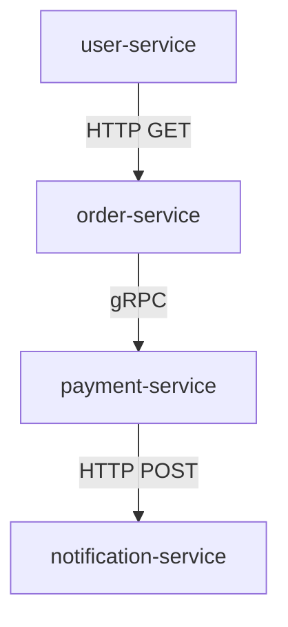

# Zipkin UI 使用：搜索技巧

## 介绍

Zipkin 是一个开源的分布式追踪系统，用于收集、存储和可视化微服务架构中的请求链路数据。Zipkin UI 提供了强大的搜索功能，帮助开发者快速定位和分析追踪数据。本文将详细介绍 Zipkin UI 的搜索技巧，包括基本查询语法、高级过滤条件以及实际应用场景。

## 基本搜索语法

在 Zipkin UI 的搜索栏中，你可以输入简单的关键词来查询追踪数据。以下是几种常见的搜索方式：

1. **服务名称搜索**：  
   直接输入服务名称（如 `user-service`）可以查询该服务的所有追踪记录。

2. **Span 名称搜索**：  
   输入 Span 名称（如 `GET /api/users`）可以查询特定操作的追踪记录。

3. **时间范围过滤**：  
   在 UI 的时间选择器中指定时间范围，可以缩小搜索结果的区间。

:::tip
Zipkin UI 默认显示最近 15 分钟的追踪数据。如果需要查询更早的数据，记得调整时间范围。
:::

## 高级搜索语法

Zipkin 支持基于标签（tags）和注解（annotations）的高级搜索。以下是常用的高级搜索语法：

### 1. 标签过滤
标签是附加到 Span 上的键值对，可以通过 `key=value` 的形式过滤。例如：
- `http.method=GET`：查询所有 HTTP 方法为 GET 的 Span。
- `error=true`：查询所有标记为错误的 Span。

### 2. 持续时间过滤
可以通过 `duration` 关键字查询特定持续时间的 Span：
- `duration>=100ms`：查询持续时间大于或等于 100 毫秒的 Span。
- `duration<1s`：查询持续时间小于 1 秒的 Span。

### 3. 组合查询
多个条件可以通过空格或逻辑运算符组合：
- `service=order-service http.method=POST`：查询 `order-service` 中所有 HTTP POST 请求。
- `service=payment-service error=true`：查询 `payment-service` 中所有出错的 Span。

:::note
Zipkin 的搜索语法不区分大小写，但标签的键值对必须完全匹配。
:::

## 实际案例

### 案例 1：查找慢请求
假设你想找出 `product-service` 中所有耗时超过 500 毫秒的请求，可以输入：
```
service=product-service duration>500ms
```

### 案例 2：排查错误
如果你想排查 `auth-service` 中所有标记为错误的请求，可以输入：
```
service=auth-service error=true
```

### 案例 3：按接口过滤
如果你想查询 `user-service` 中所有调用 `GET /api/users/{id}` 的请求，可以输入：
```
service=user-service span=GET /api/users/{id}
```

## 可视化搜索结果

Zipkin UI 会将搜索结果以时间轴的形式展示。你可以通过以下方式进一步分析：
1. **点击追踪记录**：查看完整的调用链路和 Span 详情。
2. **排序功能**：按持续时间或时间戳排序。
3. **依赖图**：通过依赖图查看服务之间的调用关系。



## 总结

Zipkin UI 的搜索功能是排查分布式系统问题的强大工具。通过掌握基本和高级搜索语法，你可以快速定位性能瓶颈、错误请求和调用链路。以下是关键点回顾：
- 使用 `service` 和 `span` 过滤特定服务和操作。
- 通过 `duration` 和 `error` 筛选慢请求和错误。
- 组合多个条件可以精确缩小搜索范围。

## 附加资源
1. [Zipkin 官方文档](https://zipkin.io/)
2. [Zipkin GitHub 仓库](https://github.com/openzipkin/zipkin)
3. [分布式追踪入门指南](https://opentracing.io/docs/)

## 练习
1. 尝试在 Zipkin UI 中搜索你最近部署的服务的追踪记录。
2. 使用 `duration` 和 `error` 标签找出系统中的性能问题和错误。
3. 组合多个条件（如服务名称和 HTTP 方法）进行高级查询。