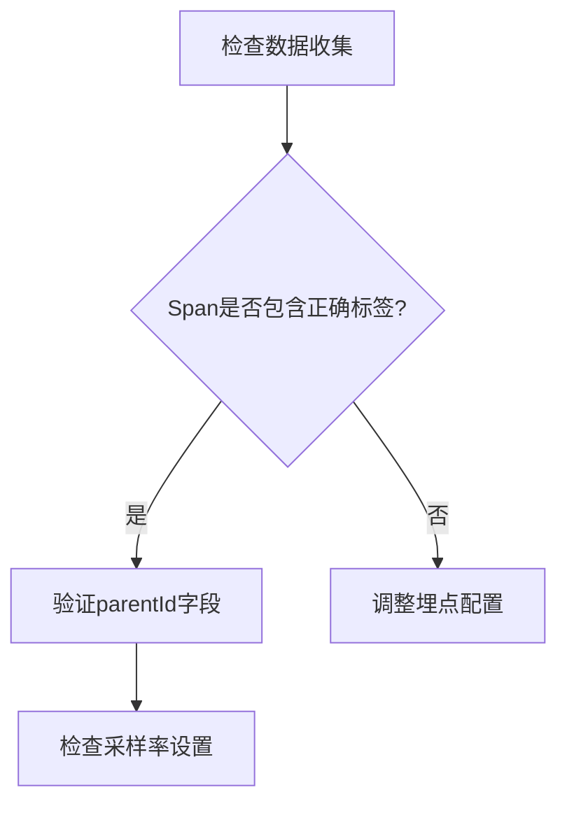

# Zipkin UI常见问题

Zipkin UI是分布式追踪系统Zipkin的可视化工具，用于分析和排查微服务架构中的延迟问题。本指南将帮助初学者解决使用UI时遇到的典型问题。

## 1. 无法查询跟踪数据

**问题描述**：在搜索界面输入条件后，返回结果为空或报错。

**可能原因**：
- 时间范围设置错误
- 服务名称拼写错误
- 后端存储未正确连接

**解决方案**：
1. 检查时间选择器是否覆盖了实际追踪时间
   ```json
   // 正确的时间范围示例（UTC格式）
   "startTs": "2023-07-20T00:00:00Z",
   "endTs": "2023-07-20T23:59:59Z"
   ```
2. 使用自动完成功能输入服务名（区分大小写）
3. 验证存储连接状态：
   ```bash
   # 检查Zipkin服务器日志
   docker logs zipkin-server
   ```

## 2. 依赖关系图显示不全

**问题描述**：依赖图只显示部分服务或连线缺失。

**排查步骤**：



1. 确认所有微服务都上报了`serviceName`和`parentId`
2. 检查采样率是否过高（建议开发环境设为100%）
   ```properties
   # Spring Sleuth配置示例
   spring.sleuth.sampler.probability=1.0
   ```

## 3. 跟踪详情时间线异常

**常见现象**：
- 时间轴出现负持续时间
- Span顺序错乱

**原因与修复**：
:::caution 时钟同步问题
分布式系统中各节点时钟不同步会导致时间计算错误。解决方式：
- 部署NTP时间同步服务
- 在Span中明确指定`timestamp`和`duration`
:::

**正确的时间戳示例**：
```json
{
  "timestamp": 1689876543210000,
  "duration": 45000,
  "name": "get-user-data"
}
```

## 4. UI界面卡顿或空白

**性能优化建议**：
1. 当返回大量跟踪数据时：
   - 添加更精确的查询条件
   - 分页加载结果（默认限制100条）
2. 浏览器端：
   - 清除本地缓存
   - 检查浏览器控制台错误（按F12）

## 5. 认证与权限问题

**企业版常见问题**：
- 登录后权限不足
- API密钥无效

**测试方案**：
```bash
# 使用curl测试API访问
curl -H "Authorization: Bearer YOUR_TOKEN" \
  http://zipkin.example.com/api/v2/traces
```

## 真实案例：电商平台延迟分析

**场景**：用户结账流程超时，通过Zipkin UI发现：
1. 支付服务到风控服务的调用耗时异常（红色高亮显示）
2. 依赖图显示这两个服务之间有网络跳转
3. 最终定位到AWS区域间带宽不足的问题

## 总结与练习

**关键点回顾**：
- 始终先验证时间范围和服务名称
- 完整的依赖图需要规范的Span数据
- 时间不同步会导致分析失真

**练习任务**：
1. 故意错误配置一个服务的采样率为0.1，观察UI变化
2. 在跟踪数据中插入错误的时间戳，验证时间轴显示
3. 尝试查询包含错误状态的跟踪（`/api/v2/traces?annotationQuery=error`）

**扩展阅读**：
- [Zipkin官方文档：UI功能](https://zipkin.io/pages/explore_ui.html)
- [分布式追踪最佳实践](https://microservices.io/patterns/observability/distributed-tracing.html)