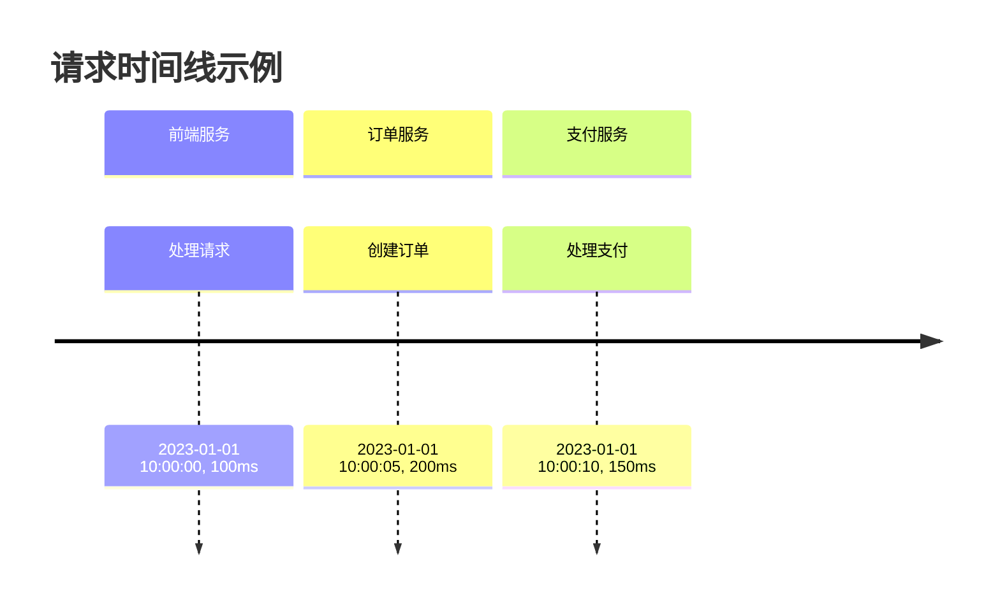

# 追踪详细信息查看

## 介绍

在分布式系统中，一个用户请求可能会跨越多个服务。Zipkin的追踪详细信息功能允许你查看请求的完整生命周期，包括每个服务的处理时间、调用的先后顺序以及可能出现的错误。这对于诊断性能瓶颈和系统故障至关重要。

## 访问追踪详情

1. **进入Zipkin UI**：打开Zipkin的Web界面（通常是 `http://localhost:9411`）。
2. **查找追踪**：通过服务名、时间范围或特定追踪ID筛选追踪列表。
3. **点击追踪条目**：选择你要查看的追踪，进入详情页面。

## 追踪详情页面解析

追踪详情页面包含以下关键部分：

### 1. 时间线概览


### 2. 跨度(Span)列表
按时间顺序显示所有跨度，每个跨度包含：
- 服务名称
- 操作名称（如API端点）
- 开始时间和持续时间
- 标签（Tags）和日志（Logs）

:::tip
点击任意跨度可以展开查看其详细元数据，包括自定义标签和错误信息。
:::

### 3. 依赖图
可视化展示服务之间的调用关系：


## 实际案例：分析延迟问题

假设用户报告"下单请求变慢"，我们通过Zipkin发现：

1. 在追踪列表中找到一个持续2秒的下单请求（正常应`<500ms`）
2. 查看详情发现：
   - 前端服务 → 订单服务：50ms（正常）
   - 订单服务 → 支付服务：1900ms（异常）
3. 检查支付服务的跨度详情，发现日志：
   ```
   "waiting for database connection"
   ```
4. 结论：支付服务数据库连接池不足导致延迟

## 高级功能

### 1. 比较追踪
选择两个相似请求的追踪，比较它们的跨度持续时间，快速识别性能退化。

### 2. JSON视图
点击"JSON"按钮查看原始追踪数据，适合自动化分析或与其他工具集成。

## 总结

通过Zipkin UI查看追踪详细信息，你可以：
- 可视化请求在系统中的完整路径
- 识别异常延迟或错误
- 分析服务间依赖关系
- 定位性能瓶颈的根本原因

## 附加练习

1. 在你的开发环境中部署Zipkin并发送一些测试请求
2. 故意在某个服务中添加延迟，然后在Zipkin中定位它
3. 尝试添加自定义标签到追踪中，并在UI中查看它们

## 延伸阅读
- [Zipkin官方文档 - UI指南](https://zipkin.io/pages/explore_ui.html)
- [分布式追踪最佳实践](https://www.oreilly.com/library/view/distributed-tracing-in/9781492056621/)