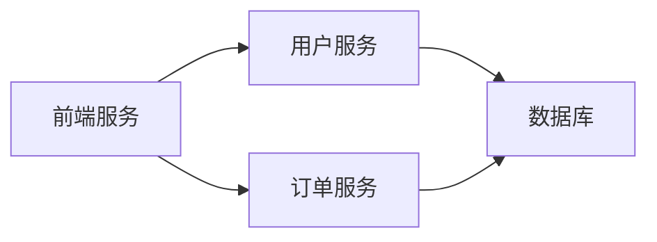
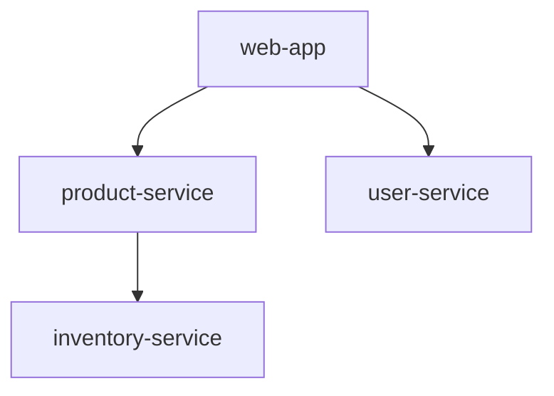

# 服务依赖图分析

## 介绍

服务依赖图（Service Dependency Graph）是Zipkin提供的核心功能之一，它通过可视化方式展示微服务之间的调用关系。对于初学者而言，理解服务依赖图能帮助你快速掌握分布式系统的整体架构，识别潜在的性能瓶颈或单点故障。

当多个微服务相互调用时，手动跟踪这些关系会非常困难。Zipkin通过收集分布式追踪数据，自动生成依赖图，图中节点代表服务，边代表调用关系。例如：



## 访问依赖图

1. 打开Zipkin UI（通常为 `http://localhost:9411`）
2. 点击顶部导航栏的 **"Dependencies"** 选项卡
3. 选择时间范围（默认显示最近1天的数据）

:::tip
如果依赖图为空，请确保：
- 有服务正在上报追踪数据
- 选择的时间范围内有调用发生
:::

## 解读依赖图元素

| 元素类型 | 说明 | 示例 |
|---------|------|------|
| 节点 | 矩形框代表独立服务 | `[user-service]` |
| 边 | 带箭头的线表示调用方向 | `web-app → auth-service` |
| 边宽度 | 越宽表示调用频率越高 |  |
| 边颜色 | 红色表示错误率较高 |  |

## 实际案例分析

假设我们有一个电商系统，包含以下服务调用链：

1. 用户访问前端（`web-app`）
2. 前端调用商品服务（`product-service`）获取列表
3. 商品服务调用库存服务（`inventory-service`）检查库存

在Zipkin中看到的依赖图可能如下：



:::note 问题诊断
如果在图中发现：
- `user-service` 到 `auth-db` 的边呈红色
- 该边的错误率显示为15%

这表明用户服务的数据库调用存在异常，需要优先排查
:::

## 高级功能

### 时间范围对比

通过调整右上角的时间选择器，可以对比不同时段的依赖关系变化。例如：
- 选择黑色星期五与平常日期的数据
- 观察新出现的服务节点或调用关系

### 点击交互

1. **点击节点**：显示该服务的详细信息，包括：
   - 平均延迟
   - 请求量
   - 错误率
2. **点击边**：显示服务间调用的统计信息：
   ```json
   {
     "callCount": 1428,
     "errorCount": 23,
     "avgDuration": 56.7
   }
   ```

## 最佳实践

1. **命名规范**：确保所有服务使用一致的命名（如全小写+连字符）
   - 错误示例：`UserService` vs `user-service`
2. **采样率**：在生产环境中合理设置采样率（建议10-20%）
   ```java
   // Spring Cloud Sleuth示例
   spring.sleuth.sampler.probability=0.1
   ```
3. **异常监控**：定期检查红色边对应的服务日志

## 总结

服务依赖图是理解微服务架构的"地图"，通过本指南你学会了：
- 如何访问和解读Zipkin的依赖图
- 识别常见拓扑结构问题
- 利用交互功能深入分析

## 扩展练习

1. 在你的本地环境中部署两个相互调用的服务
2. 配置Zipkin收集追踪数据
3. 观察依赖图的变化：
   - 正常情况下的图形
   - 停止一个服务后的图形变化

## 附加资源

- [Zipkin官方文档 - 依赖分析](https://zipkin.io/pages/data_model.html)
- [分布式追踪模式](https://microservices.io/patterns/observability/distributed-tracing.html)
- [Spring Cloud Sleuth配置指南](https://docs.spring.io/spring-cloud-sleuth/docs/current/reference/html/)