# 时间轴查看

## 介绍

在分布式系统中，请求通常会经过多个服务，每个服务都会消耗一定的时间。Zipkin 的 **时间轴查看** 功能允许你直观地观察请求在系统中的时间分布，帮助你快速识别性能瓶颈或异常延迟。

时间轴以水平条形图的形式展示每个跨度的持续时间，并按服务层级排列。通过这种方式，你可以轻松比较不同服务或操作之间的耗时情况。

## 时间轴的基本结构

在 Zipkin UI 中，时间轴通常显示在追踪详情页面的顶部。以下是一个典型的时间轴示例：

```mermaid
gantt
    title 请求时间轴示例
    dateFormat  X
    axisFormat %s
    section 前端服务
    请求处理 : 0, 3
    section 订单服务
    订单验证 : 3, 5
    库存检查 : 5, 8
    section 支付服务
    支付处理 : 8, 12
```

这个图表展示了：
- 前端服务处理请求耗时 3 秒
- 订单服务先进行验证（2 秒），然后检查库存（3 秒）
- 支付服务处理耗时 4 秒

## 如何使用时间轴

### 1. 访问时间轴
1. 在 Zipkin UI 中搜索并选择一个追踪记录
2. 在追踪详情页面，时间轴会自动显示在顶部

### 2. 解读时间轴
- **颜色编码**：不同服务通常用不同颜色表示
- **条形长度**：表示该操作的持续时间
- **空白间隙**：表示服务间的网络延迟或等待时间

### 3. 交互功能
- **悬停**：将鼠标悬停在条形上可查看详细信息
- **缩放**：使用鼠标滚轮或时间轴下方的控制按钮缩放视图
- **时间标记**：可以拖动时间标记来测量特定时间间隔

## 实际案例分析

假设我们有一个电商应用，用户报告结账过程缓慢。通过 Zipkin 的时间轴，我们发现以下情况：

```mermaid
gantt
    title 结账请求时间轴
    dateFormat  X
    axisFormat %s
    section Web前端
    页面渲染 : 0, 2
    section 订单服务
    创建订单 : 2, 4
    验证地址 : 4, 9
    section 支付服务
    处理支付 : 9, 11
```

从这个时间轴可以看出：
1. 地址验证耗时异常长（5 秒）
2. 其他操作都在正常范围内（1-2 秒）

:::tip 分析建议
这种情况下，应该重点检查：
- 地址验证服务的性能
- 地址验证服务的数据库查询
- 地址验证服务的第三方API调用
:::

## 高级时间轴功能

### 1. 依赖关系视图
Zipkin 可以显示服务间的依赖关系，帮助你理解时间轴中的调用顺序。

### 2. 时间比较
对于相似的请求，你可以并排比较它们的时间轴，找出性能差异。

### 3. 错误标记
如果某个跨度包含错误，Zipkin 会在时间轴上用红色或其他醒目颜色标记。

## 总结

Zipkin 的时间轴查看功能是分析分布式系统性能的强大工具。通过它，你可以：
- 直观地看到请求在系统中的流动
- 快速识别耗时异常的服务
- 比较不同请求的性能表现
- 发现系统瓶颈

## 练习建议

1. 在你的测试环境中部署一个简单的微服务应用
2. 生成一些追踪数据
3. 尝试使用时间轴分析这些请求
4. 故意制造一些延迟，观察时间轴如何反映这些变化

## 进一步学习

- 阅读 Zipkin 官方文档中的高级追踪分析部分
- 学习如何将时间轴数据导出进行进一步分析
- 探索如何将 Zipkin 与其他监控工具集成