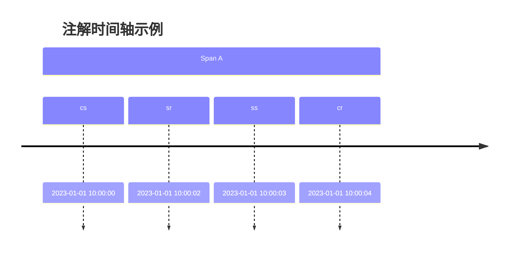

# 标签与注解查看

## 介绍

在分布式系统中，Zipkin通过**标签（Tags）**和**注解（Annotations）**记录请求链路的附加信息。标签是键值对形式的元数据（如 `http.method=GET`），而注解是带有时间戳的事件标记（如 `Server Received`）。通过Zipkin UI查看这些数据，可以快速定位问题或分析系统行为。

## 标签（Tags）详解

标签是静态的元数据，用于描述Span的特征。例如：
- `http.method`: HTTP请求方法（GET/POST等）
- `error`: 标记错误状态（如 `true`）

### 查看标签的步骤
1. 在Zipkin UI的追踪列表中，点击一个追踪记录。
2. 展开任意Span，在详情面板的 **Tags** 部分查看键值对。

:::note 示例标签
```json
{
  "http.method": "GET",
  "http.path": "/api/users",
  "error": "true"
}
```
:::

## 注解（Annotations）详解

注解是带有时间戳的事件记录，用于标记Span生命周期中的关键时间点。例如：
- `cs`（Client Send）: 客户端发起请求
- `sr`（Server Receive）: 服务端接收请求

### 查看注解的步骤
1. 在Span详情中，切换到 **Annotations** 标签页。
2. 时间轴会显示注解事件及其时间戳。



## 实际案例

假设一个用户查询失败，通过标签和注解可以分析：
1. **标签**显示 `error=true` 和 `http.path=/api/users`。
2. **注解**显示 `ss`（Server Send）与 `sr` 之间耗时过长，表明服务端处理缓慢。

:::tip 调试技巧
结合标签中的错误信息和注解的时间间隔，可以快速定位到是服务端性能问题还是客户端参数错误。
:::

## 总结

- **标签**提供静态元数据，帮助理解Span的上下文。
- **注解**记录动态事件，用于分析时间消耗。
- 两者结合是诊断分布式系统问题的强大工具。

## 附加练习

1. 在本地启动Zipkin，发送一个包含自定义标签（如 `user.id=123`）的追踪数据。
2. 使用注解时间轴计算服务端处理请求的耗时。

## 进一步学习
- [Zipkin官方文档：数据模型](https://zipkin.io/pages/data_model.html)
- 实践：在Spring Boot应用中添加自定义标签和注解。