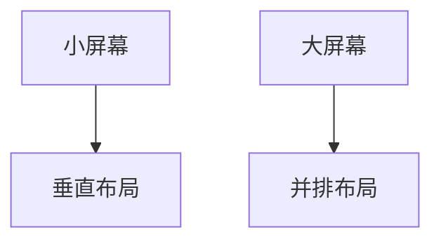

# 响应式设计

## 介绍

响应式设计（Responsive Design）是一种网页设计方法，旨在使网站能够自动适应不同设备的屏幕尺寸和分辨率，从而提供一致的用户体验。在Zipkin UI中，响应式设计尤为重要，因为用户可能通过桌面电脑、平板或手机访问分布式追踪数据。本节将介绍响应式设计的基本原理，并通过实际案例展示如何在Zipkin UI中应用这些技术。

## 基本原理

响应式设计的核心是使用以下技术：
1. **弹性布局（Flexible Grids）**：使用相对单位（如百分比）而非固定单位（如像素）定义布局。
2. **媒体查询（Media Queries）**：根据设备特性（如屏幕宽度）应用不同的CSS样式。
3. **弹性媒体（Flexible Media）**：确保图片和视频等媒体内容能够随容器大小调整。

### 示例：媒体查询
```css
/* 默认样式 */
.container {
  width: 100%;
  padding: 10px;
}

/* 平板设备（宽度 ≥ 768px） */
@media (min-width: 768px) {
  .container {
    width: 80%;
    margin: 0 auto;
  }
}

/* 桌面设备（宽度 ≥ 1024px） */
@media (min-width: 1024px) {
  .container {
    width: 60%;
  }
}
```

## 在Zipkin UI中的应用

Zipkin UI是一个基于Web的分布式追踪系统，用户可能需要在不同设备上查看追踪数据。以下是实现响应式设计的关键点：

### 1. 布局调整
Zipkin UI的主要组件（如追踪列表和详情视图）需要根据屏幕宽度重新排列。例如：
- 在小屏幕上，追踪列表可以折叠为垂直布局。
- 在大屏幕上，列表和详情可以并排显示。



### 2. 字体和间距
使用相对单位（如`rem`或`em`）定义字体大小和间距，确保文本在不同设备上可读。

```css
.trace-item {
  font-size: 1rem;
  padding: 0.5em;
}
```

### 3. 交互优化
在小屏幕上，按钮和链接需要更大的点击区域，避免误操作。

```css
.button {
  padding: 12px 24px;
}

@media (max-width: 768px) {
  .button {
    padding: 16px 32px;
  }
}
```

## 实际案例

假设我们需要优化Zipkin UI的追踪详情页面，使其在手机和桌面上都能良好显示。

### 桌面布局
```html
<div class="trace-detail">
  <div class="trace-metadata">...</div>
  <div class="trace-spans">...</div>
</div>
```

```css
.trace-detail {
  display: grid;
  grid-template-columns: 30% 70%;
}
```

### 手机布局
```css
@media (max-width: 768px) {
  .trace-detail {
    display: block;
  }
}
```

## 总结

响应式设计是确保Zipkin UI在不同设备上提供一致用户体验的关键技术。通过弹性布局、媒体查询和弹性媒体，可以轻松实现这一目标。以下是进一步学习的资源：

- [MDN响应式设计指南](https://developer.mozilla.org/en-US/docs/Learn/CSS/CSS_layout/Responsive_Design)
- [Zipkin UI GitHub仓库](https://github.com/openzipkin/zipkin-ui)

:::tip 练习
尝试在本地Zipkin UI项目中添加一个媒体查询，调整追踪列表在小屏幕上的显示方式。
:::