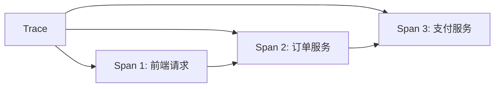
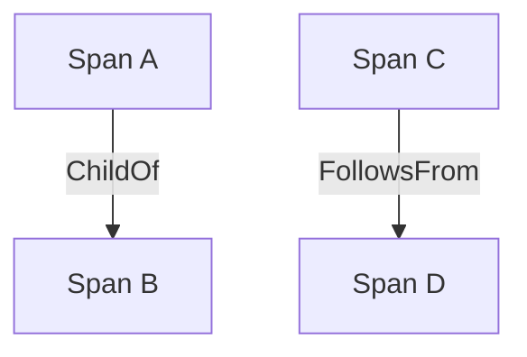

# OpenTracing标准介绍

## 什么是OpenTracing?

OpenTracing是一个**与厂商无关**的分布式追踪标准，为开发人员提供统一的API来收集和传播跨服务边界的追踪数据。它通过定义通用的数据模型和接口，使得不同追踪系统（如Zipkin、Jaeger）能够互相兼容。

:::note 关键特性
- **标准化API**：避免被特定追踪系统锁定
- **多语言支持**：包括Java、Python、Go等主流语言
- **上下文传播**：跨进程/服务传递追踪上下文
:::

## 核心概念

### 1. Trace（追踪）
表示一个完整的请求链路，由多个Span组成。例如：用户下单操作可能涉及订单服务、支付服务和库存服务。



### 2. Span（跨度）
代表一个独立的工作单元，包含：
- 操作名称
- 开始/结束时间戳
- 标签（Tags）和日志（Logs）
- 引用关系（父子、跟随等）

```python
# Python示例：创建span
import opentracing

tracer = opentracing.global_tracer()
with tracer.start_span('operation_name') as span:
    span.set_tag('http.method', 'GET')
    span.log_kv({'event': 'processing_started'})
```

### 3. 上下文传播（Context Propagation）
通过`SpanContext`在服务间传递追踪信息，通常通过HTTP头实现：

```http
X-B3-TraceId: 80f198ee56343ba864fe8b2a57d3eff7
X-B3-SpanId: e457b5a2e4d86bd1
X-B3-ParentSpanId: 05e3ac9a4f6e3b90
```

## 数据模型详解

### Span间关系


- **ChildOf**：父span依赖子span的结果（同步调用）
- **FollowsFrom**：父span不依赖子span（异步消息）

### 标签(Tags) vs 日志(Logs)
| 特性       | Tags                      | Logs                     |
|------------|---------------------------|--------------------------|
| 用途       | 描述span特征              | 记录离散事件              |
| 是否可索引 | 是                        | 否                       |
| 示例       | `http.status_code=200`    | `error.stack_trace=...`  |

## 实际应用案例

**电商订单流程追踪**：
1. 用户发起订单请求（前端span）
2. 订单服务创建订单记录（服务span）
3. 支付服务处理支付（服务span）
4. 库存服务扣减库存（服务span）

```java
// Java代码示例
try (Scope scope = tracer.buildSpan("process_order").startActive(true)) {
    scope.span().setTag("order.id", orderId);
    
    // 调用支付服务
    try (Scope paymentScope = tracer.buildSpan("process_payment")
            .asChildOf(scope.span())
            .startActive(true)) {
        paymentService.charge(order);
    }
}
```

## OpenTracing与Zipkin

Zipkin原生支持OpenTracing标准，可通过以下方式集成：

```javascript
// Node.js集成示例
const { Tracer } = require('zipkin');
const zipkinTransformer = require('zipkin-javascript-opentracing');

const zipkinTracer = new Tracer({ ctxImpl, recorder });
const opentracingTracer = zipkinTransformer(zipkinTracer);
```

:::tip 最佳实践
1. 为所有跨服务调用添加追踪
2. 使用有意义的span名称（如`serviceName.operation`）
3. 记录关键错误和性能指标
4. 保持采样率适中（生产环境建议10-20%）
:::

## 总结

OpenTracing通过标准化接口解决了分布式追踪的碎片化问题，其主要特点包括：
- 统一的跨语言API规范
- 灵活的数据模型设计
- 与现有系统（如Zipkin）的良好兼容性

## 扩展资源

1. [OpenTracing官方文档](https://opentracing.io/docs/)
2. [Zipkin与OpenTracing集成指南](https://zipkin.io/pages/instrumenting.html)
3. 实践练习：尝试在本地启动Zipkin服务器，并用OpenTracing API发送简单的追踪数据

:::warning 注意
OpenTracing已与OpenTelemetry项目合并，新项目建议考虑使用OpenTelemetry，但其概念体系仍与OpenTracing兼容
:::