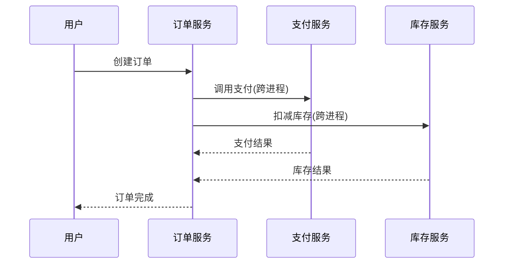

# Zipkin 与OpenTracing集成

## 介绍

OpenTracing 是一个**与厂商无关**的分布式追踪标准，而 Zipkin 是一个流行的开源分布式追踪系统。通过将两者集成，开发者可以使用 OpenTracing 的标准 API 发送追踪数据到 Zipkin 后端，实现跨语言、跨框架的统一监控。

:::note 关键概念
- **OpenTracing**: 提供统一的追踪 API 规范
- **Zipkin**: 提供数据存储、可视化和分析功能
- **集成优势**: 代码可移植性 + Zipkin 的强大分析能力
:::

## 集成原理


1. 应用程序调用 OpenTracing API
2. Zipkin 提供的兼容 Tracer 将数据转换为 Zipkin 格式
3. 数据通过 HTTP 或 Thrift 协议发送到 Zipkin 服务器

## 实现步骤

### 1. 添加依赖

对于 Java 项目，添加以下 Maven 依赖：

```xml
<dependency>
    <groupId>io.opentracing.contrib</groupId>
    <artifactId>opentracing-zipkin</artifactId>
    <version>0.2.0</version>
</dependency>
<dependency>
    <groupId>io.zipkin.reporter2</groupId>
    <artifactId>zipkin-sender-okhttp3</artifactId>
    <version>2.16.3</version>
</dependency>
```

### 2. 配置 Tracer

```java
import brave.Tracing;
import brave.opentracing.BraveTracer;
import zipkin2.reporter.AsyncReporter;
import zipkin2.reporter.okhttp3.OkHttpSender;

// 配置Zipkin上报地址
OkHttpSender sender = OkHttpSender.create("http://localhost:9411/api/v2/spans");
AsyncReporter<zipkin2.Span> reporter = AsyncReporter.create(sender);

// 创建OpenTracing兼容的Tracer
Tracing braveTracing = Tracing.newBuilder()
    .localServiceName("my-service")
    .spanReporter(reporter)
    .build();

io.opentracing.Tracer tracer = BraveTracer.create(braveTracing);
```

### 3. 创建追踪Span

```java
// 创建根Span
Span span = tracer.buildSpan("handle-request").start();
try (Scope scope = tracer.activateSpan(span)) {
    // 业务逻辑...
    Span childSpan = tracer.buildSpan("db-query").start();
    // 子Span操作...
    childSpan.finish();
} finally {
    span.finish();
}
```

## 实际案例：电商订单系统

假设我们有一个包含以下服务的电商系统：

1. **订单服务** (Java/Spring Boot)
2. **支付服务** (Go)
3. **库存服务** (Python)

通过 OpenTracing + Zipkin 集成：



所有服务使用 OpenTracing API，数据统一汇总到 Zipkin，形成完整的调用链视图。

## 常见问题

:::caution 注意
1. **采样率控制**: 生产环境应配置适当的采样率
   ```java
   Tracing.newBuilder().sampler(Sampler.create(0.1)) // 10%采样
   ```
2. **跨进程传播**: 确保正确传播 `trace-id` 和 `span-id`
3. **性能影响**: 异步上报避免阻塞主线程
:::

## 总结

通过 OpenTracing 与 Zipkin 集成：
- 获得标准化的追踪 API
- 保持与 Zipkin 生态的兼容性
- 实现多语言系统的统一监控

## 扩展学习

1. **官方文档**:
   - [OpenTracing 规范](https://opentracing.io/)
   - [Zipkin Brave 库](https://github.com/openzipkin/brave)

2. **实践练习**:
   - 搭建本地 Zipkin 服务器
   - 用两种语言实现服务间追踪
   - 尝试调整采样率观察数据变化

3. **高级话题**:
   - 与 Prometheus/Grafana 集成
   - 分布式上下文传播
   - 追踪数据分析