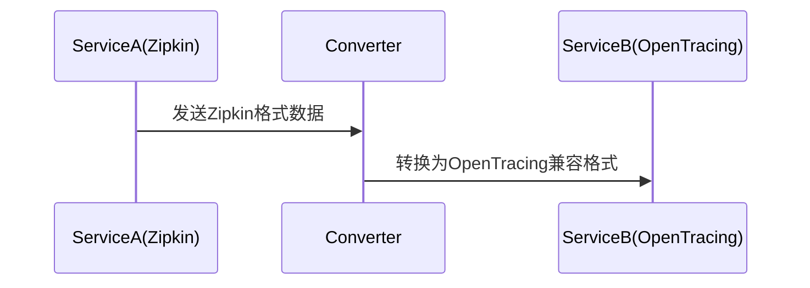

# 多追踪系统兼容

## 介绍

在现代分布式系统中，服务可能使用不同的追踪系统（如Zipkin、Jaeger、OpenTracing等）。**多追踪系统兼容**是指通过标准化协议或适配器，使这些系统能够互相理解彼此的追踪数据。本文将重点介绍Zipkin与OpenTracing的兼容性实现。

:::note 关键概念
- **Zipkin**：Twitter开端的分布式追踪系统，基于显式埋点。
- **OpenTracing**：厂商中立的追踪API标准，提供统一接口。
:::

## 为什么需要兼容性？

1. **技术栈异构性**：不同服务可能采用不同追踪工具。
2. **数据聚合需求**：需要统一查看跨系统的调用链。
3. **迁移过渡期**：系统从一种追踪方案迁移到另一种时的兼容需求。

## 兼容性实现方案

### 方案1：通过OpenTracing桥接

OpenTracing作为抽象层，可以对接多种追踪系统后端（包括Zipkin）。以下是Java示例：

```java
// 使用OpenTracing的Zipkin适配器
Tracer zipkinTracer = new ZipkinTracer.Builder()
    .sender(OkHttpSender.create("http://localhost:9411/api/v2/spans"))
    .build();

// 将Zipkin Tracer包装为OpenTracing Tracer
Tracer tracer = BraveTracer.create(zipkinTracer);
```

### 方案2：数据格式转换

不同系统间通过通用数据格式（如OpenTelemetry Protocol）转换：



## 实际案例：电商系统追踪

假设一个电商系统包含：
- 订单服务（使用Zipkin）
- 支付服务（使用OpenTracing）

实现步骤：
1. 在订单服务中配置Zipkin的OpenTracing适配器
2. 支付服务保持原生OpenTracing实现
3. 通过共享相同的Trace ID实现链路关联

```java
// 订单服务（Zipkin+OpenTracing）
Span orderSpan = tracer.buildSpan("create_order").start();
try (Scope scope = tracer.activateSpan(orderSpan)) {
    // 调用支付服务
    HttpClient.post("/pay")
        .header("trace-id", orderSpan.context().toTraceId());
}
```

## 常见问题解决

:::caution 注意
- **ID格式差异**：Zipkin使用64/128位ID，需确保转换时长度兼容
- **标签命名冲突**：不同系统的预留标签（如`error`）可能需要映射
- **采样率同步**：跨系统需统一采样决策
:::

## 总结

实现多追踪系统兼容的关键在于：
1. 使用标准化API（如OpenTracing）作为抽象层
2. 通过中间件转换数据格式
3. 确保核心字段（TraceID、SpanID）的兼容性

## 扩展资源

1. [OpenTracing到Zipkin的官方桥接文档](https://github.com/openzipkin-contrib/brave-opentracing)
2. W3C Trace Context标准（跨系统追踪上下文规范）
3. 练习：尝试在本地同时启动Zipkin和Jaeger，并实现两者的数据互认