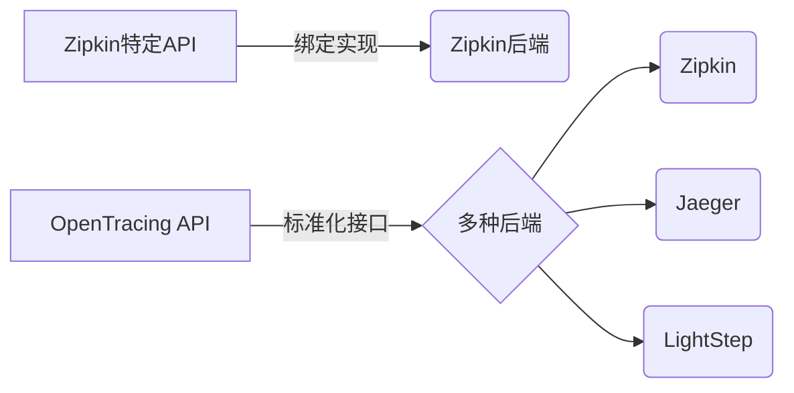

# 迁移至OpenTracing

## 介绍

OpenTracing是一个**与厂商无关**的分布式追踪标准，而Zipkin是一个具体的追踪系统实现。迁移到OpenTracing意味着从Zipkin的专有API转向标准化接口，从而获得更好的可移植性和生态系统兼容性。本章将指导您完成这一过程的关键步骤。

:::note 为什么需要迁移？
- 避免厂商锁定（Vendor Lock-in）
- 兼容多种追踪后端（如Jaeger, LightStep等）
- 使用统一的API规范
:::

## 核心概念对比



## 迁移步骤

### 1. 依赖项调整

替换Zipkin原生依赖为OpenTracing兼容库：

```java
// 旧：Zipkin原生依赖
implementation 'io.zipkin.brave:brave:5.13.2'

// 新：OpenTracing + Zipkin适配器
implementation 'io.opentracing:opentracing-api:0.33.0'
implementation 'io.opentracing.brave:brave-opentracing:0.37.1'
```

### 2. Tracer初始化改造

改造初始化代码以使用OpenTracing接口：

```java
// 旧：直接使用Zipkin的Brave
Brave brave = new Brave.Builder("service-name").build();
Tracing tracing = brave.tracing();

// 新：通过OpenTracing包装
Brave brave = new Brave.Builder("service-name").build();
Tracer tracer = BraveTracer.create(brave.tracing());
GlobalTracer.register(tracer);
```

### 3. 跨度(Span)API迁移

对比关键操作的变化：

| 操作         | Zipkin API                  | OpenTracing API               |
|--------------|----------------------------|-------------------------------|
| 创建根Span   | `tracing.tracer().newTrace()` | `tracer.buildSpan("operation").start()` |
| 记录标签     | `span.tag("key", "value")`  | `span.setTag("key", "value")` |
| 记录日志     | `span.annotate("event")`    | `span.log("event")`           |

### 4. 上下文传播适配

```java
// 旧：Zipkin的Brave上下文
Span span = tracing.tracer().nextSpan().name("operation").start();

// 新：OpenTracing上下文
Span span = tracer.buildSpan("operation").start();
try (Scope scope = tracer.activateSpan(span)) {
    // 业务代码
}
```

## 实际案例：HTTP服务追踪

### 迁移前（纯Zipkin）

```java
// 服务器端
httpTracing = HttpTracing.create(tracing);
Filter tracingFilter = httpTracing.serverRequestInterceptor();

// 客户端
HttpTracing clientTracing = httpTracing.clientRequestInterceptor();
```

### 迁移后（OpenTracing）

```java
// 使用opentracing-web-servlet-filter
ServletFilter filter = new TracingFilter(tracer);

// 客户端使用opentracing-okhttp3
OkHttpClient client = new OkHttpClient.Builder()
    .addInterceptor(new TracingInterceptor(tracer))
    .build();
```

## 兼容性注意事项

:::caution 注意差异点
1. **采样率配置**：OpenTracing的采样决策通常在Tracer层面处理
2. **二进制注解**：Zipkin的特殊字段需要映射到OpenTracing的标准标签
3. **时钟同步**：确保所有系统使用相同的时间源
:::

## 验证迁移结果

使用Zipkin UI检查追踪数据是否正常：

1. 服务名称是否正确显示
2. 父子跨度关系是否保持
3. 标签和日志是否完整传递

## 总结

迁移到OpenTracing的主要优势包括：

- 标准化接口带来的灵活性
- 多后端支持能力
- 更丰富的生态系统工具

## 扩展资源

1. [OpenTracing官方文档](https://opentracing.io/docs/)
2. [Brave-OpenTracing桥接项目](https://github.com/openzipkin-contrib/brave-opentracing)
3. 练习：尝试将现有的Zipkin Spring Boot应用迁移到OpenTracing标准

:::tip 渐进式迁移
可以同时运行新旧两套系统一段时间，通过双写策略验证数据一致性
:::