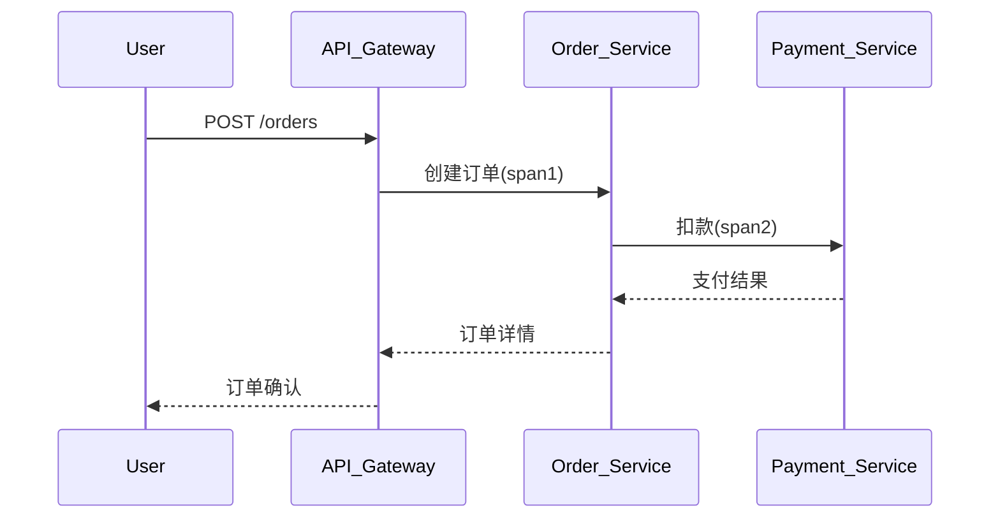

# OpenTracing最佳实践

## 介绍

OpenTracing是一套**与厂商无关**的分布式追踪API规范，它允许开发者在不同编程语言和追踪系统中使用统一的接口。与Zipkin结合使用时，能实现跨服务的全链路监控。本文将通过实际案例展示如何遵循OpenTracing规范编写可观测性代码。

:::note 为什么需要标准化？
不同追踪系统（如Jaeger/Zipkin）有各自的SDK，OpenTracing通过抽象层避免了厂商锁定问题。
:::

## 核心实践原则

### 1. 正确的Span生命周期管理

每个Span代表一个逻辑操作单元，必须确保其正确关闭：

```javascript
// Node.js示例
const span = tracer.startSpan('operation_name');
try {
  // 业务逻辑...
  span.log({ event: 'operation_success' });
} catch (err) {
  span.setTag('error', true);
  span.log({ event: 'error', message: err.message });
} finally {
  span.finish(); // 必须调用！
}
```

### 2. 上下文传播的标准方式

跨服务传递追踪上下文时，应使用标准的`inject`/`extract`方法：

```python
# Python示例
from opentracing.propagation import Format

# 客户端发送请求前
carrier = {}
tracer.inject(span.context, Format.HTTP_HEADERS, carrier)
requests.get(url, headers=carrier)

# 服务端接收请求时
context = tracer.extract(Format.HTTP_HEADERS, request.headers)
span = tracer.start_span('server_span', child_of=context)
```

### 3. 有意义的Span命名

遵循这些命名约定：
- 使用`lower_snake_case`
- 明确操作目的：`get_user_profile`优于`process_request`
- 包含业务领域：`auth.validate_token`

### 4. 合理的标签(Tags)与日志(Logs)

| 标签类型       | 示例                          | 适用场景                  |
|----------------|-------------------------------|-------------------------|
| 组件标识       | `component: "http-server"`    | 基础设施分类             |
| 错误标记       | `error: true`                 | 异常捕获时               |
| 性能指标       | `http.status_code: 404`       | HTTP请求响应             |

## 真实案例：电商订单流程



对应的追踪实现要点：

```java
// Java代码片段
Span orderSpan = tracer.buildSpan("create_order")
    .withTag("order.amount", 2999)
    .start();

try (Scope scope = tracer.activateSpan(orderSpan)) {
    // 订单业务逻辑...
    Span paymentSpan = tracer.buildSpan("process_payment")
        .asChildOf(orderSpan)
        .start();
    
    // 支付调用...
} finally {
    orderSpan.finish();
}
```

## 常见陷阱与解决方案

:::warning 注意这些坑！
1. **Span泄漏**：忘记调用`finish()`会导致内存溢出
   - 解决方案：使用try-with-resource（Java）或defer（Go）

2. **过度追踪**：对高频操作（如循环内DB调用）全量追踪
   - 解决方案：采样率控制或聚合统计

3. **上下文丢失**：异步操作中未正确传递上下文
   - 解决方案：使用`tracer.scopeManager()`管理上下文
:::

## 总结与进阶

通过OpenTracing规范，我们能够：
- 实现跨语言/平台的统一追踪
- 与Zipkin等后端无缝集成
- 通过标准标签增强可观测性

**推荐练习**：
1. 在本地启动Zipkin服务器
2. 用任何语言实现两个模拟服务间的追踪传播
3. 在Zipkin UI中验证追踪数据

**延伸阅读**：
- OpenTracing官方文档规范
- Zipkin的Brave instrumentation实现
- W3C TraceContext标准