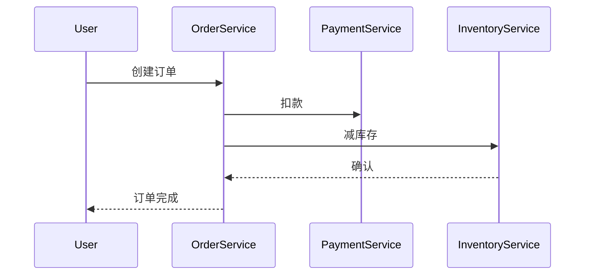

# OpenTracing常见问题

## 介绍
OpenTracing是一个**跨语言的分布式追踪标准**，它定义了统一的API规范，允许开发者在不修改代码的情况下切换不同的追踪系统（如Zipkin、Jaeger等）。本节将解答与OpenTracing相关的常见问题，并通过示例展示其与Zipkin的协作方式。

---

## 1. OpenTracing与Zipkin的关系是什么？
OpenTracing是**标准接口**，而Zipkin是**具体实现**。通过OpenTracing的Zipkin适配器（如`opentracing-zipkin`库），可以将追踪数据发送到Zipkin后端。

:::tip 类比理解
OpenTracing类似JDBC的API规范，Zipkin则是MySQL这样的具体数据库实现。
:::

---

## 2. 如何初始化OpenTracing与Zipkin的集成？
以下是Python语言的示例代码：

```python
from opentracing import Tracer
from opentracing.ext import tags
from opentracing.propagation import Format
from zipkin_ot import create_zipkin_tracer

# 初始化Zipkin适配的OpenTracing Tracer
zipkin_tracer = create_zipkin_tracer(
    zipkin_address="http://localhost:9411",
    service_name="my-service"
)

# 开始一个Span
with zipkin_tracer.start_active_span('operation') as scope:
    scope.span.set_tag(tags.HTTP_METHOD, "GET")
    scope.span.log_kv({"event": "query_started"})
```

---

## 3. Span上下文如何跨服务传递？
OpenTracing通过`inject`和`extract`方法实现上下文传播：

```python
# 服务A: 注入上下文到HTTP头
headers = {}
zipkin_tracer.inject(
    span_context=active_span.context,
    format=Format.HTTP_HEADERS,
    carrier=headers
)

# 服务B: 从HTTP头提取上下文
span_ctx = zipkin_tracer.extract(
    format=Format.HTTP_HEADERS,
    carrier=request.headers
)
```

---

## 4. 常见错误排查

### 问题：Zipkin未收到Span数据
- 检查Zipkin服务地址是否正确
- 验证网络连通性（如`curl http://zipkin:9411`）
- 查看Tracer日志是否报错

### 问题：Span间无关联
- 确保正确传递了`span_context`
- 验证`inject/extract`的`format`参数匹配

---

## 5. 实际案例：电商系统追踪
以下是一个订单处理流程的追踪场景：



对应的OpenTracing调用链会生成如下结构的Span：
- OrderService (Root Span)
  - PaymentService (Child Span)
  - InventoryService (Child Span)

---

## 总结
关键点回顾：
1. OpenTracing是标准，Zipkin是具体实现
2. 通过`inject/extract`实现跨服务上下文传递
3. 标签（Tags）和日志（Logs）用于丰富追踪数据

## 扩展练习
1. 在本地的Zipkin中实现一个多服务调用链追踪
2. 尝试为Span添加自定义标签（如`user_id`）
3. 比较OpenTracing与OpenTelemetry的API差异

## 附加资源
- [OpenTracing官方文档](https://opentracing.io/docs/)
- [Zipkin OpenTracing适配器GitHub](https://github.com/openzipkin-contrib/zipkin-opentracing)