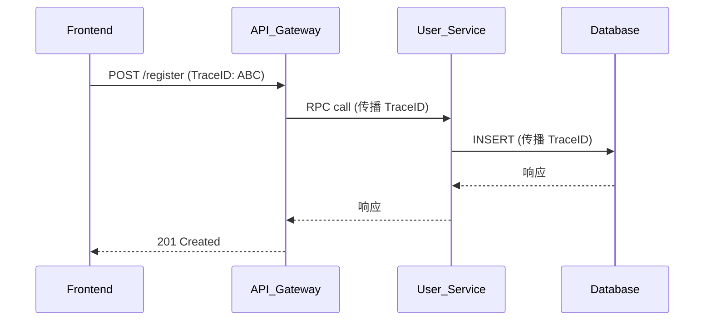

# OpenTracing API 使用

## 介绍

OpenTracing 是一个**与厂商无关**的分布式追踪 API 规范，它允许开发者在不同编程语言和追踪系统中使用统一的接口记录请求链路。与 Zipkin 结合使用时，OpenTracing 能帮助可视化微服务架构中的调用流程。

本节将介绍 OpenTracing 的核心 API 使用方法，并通过实际代码演示如何集成到应用中。

---

## 核心概念

### 1. Tracer
Tracer 是 OpenTracing 的核心接口，负责创建 `Span`（追踪的基本单元）。初始化示例：

```javascript
const { initTracer } = require('jaeger-client');
const tracer = initTracer(config); // 配置参考后续示例
```

### 2. Span
代表一个独立的工作单元（如 HTTP 请求或数据库操作），包含：
- 操作名称
- 开始/结束时间戳
- 标签（Tags）和日志（Logs）

### 3. SpanContext
跨进程传递的上下文信息，包含：
- Trace ID（全局唯一）
- Span ID（当前操作标识）

---

## 基础用法

### 创建根 Span
```javascript
const span = tracer.startSpan('operation_name');
span.setTag('http.method', 'GET');
// ...执行操作...
span.finish(); // 必须显式结束
```

### 子 Span（上下文传播）
```javascript
const childSpan = tracer.startSpan('child_operation', {
  childOf: span.context() // 关联父Span
});
```

### 跨进程追踪
通过 `inject` 和 `extract` 实现上下文传播：

```javascript
// 发送方
const headers = {};
tracer.inject(span.context(), FORMAT_HTTP_HEADERS, headers);

// 接收方
const context = tracer.extract(FORMAT_HTTP_HEADERS, headers);
const serverSpan = tracer.startSpan('server_side', { childOf: context });
```

---

## 实际案例：HTTP 服务追踪

### 场景描述
追踪一个用户注册请求的完整流程：
1. 前端 → API 网关
2. API 网关 → 用户服务
3. 用户服务 → 数据库

### 代码实现（Node.js 示例）
```javascript
// 初始化追踪器
const tracer = initTracer({
  serviceName: 'user-service',
  reporter: {
    agentHost: 'zipkin' // Zipkin 服务器地址
  }
});

// Express 中间件
app.use((req, res, next) => {
  const context = tracer.extract(FORMAT_HTTP_HEADERS, req.headers);
  const span = tracer.startSpan('http_request', { childOf: context });
  
  span.setTag('http.method', req.method);
  span.setTag('http.url', req.url);

  // 将 span 注入请求上下文
  req.traceContext = { span, tracer };

  res.on('finish', () => {
    span.setTag('http.status_code', res.statusCode);
    span.finish();
  });

  next();
});

// 数据库调用示例
async function createUser(userData) {
  const { span, tracer } = req.traceContext;
  const dbSpan = tracer.startSpan('db_query', { childOf: span });
  
  try {
    dbSpan.setTag('db.type', 'mysql');
    const result = await db.query('INSERT INTO users...');
    dbSpan.finish();
    return result;
  } catch (err) {
    dbSpan.setTag('error', true);
    dbSpan.log({ event: 'error', message: err.message });
    throw err;
  }
}
```

---

## 可视化流程



---

## 最佳实践

:::tip 关键建议
1. **命名规范**：Span 操作名使用 `lower_snake_case`
2. **标签分类**：
   - `http.*`：HTTP 相关元数据
   - `db.*`：数据库操作信息
   - `error`：标记失败操作
3. **采样控制**：生产环境建议动态采样
:::

:::warning 常见错误
- 忘记调用 `span.finish()` 导致内存泄漏
- 未正确处理上下文传播导致链路断裂
- 记录过多日志影响性能
:::

---

## 总结

通过 OpenTracing API 你可以：
1. 标准化跨语言的追踪实现
2. 与 Zipkin 等后端系统无缝集成
3. 通过标签和日志丰富上下文信息

## 扩展练习
1. 尝试在 Python 或 Java 中实现等效代码
2. 为你的微服务添加错误重试场景的追踪
3. 在 Zipkin UI 中对比不同请求的耗时分布

## 附加资源
- [OpenTracing 官方文档](https://opentracing.io/docs/)
- [Zipkin 集成指南](https://zipkin.io/pages/tracers_instrumentation.html)