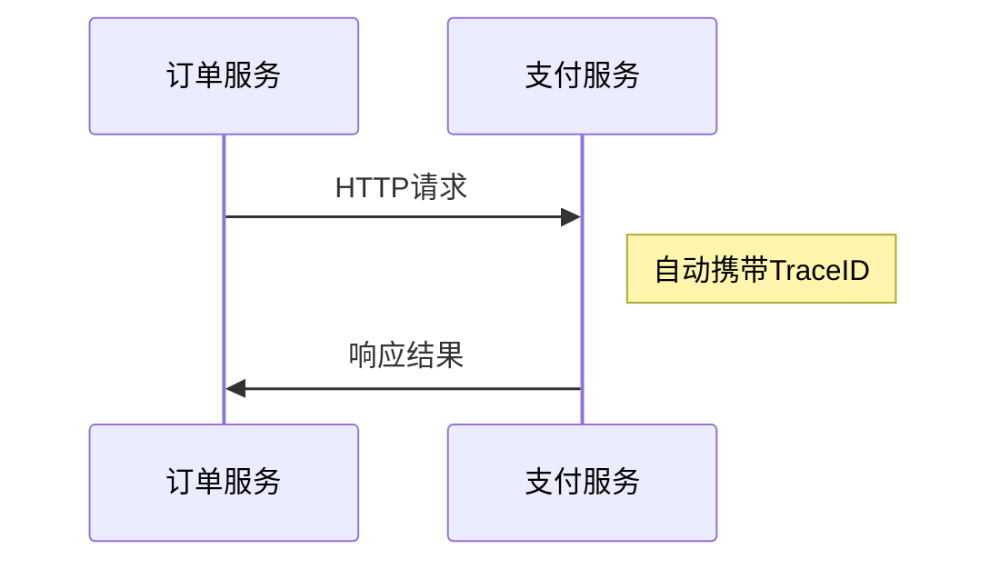

# Tracer实例化

## 介绍

在分布式追踪系统中，`Tracer` 是核心组件之一，负责创建和管理跨度（Span），记录请求在系统中的流动路径。本文将介绍如何在Zipkin和OpenTracing中实例化`Tracer`对象，并解释其关键配置选项。

:::note
**Tracer的作用**  
`Tracer`是追踪系统的入口点，用于：
- 创建根跨度（Root Span）
- 将上下文信息注入到跨系统中
- 上报追踪数据到收集器（如Zipkin）
:::

---

## 基础概念

### 1. OpenTracing与Zipkin的关系
OpenTracing是一套分布式追踪的API规范，而Zipkin是具体的实现之一。通过OpenTracing的`Tracer`接口，可以兼容不同的追踪系统（如Zipkin、Jaeger等）。

### 2. Tracer的核心配置
实例化`Tracer`时通常需要以下配置：
- **服务名称**：标识当前应用（如`user-service`）
- **上报地址**：Zipkin服务器的URL（如`http://localhost:9411`）
- **采样率**：控制追踪数据的采集频率

---

## 代码示例

### 使用OpenTracing与Zipkin的Java示例

```java
import brave.Tracing;
import brave.opentracing.BraveTracer;
import zipkin2.reporter.AsyncReporter;
import zipkin2.reporter.okhttp3.OkHttpSender;

// 1. 配置Zipkin上报器
OkHttpSender sender = OkHttpSender.create("http://localhost:9411/api/v2/spans");
AsyncReporter<zipkin2.Span> reporter = AsyncReporter.create(sender);

// 2. 创建Tracing对象
Tracing braveTracing = Tracing.newBuilder()
    .localServiceName("order-service") // 服务名称
    .spanReporter(reporter)
    .sampler(Sampler.ALWAYS_SAMPLE)    // 采样率（此处为100%）
    .build();

// 3. 转换为OpenTracing的Tracer
io.opentracing.Tracer tracer = BraveTracer.create(braveTracing);
```

:::tip
**关键参数说明**：
- `localServiceName`：会在Zipkin UI中显示为服务名称
- `Sampler.ALWAYS_SAMPLE`：生产环境建议使用概率采样（如`Sampler.create(0.1)`）
:::

---

## 实际应用场景

### 微服务中的Tracer初始化
在Spring Boot应用中，通常通过`@Bean`声明全局Tracer：

```java
@Bean
public io.opentracing.Tracer zipkinTracer() {
    // 使用Spring环境变量配置
    String zipkinUrl = env.getProperty("zipkin.url");
    String serviceName = env.getProperty("spring.application.name");
    
    return BraveTracer.create(
        Tracing.newBuilder()
            .localServiceName(serviceName)
            .spanReporter(AsyncReporter.create(
                OkHttpSender.create(zipkinUrl)
            ))
            .build()
    );
}
```

### 多模块协作时的效果
当服务A（订单服务）调用服务B（支付服务）时：


---

## 常见问题

### 1. 采样率如何设置？
- **开发环境**：`ALWAYS_SAMPLE`（全采样）
- **生产环境**：推荐`Sampler.create(0.1)`（10%采样）

### 2. 上报失败怎么处理？
Zipkin的`AsyncReporter`默认会缓存数据并重试，但需要确保：
```java
// 添加错误日志
reporter.addFailureListener(new ReporterMetrics());
```

---

## 总结

- Tracer实例化是分布式追踪的第一步
- 必须配置服务名称和Zipkin地址
- 采样率需要根据环境调整
- OpenTracing提供了与具体实现的桥接能力

## 扩展练习
1. 尝试在本地启动Zipkin服务器并修改上报地址
2. 创建一个Spring Boot项目，集成OpenTracing
3. 观察不同采样率对追踪数据的影响

## 附加资源
- [Zipkin官方文档](https://zipkin.io/)
- [OpenTracing Java指南](https://opentracing.io/guides/java/)