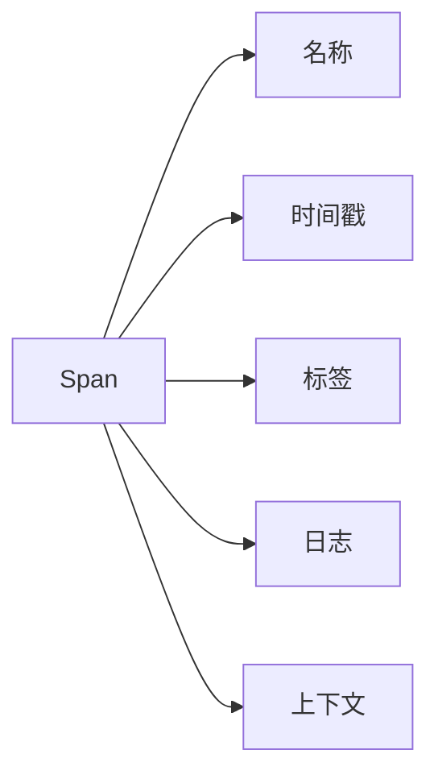
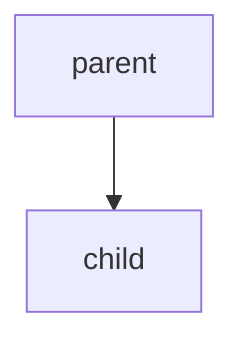

# Span创建与管理

## 介绍

在分布式追踪系统中，**Span** 是核心概念之一，代表一个独立的工作单元或操作。例如，一个HTTP请求、数据库查询或方法调用都可以是一个Span。Span之间通过父子关系形成调用链（Trace），帮助我们理解请求在分布式系统中的流转过程。

在Zipkin和OpenTracing中，Span的创建与管理是构建追踪数据的基础。本文将逐步介绍如何创建、配置和管理Span，并通过实际案例展示其应用场景。

---

## Span的基本结构

一个Span通常包含以下信息：
- **名称**：描述操作的标识（如 `get-user-data`）。
- **时间戳**：记录开始和结束时间。
- **标签（Tags）**：键值对形式的元数据（如 `http.method=GET`）。
- **日志（Logs）**：记录事件或错误信息。
- **上下文（Context）**：包含Trace ID、Span ID等，用于关联上下游Span。



---

## 创建Span

### 1. 使用OpenTracing API创建Span

以下是一个简单的Java示例，展示如何通过OpenTracing API创建Span：

```java
import io.opentracing.Tracer;
import io.opentracing.util.GlobalTracer;

// 获取Tracer实例（通常由框架注入）
Tracer tracer = GlobalTracer.get();

// 创建Span
Tracer.SpanBuilder spanBuilder = tracer.buildSpan("calculate-price");
spanBuilder.withTag("service", "pricing-engine");

// 启动Span
try (Tracer.SpanScope scope = spanBuilder.startActive(true)) {
    // 业务逻辑
    System.out.println("Calculating price...");
    // 添加日志
    scope.span().log("Price calculation completed");
}
```

:::note
- `startActive(true)` 表示Span会自动在作用域结束时关闭。
- 使用 `try-with-resources` 确保Span正确结束。
:::

### 2. 手动管理Span生命周期

如果需要更细粒度的控制，可以手动管理Span：

```java
Tracer.Span span = tracer.buildSpan("manual-span").start();
try {
    span.setTag("manual", true);
    // 业务逻辑
} finally {
    span.finish(); // 必须显式结束Span
}
```

---

## Span的父子关系

Span通过上下文（Context）建立父子关系，形成调用链。以下是一个嵌套Span的示例：

```java
// 父Span
try (Tracer.SpanScope parentScope = tracer.buildSpan("parent").startActive(true)) {
    // 子Span
    try (Tracer.SpanScope childScope = tracer.buildSpan("child").startActive(true)) {
        childScope.span().log("Child operation");
    }
}
```



:::tip
子Span会自动继承父Span的上下文（如Trace ID），无需手动传递。
:::

---

## 实际案例：追踪HTTP请求

假设我们有一个微服务，需要追踪HTTP请求的处理过程：

```java
import javax.servlet.http.HttpServletRequest;
import io.opentracing.tag.Tags;

// 创建HTTP请求的Span
try (Tracer.SpanScope scope = tracer.buildSpan("handle-request")
    .withTag(Tags.HTTP_METHOD.getKey(), request.getMethod())
    .withTag(Tags.HTTP_URL.getKey(), request.getRequestURL().toString())
    .startActive(true)) {

    // 模拟业务处理
    processRequest(request);
    scope.span().log("Request processed successfully");
}
```

输出到Zipkin的Span数据示例：
```json
{
  "name": "handle-request",
  "tags": {
    "http.method": "GET",
    "http.url": "/api/users"
  },
  "logs": [
    { "timestamp": "...", "fields": { "event": "Request processed successfully" } }
  ]
}
```

---

## 总结

- **Span** 是分布式追踪的基本单元，用于描述一个操作或请求。
- 通过OpenTracing API可以轻松创建和管理Span。
- Span的父子关系自动构建调用链，帮助分析系统性能。
- 实际应用中，Span常用于追踪HTTP请求、数据库调用等场景。

---

## 附加资源

1. [OpenTracing官方文档](https://opentracing.io/docs/)
2. [Zipkin Span数据结构](https://zipkin.io/pages/data_model.html)
3. 练习：尝试在本地Zipkin实例中创建一个包含父子关系的Trace，并观察UI中的展示效果。