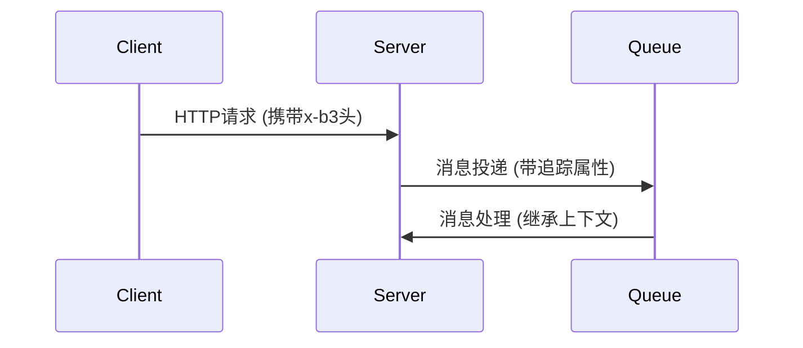

# SpanContext传播

## 介绍

在分布式追踪系统中，**SpanContext**是跨服务边界传递追踪上下文的核心载体。它包含了两类关键信息：
1. **追踪标识** - traceId、spanId、parentId等
2. ** baggage items** - 自定义的键值对元数据

当请求在服务间流动时，SpanContext的传播保证了所有相关操作都能被关联到同一个调用链中。本文将详细讲解Zipkin与OpenTracing中SpanContext的传播机制。

:::note 为什么需要传播？
没有SpanContext传播，我们就无法将跨服务的调用关联起来，分布式追踪系统也就失去了意义。
:::

## 传播方式

### 1. HTTP头传播（最常见）

OpenTracing定义了标准的HTTP头名称：
- `x-b3-traceid`: 128位或64位traceId
- `x-b3-spanid`: 当前spanId
- `x-b3-parentspanid`: 父spanId
- `x-b3-sampled`: 采样标志

示例HTTP请求头：
```http
GET /api/user HTTP/1.1
Host: example.com
x-b3-traceid: 80f198ee56343ba864fe8b2a57d3eff7
x-b3-spanid: e457b5a2e4d86bd1
x-b3-parentspanid: 05e3ac9a4f6e3b90
x-b3-sampled: 1
```

### 2. 代码示例（Java + Brave/Zipkin）

注入SpanContext到HTTP请求：
```java
// 客户端侧
@Autowired Tracing tracing;

void makeRequest() {
    Span span = tracing.tracer().newTrace().name("client-call").start();
    try (Scope scope = tracing.tracer().withSpanInScope(span)) {
        Request request = new Request.Builder()
            .url("http://backend/api")
            .build();
        
        // 注入追踪上下文
        tracing.propagation().injector(Request.Builder::addHeader)
            .inject(span.context(), request);
        
        // 发送请求...
    }
}
```

服务端提取SpanContext：
```java
// 服务端侧
SpanContext context = tracing.propagation()
    .extractor(Request::header)
    .extract(request);
Span span = tracing.tracer().buildSpan("handle-request")
    .asChildOf(context)
    .start();
```

### 3. 其他传播方式

除了HTTP头，SpanContext也可以通过以下方式传播：
- **gRPC元数据**
- **消息队列属性**（如Kafka headers）
- **线程上下文**（同一进程内）

## 传播流程可视化



## 实际案例：电商订单流程

考虑一个电商系统创建订单的流程：
1. 用户服务 → 订单服务（HTTP）
2. 订单服务 → 支付服务（gRPC）
3. 支付服务 → 消息通知（Kafka）


通过SpanContext传播，所有服务间的调用都会自动关联到同一个traceId，即使混合使用了多种通信协议。

## 常见问题

:::caution 注意事项
1. **采样标志传播**：确保采样决策在调用链中保持一致
2. **Baggage限制**：避免携带过大或敏感数据
3. **协议转换**：跨协议传播时需要特殊处理（如HTTP→gRPC）
:::

## 总结

SpanContext传播是分布式追踪的基石，它：
- 通过标准化的方式传递追踪上下文
- 支持跨多种通信协议
- 保持调用链的完整性和一致性

## 扩展练习

1. 使用Zipkin本地实例，观察HTTP头中的B3传播
2. 尝试实现一个跨HTTP和Kafka的传播案例
3. 修改采样率，观察上下文传播的变化

## 延伸阅读

- [Zipkin B3 Propagation文档](https://github.com/openzipkin/b3-propagation)
- [OpenTracing Propagation标准](https://opentracing.io/docs/overview/inject-extract/)