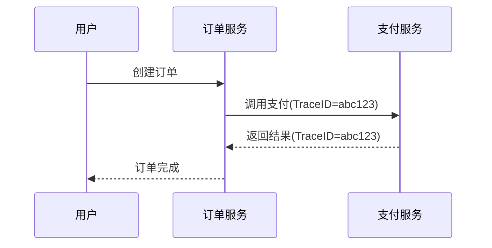

# 全局Tracer配置

## 介绍

在分布式系统中，**全局Tracer配置**是确保所有服务使用统一追踪组件的关键步骤。通过OpenTracing标准与Zipkin的结合，开发者可以轻松实现跨服务的链路追踪。本节将介绍如何初始化全局Tracer，并解释其核心作用：

- **统一管理**：避免每个服务重复配置Tracer实例。
- **跨服务关联**：通过全局ID（TraceID）串联不同服务的调用链。
- **标准化**：遵循OpenTracing API规范，兼容多种追踪后端（如Zipkin）。

:::note 核心概念
全局Tracer是一个单例对象，通常通过 `GlobalTracer.register()` 方法注册，供整个应用程序调用。
:::

---

## 基础配置步骤

### 1. 添加依赖
首先确保项目中包含OpenTracing与Zipkin的依赖（以Java为例）：
```xml
<!-- OpenTracing核心库 -->
<dependency>
  <groupId>io.opentracing</groupId>
  <artifactId>opentracing-api</artifactId>
  <version>0.33.0</version>
</dependency>
<!-- Zipkin报告器 -->
<dependency>
  <groupId>io.opentracing.contrib</groupId>
  <artifactId>opentracing-zipkin</artifactId>
  <version>0.1.0</version>
</dependency>
```

### 2. 初始化Tracer
以下代码展示如何创建Zipkin兼容的Tracer并注册为全局实例：
```java
import io.opentracing.Tracer;
import io.opentracing.contrib.zipkin.ZipkinTracer;
import zipkin2.reporter.AsyncReporter;
import zipkin2.reporter.urlconnection.URLConnectionSender;

public class TracerConfig {
    public static void initGlobalTracer() {
        // 创建Zipkin报告器（发送数据到Zipkin服务器）
        AsyncReporter<zipkin2.Span> reporter = AsyncReporter.create(
            URLConnectionSender.create("http://localhost:9411/api/v2/spans")
        );
        
        // 构建Tracer实例
        Tracer tracer = ZipkinTracer.newBuilder()
            .reporter(reporter)
            .serviceName("my-service")
            .build();
            
        // 注册为全局Tracer
        io.opentracing.util.GlobalTracer.register(tracer);
    }
}
```

### 3. 验证配置
通过以下代码测试全局Tracer是否生效：
```java
Tracer tracer = io.opentracing.util.GlobalTracer.get();
try (Scope scope = tracer.buildSpan("test-operation").startActive(true)) {
    scope.span().log("Global tracer is working!");
}
```

---

## 实际应用场景

### 微服务调用链追踪
假设有两个服务：**订单服务**和**支付服务**，通过全局Tracer实现调用链关联：



在Zipkin界面中，可通过TraceID `abc123` 查看完整的跨服务调用流程。

:::tip 最佳实践
- **服务命名规范**：确保每个服务的 `serviceName` 具有唯一性（如 `order-service-v1`）。
- **错误处理**：在Tracer初始化时添加错误回调，例如上报失败时记录日志。
:::

---

## 常见问题

### Q: 全局Tracer与局部Tracer冲突怎么办？
A: 通过 `GlobalTracer.isRegistered()` 检查是否已注册，避免重复初始化。

### Q: 如何动态更换Tracer实现？
A: OpenTracing的 `GlobalTracer` 支持通过 `registerIfAbsent()` 方法安全替换。

---

## 总结与练习

### 总结
- 全局Tracer通过单例模式提供统一的追踪入口。
- Zipkin与OpenTracing的集成需依赖特定的报告器（Reporter）。
- TraceID的自动传递依赖于OpenTracing的上下文传播机制。

### 练习
1. 在本地的Spring Boot项目中配置全局Zipkin Tracer。
2. 创建两个REST接口，模拟服务调用并验证Zipkin是否捕获完整链路。
3. （进阶）尝试在Tracer中添加自定义标签（如 `environment=dev`）。

### 扩展阅读
- [OpenTracing官方文档](https://opentracing.io/docs/)
- [Zipkin Brave与OpenTracing的对比](https://zipkin.io/pages/instrumenters.html)