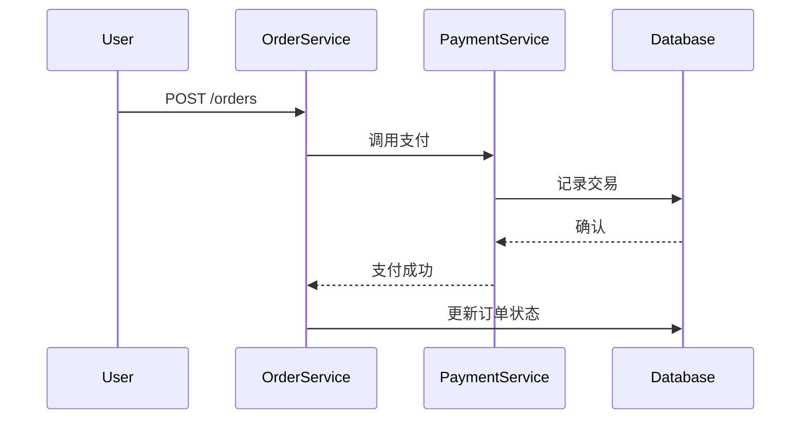

## 介绍

OpenTracing标签（Tags）是附加在Span上的键值对，用于记录与请求相关的元数据（如HTTP状态码、数据库类型等）。它们不同于日志（Logs），主要用于描述Span的**静态属性**而非动态事件。标签规范确保了不同追踪系统的数据互操作性。

:::note 关键区别
- **标签（Tags）**：描述Span的持久特性（如 `http.method="GET"`）
- **日志（Logs）**：记录时间点事件（如 `"error occurred at 12:00"`）
:::

---

## 标准标签规范

OpenTracing定义了[语义约定标签](https://github.com/opentracing/specification/blob/master/semantic_conventions.md)，分为以下类别：

### 1. 通用标签
| 键名 | 类型 | 描述 | 示例 |
|------|------|------|------|
| `component` | string | 生成Span的组件名 | `"spring-boot"` |
| `error` | boolean | 标记Span是否失败 | `true` |

### 2. HTTP标签
```python
span.set_tag("http.method", "GET")
span.set_tag("http.status_code", 200)
span.set_tag("http.url", "/api/users")
```

### 3. 数据库标签
```java
tracer.buildSpan("query")
  .withTag("db.type", "mysql")
  .withTag("db.instance", "users_db")
  .start();
```

---

## 自定义标签实践

### 最佳实践
1. **前缀命名**：自定义标签建议使用 `company.` 前缀（如 `acme.order_id`）
2. **避免敏感数据**：不要记录密码、密钥等
3. **控制数量**：单个Span的标签建议不超过20个

### 错误示例 vs 正确示例
```javascript
// 错误：暴露敏感信息
span.setTag("query", "SELECT * FROM users WHERE password='123456'")

// 正确：使用摘要
span.setTag("db.query", "SELECT FROM users WHERE [filtered]")
```

---

## 实际案例：电商订单追踪



对应标签示例：
```go
// 订单服务Span
span.SetTag("component", "order-service")
span.SetTag("http.route", "/orders")
span.SetTag("order.id", "12345")

// 支付服务Span
span.SetTag("component", "payment-gateway")
span.SetTag("payment.amount", 99.99)
span.SetTag("payment.currency", "USD")
```

---

## 总结

1. **标准化优先**：优先使用OpenTracing定义的语义标签
2. **谨慎自定义**：遵循命名规范，避免信息泄露
3. **上下文增强**：通过标签使Span具备业务可读性

---

## 扩展练习

1. 在Zipkin UI中查找一个HTTP请求的Span，观察其标准标签
2. 为你的微服务添加 `component` 和自定义业务标签
3. 对比同一个Span在有/无关键标签时的调试效率差异

:::tip 附加资源
- [OpenTracing语义规范](https://opentracing.io/specification/)
- [Jaeger标签实践指南](https://www.jaegertracing.io/docs/1.21/client-libraries/)
:::