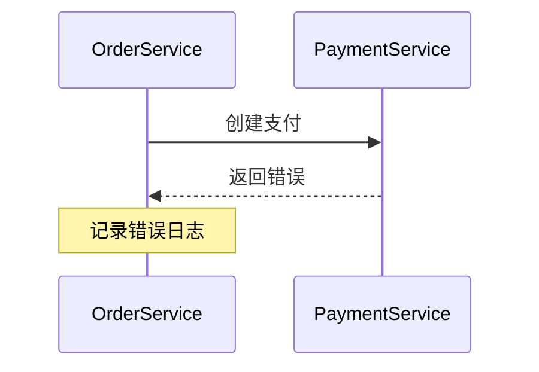

# OpenTracing日志规范

## 介绍

OpenTracing是一个**跨语言的分布式追踪标准**，它定义了如何在分布式系统中记录和传递追踪数据。日志规范（Logging Specification）是OpenTracing的重要组成部分，用于在追踪过程中记录关键事件或上下文信息。通过标准化的日志格式，开发者可以更清晰地理解系统行为，并快速定位问题。

本文将介绍OpenTracing日志规范的核心概念、使用方法以及实际应用场景。

---

## 核心概念

### 1. 什么是OpenTracing日志？
OpenTracing日志是**附加到Span（追踪的基本单元）上的结构化数据**，用于记录Span生命周期中的关键事件。例如：
- 记录错误信息
- 记录调试信息
- 记录性能指标（如耗时）

日志通常包含以下字段：
- **时间戳**：事件发生的时间
- **事件名称**（可选）：描述事件的简短标识
- **键值对**（Payload）：事件的详细信息

### 2. 日志与标签（Tags）的区别
- **标签（Tags）**：用于描述Span的元数据（如HTTP状态码、服务名称），通常不会变化。
- **日志（Logs）**：用于记录Span执行过程中的动态事件（如异常、调试信息）。

---

## 代码示例

以下是一个使用OpenTracing记录日志的示例（以Python为例）：

```python
import opentracing

# 假设已初始化Tracer
tracer = opentracing.tracer

with tracer.start_active_span('example_span') as scope:
    span = scope.span
    
    # 记录一条普通日志
    span.log_kv({
        'event': 'cache_hit',
        'size': 1024
    })
    
    try:
        # 模拟业务逻辑
        raise ValueError("Something went wrong")
    except Exception as e:
        # 记录错误日志
        span.log_kv({
            'event': 'error',
            'error.object': e,
            'message': 'Failed to process request'
        })
        span.set_tag('error', True)
```

**输出结果**（在Zipkin UI中查看）：
- Span会显示两条日志记录：
  1. `cache_hit`事件，附带`size=1024`
  2. `error`事件，附带异常详情

---

## 实际应用场景

### 案例：微服务调用链中的错误排查
假设有一个订单服务调用支付服务，支付失败时记录日志：



在代码中：
```python
with tracer.start_active_span('process_order') as scope:
    try:
        payment_result = call_payment_service()
    except PaymentError as e:
        scope.span.log_kv({
            'event': 'payment_failed',
            'error': str(e),
            'payment_id': '12345'
        })
```

通过日志可以快速定位：
- 哪个订单支付失败（`payment_id`）
- 失败原因（`error`字段）

---

## 总结

OpenTracing日志规范提供了一种**标准化**的方式记录分布式系统中的事件，帮助开发者：
1. 统一日志格式
2. 关联日志与追踪数据
3. 快速定位问题

:::tip 最佳实践
- 为关键事件（如错误、超时）添加日志
- 使用一致的字段名（如`error`、`event`）
- 避免记录敏感信息（如密码、令牌）
:::

## 扩展资源
1. [OpenTracing官方文档](https://opentracing.io/docs/)
2. [Zipkin与OpenTracing集成指南](https://zipkin.io/pages/instrumenting.html)
3. 练习：尝试在本地Zipkin中实现一个带日志记录的Span，并观察UI展示效果