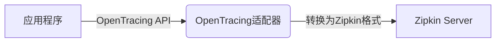
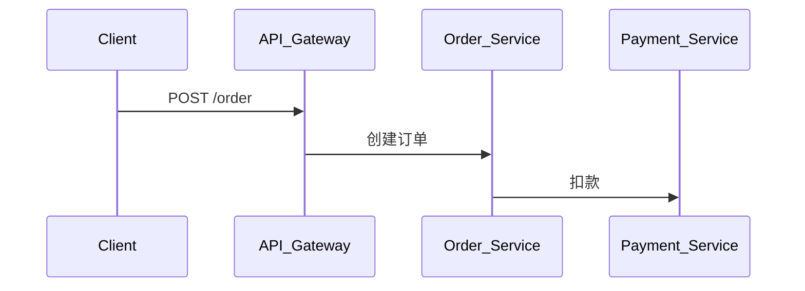

# 框架集成策略

## 介绍

在分布式系统中，**Zipkin**和**OpenTracing**的结合为开发者提供了标准化的追踪解决方案。OpenTracing作为厂商中立的API规范，允许你通过统一接口记录追踪数据，而Zipkin则作为后端存储和可视化工具。本章将介绍如何将二者集成到常见框架中（如Spring Boot、Node.js等），并演示实际配置案例。

---

## 核心概念

### 1. OpenTracing与Zipkin的关系
- **OpenTracing**: 提供标准化的追踪API，不依赖具体实现。
- **Zipkin**: 作为具体的追踪系统实现，可通过适配器（如`brave-opentracing`）兼容OpenTracing。



### 2. 集成策略类型
- **直接集成**: 使用框架原生Zipkin支持（如Spring Cloud Sleuth）。
- **通过OpenTracing集成**: 使用OpenTracing的通用接口，适配Zipkin作为实现。

---

## 框架集成示例

### 示例1：Spring Boot集成
通过`spring-cloud-starter-zipkin`直接集成Zipkin：

```java
// application.properties
spring.zipkin.base-url=http://localhost:9411
spring.sleuth.sampler.probability=1.0  // 100%采样率
```

或通过OpenTracing适配器：

```java
// pom.xml 依赖
<dependency>
  <groupId>io.opentracing.contrib</groupId>
  <artifactId>opentracing-spring-jaeger-web-starter</artifactId>
  <version>3.3.1</version>
</dependency>
<dependency>
  <groupId>io.opentracing.brave</groupId>
  <artifactId>brave-opentracing</artifactId>
  <version>1.0.0</version>
</dependency>
```

### 示例2：Node.js集成
使用`zipkin-javascript-opentracing`库：

```javascript
const {Tracer} = require('opentracing');
const {ZipkinB3TextMapCodec} = require('zipkin-javascript-opentracing');
const zipkinTracer = new Tracer({
  serviceName: 'my-node-service',
  codec: new ZipkinB3TextMapCodec()
});
```

---

## 实际案例：微服务链路追踪

假设一个订单处理流程涉及三个服务：
1. **API Gateway** (Spring Boot)
2. **Order Service** (Node.js)
3. **Payment Service** (Python)



通过统一配置OpenTracing+Zipkin，所有服务的追踪数据将关联到同一个Trace ID，在Zipkin UI中可视化完整调用链。

:::tip 调试建议
在开发环境中设置100%采样率（如`spring.sleuth.sampler.probability=1.0`），确保所有请求都被追踪。
:::

---

## 总结

| 策略类型       | 适用场景                  | 优势                         |
|----------------|-------------------------|----------------------------|
| 直接Zipkin集成  | 框架原生支持Zipkin        | 配置简单，性能优化           |
| OpenTracing适配 | 需要多追踪后端兼容        | 代码可移植，避免厂商锁定     |

---

## 延伸学习
1. 官方资源：
   - [Zipkin Brave文档](https://github.com/openzipkin/brave)
   - [OpenTracing规范](https://opentracing.io/specification/)
2. 练习：
   - 在本地启动Zipkin Server（Docker命令：`docker run -d -p 9411:9411 openzipkin/zipkin`）
   - 尝试将一个现有Spring Boot服务接入Zipkin，并观察UI中的追踪数据