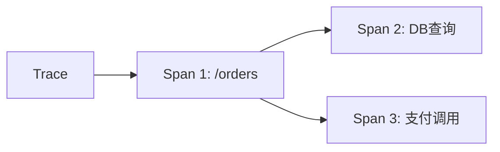

# OpenTelemetry简介

## 什么是OpenTelemetry？

OpenTelemetry（简称OTel）是一个**开源的观测性框架**，用于生成、收集和管理**遥测数据**（如指标、日志和追踪）。它是CNCF（云原生计算基金会）的毕业项目，旨在为分布式系统提供**统一的标准**，替代早期的OpenTracing和OpenCensus项目。

:::note 关键特性
- **跨语言支持**：提供Java、Python、Go等主流语言的SDK。
- **与供应商无关**：数据可导出到Zipkin、Jaeger等后端。
- **三大支柱**：追踪（Tracing）、指标（Metrics）、日志（Logging）。
:::

## 核心组件

### 1. API与SDK
- **API层**：定义遥测数据的生成接口（如创建Span）。
- **SDK层**：实现API功能，处理数据导出和采样。

### 2. 数据模型
OpenTelemetry使用以下核心概念：
- **Span**：代表一个操作单元（如HTTP请求）。
- **Trace**：一组关联Span的有向无环图（DAG）。



### 3. 导出器（Exporters）
将数据发送到后端系统，例如：
```python
from opentelemetry import trace
from opentelemetry.sdk.trace.export import ConsoleSpanExporter
from opentelemetry.sdk.trace import TracerProvider

provider = TracerProvider()
provider.add_span_processor(BatchSpanProcessor(ConsoleSpanExporter()))
trace.set_tracer_provider(provider)

tracer = trace.get_tracer(__name__)
with tracer.start_as_current_span("example_span"):
    print("Hello, OpenTelemetry!")
```

**输出示例**：
```
{
  "name": "example_span",
  "context": {"trace_id": "xyz123", "span_id": "abc456"},
  "kind": "INTERNAL",
  "timestamp": "2023-01-01T00:00:00Z"
}
```

## 实际应用场景

### 电商系统的分布式追踪
1. **用户下单**：前端生成一个Trace，包含订单创建、库存检查、支付三个Span。
2. **错误诊断**：当支付失败时，通过TraceID快速定位问题Span。

:::tip 为什么选择OpenTelemetry？
- **避免锁定**：与特定APM工具解耦。
- **社区支持**：CNCF项目确保长期维护。
:::

## 与Zipkin的关系
OpenTelemetry可以**替代Zipkin的客户端库**，通过Zipkin导出器将数据发送到Zipkin服务器：
```yaml
# OpenTelemetry Collector配置示例
exporters:
  zipkin:
    endpoint: "http://zipkin:9411/api/v2/spans"
```

## 总结

OpenTelemetry是现代分布式系统的观测性标准，通过以下方式简化问题排查：
1. 统一多语言 instrumentation
2. 提供灵活的导出选项
3. 标准化数据模型

**延伸学习**：
- 官方文档：[opentelemetry.io](https://opentelemetry.io/)
- 动手练习：尝试用OTel SDK追踪一个Python Flask应用