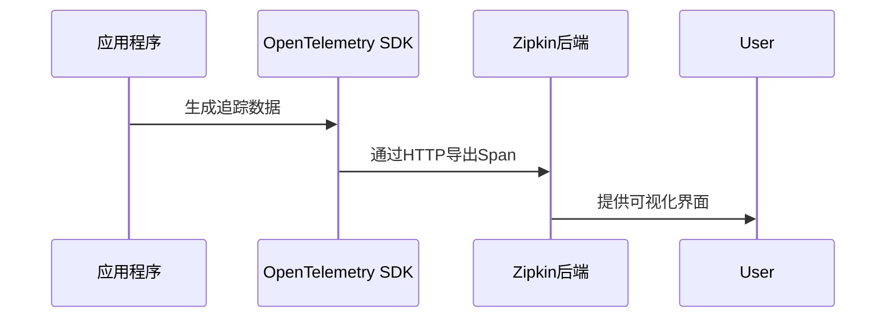

# Zipkin 与OpenTelemetry集成

## 介绍

在现代分布式系统中，**Zipkin**和**OpenTelemetry**都是广泛使用的追踪工具。Zipkin是一个开源的分布式追踪系统，而OpenTelemetry（简称OTel）是一个统一的观测性框架，支持指标、日志和追踪数据的收集。通过将两者集成，开发者可以利用OpenTelemetry的丰富功能（如自动埋点、多语言支持）将数据导出到Zipkin进行可视化分析。

:::note 关键概念
- **Zipkin**：专注于分布式追踪的存储和可视化。
- **OpenTelemetry**：提供跨语言的SDK和API，用于生成和导出遥测数据。
:::

## 为什么需要集成？

1. **统一数据采集**：OpenTelemetry支持多种语言和框架的自动埋点，而Zipkin提供成熟的UI和分析工具。
2. **灵活性**：通过OTel的导出器（Exporter），可以轻松切换后端系统（如Zipkin、Jaeger等）。
3. **标准化**：OpenTelemetry是CNCF项目，逐渐成为行业标准。

---

## 集成步骤

### 1. 安装OpenTelemetry依赖
以Java为例，添加OpenTelemetry SDK和Zipkin导出器依赖：
```xml
<dependency>
  <groupId>io.opentelemetry</groupId>
  <artifactId>opentelemetry-sdk</artifactId>
  <version>1.30.0</version>
</dependency>
<dependency>
  <groupId>io.opentelemetry</groupId>
  <artifactId>opentelemetry-exporter-zipkin</artifactId>
  <version>1.30.0</version>
</dependency>
```

### 2. 配置OpenTelemetry导出到Zipkin
```java
OpenTelemetrySdk sdk = OpenTelemetrySdk.builder()
  .setTracerProvider(
    SdkTracerProvider.builder()
      .addSpanProcessor(
        BatchSpanProcessor.builder(
          ZipkinSpanExporter.builder()
            .setEndpoint("http://localhost:9411/api/v2/spans")
            .build()
        ).build()
      )
      .build()
  )
  .build();
```

### 3. 启动Zipkin服务
确保Zipkin服务已运行（默认端口9411）：
```bash
docker run -d -p 9411:9411 openzipkin/zipkin
```

---

## 数据流示意图


---

## 实际案例：微服务调用追踪

假设有两个服务：`OrderService`和`PaymentService`，通过OpenTelemetry埋点并将数据发送到Zipkin。

### 代码示例
在`OrderService`中创建跨服务调用：
```java
Tracer tracer = sdk.getTracer("order-service");
Span orderSpan = tracer.spanBuilder("process_order").startSpan();
try (Scope scope = orderSpan.makeCurrent()) {
  // 调用PaymentService
  HttpClient client = HttpClient.newHttpClient();
  HttpRequest request = HttpRequest.newBuilder()
    .uri(URI.create("http://payment-service/pay"))
    .header("traceparent", getCurrentTraceContext()) // 传递追踪上下文
    .build();
  client.send(request, HttpResponse.BodyHandlers.ofString());
} finally {
  orderSpan.end();
}
```

### Zipkin 中的效果
在Zipkin UI中可以看到：
1. 完整的调用链（OrderService → PaymentService）。
2. 每个Span的耗时和标签（如HTTP状态码）。

---

## 常见问题

:::caution 注意
1. **时区问题**：确保所有服务的时钟同步，否则Zipkin中的时间轴可能错乱。
2. **采样率**：在高负载系统中配置适当的采样率（例如通过`Sampler`）。
3. **字段映射**：OpenTelemetry的Span模型与Zipkin不完全一致，导出时会自动转换。
:::

---

## 总结

通过OpenTelemetry和Zipkin的集成，开发者可以：
- 利用OTel的多语言支持和丰富功能采集数据。
- 使用Zipkin的成熟界面进行分析。
- 轻松扩展其他观测性工具（如Prometheus）。

---

## 扩展练习
1. 尝试在Python或Node.js中实现相同的集成。
2. 在Zipkin中过滤出耗时超过1秒的Span。
3. 配置OpenTelemetry将数据同时发送到Zipkin和日志文件。

## 附加资源
- [OpenTelemetry官方文档](https://opentelemetry.io/docs/)
- [Zipkin架构说明](https://zipkin.io/pages/architecture.html)