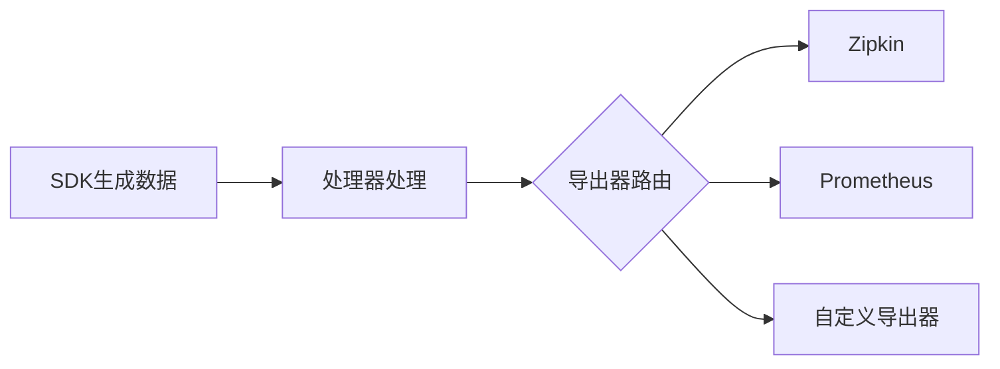

# OpenTelemetry扩展能力

## 介绍

OpenTelemetry的扩展能力是其作为现代可观测性框架的核心优势之一。通过灵活的扩展机制，开发者可以定制数据采集、处理和导出的全流程，满足特定业务场景的需求。本文将深入探讨OpenTelemetry的三大扩展方向：**自定义检测库（Instrumentation Libraries）**、**处理器（Processors）**和**导出器（Exporters）**。

:::tip 初学者提示
扩展能力就像给相机添加滤镜——基础功能保持不变，但您可以通过插件实现特殊效果。
:::

## 1. 自定义检测库

检测库用于自动或手动生成遥测数据（Traces, Metrics, Logs）。OpenTelemetry允许创建领域特定的检测库。

### 示例：自定义HTTP中间件检测
```javascript
// 自定义Express中间件检测
const { trace } = require('@opentelemetry/api');

function customMiddleware(req, res, next) {
  const tracer = trace.getTracer('my-custom-instrumentation');
  const span = tracer.startSpan('custom_operation');
  
  // 添加自定义属性
  span.setAttribute('http.user_agent', req.headers['user-agent']);
  
  res.on('finish', () => {
    span.end();
  });
  
  next();
}
```

## 2. 处理器扩展

处理器在数据导出前进行转换或过滤，常见用例包括：
- 敏感数据脱敏
- 采样策略实施
- 属性添加/删除

### 示例：自定义属性处理器
```go
// Go实现的简单属性处理器
type CustomProcessor struct {
    nextProcessor sdktrace.SpanProcessor
}

func (p *CustomProcessor) OnStart(span sdktrace.ReadWriteSpan, parentContext context.Context) {
    span.SetAttributes(attribute.String("deployment.region", "us-west-1"))
    p.nextProcessor.OnStart(span, parentContext)
}

// 注册处理器
provider := sdktrace.NewTracerProvider(
    sdktrace.WithSpanProcessor(&CustomProcessor{nextProcessor: batchProcessor}),
)
```

## 3. 导出器扩展

OpenTelemetry支持将数据导出到任意后端系统，包括自定义监控平台。

### 导出器架构流程


### 示例：控制台美化导出器
```python
# Python自定义控制台导出器
from opentelemetry.sdk.trace.export import SpanExporter, SpanExportResult

class PrettyConsoleExporter(SpanExporter):
    def export(self, spans):
        for span in spans:
            print(f"✨ [{span.name}] Duration: {span.end_time - span.start_time}")
        return SpanExportResult.SUCCESS

# 使用导出器
trace.get_tracer_provider().add_span_processor(
    SimpleSpanProcessor(PrettyConsoleExporter())
)
```

## 实际应用场景

**电商平台案例**：
1. 自定义检测库：捕获购物车操作的特殊指标
2. 处理器：过滤掉健康检查请求的跟踪数据
3. 导出器：同时向Zipkin和内部风控系统发送数据

```java
// Java多导出器配置示例
OpenTelemetrySdk.builder()
    .addSpanProcessor(
        SimpleSpanProcessor.create(
            SpanExporter.composite(
                ZipkinSpanExporter.create(),
                new RiskControlExporter()
            )
        )
    )
    .buildAndRegisterGlobal();
```

## 总结与进阶

OpenTelemetry的扩展能力使其能够适应各种复杂场景：
- 通过检测库捕获领域特定数据
- 使用处理器实现数据清洗和增强
- 利用导出器对接异构监控系统

:::note 练习建议
1. 创建一个添加请求耗时百分位数的处理器
2. 开发将跟踪数据导出到CSV文件的导出器
3. 尝试包装现有日志库作为OpenTelemetry检测库
:::

**扩展阅读**：
- OpenTelemetry官方组件仓库
- W3C Trace Context规范
- 分布式追踪模式手册