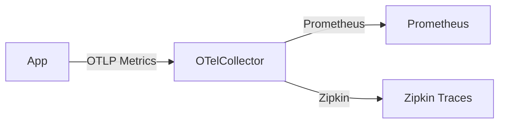

# OpenTelemetry指标采集

## 介绍

OpenTelemetry（简称OTel）是一个开源的观测性框架，用于生成、收集和管理**指标（Metrics）**、**追踪（Traces）**和**日志（Logs）**。本文将重点介绍**指标采集**部分，帮助初学者理解如何通过OpenTelemetry收集系统性能数据。

指标是数值型的测量数据，例如：
- CPU使用率
- 请求延迟
- 内存占用

:::note 关键概念
- **MeterProvider**: 指标的入口点，用于创建`Meter`实例。
- **Meter**: 用于创建指标仪器（如计数器、直方图）。
- **Instrument**: 具体的指标类型（如`Counter`、`Gauge`）。
:::

---

## 核心组件

### 1. MeterProvider 初始化
首先需要配置`MeterProvider`，指定指标的导出方式（如控制台、Prometheus或Zipkin）。

```javascript
const { MeterProvider, ConsoleMetricExporter } = require('@opentelemetry/sdk-metrics');
const { Resource } = require('@opentelemetry/resources');

const meterProvider = new MeterProvider({
  resource: new Resource({ 'service.name': 'my-service' }),
});

// 导出到控制台（实际项目中可能使用Prometheus或OTLP）
meterProvider.addMetricReader(new ConsoleMetricExporter());
```

### 2. 创建指标仪器
OpenTelemetry支持多种指标类型：

| 类型          | 用途                          | 示例                |
|---------------|-----------------------------|-------------------|
| `Counter`     | 累加值（如请求次数）             | `http.requests`  |
| `Gauge`       | 瞬时值（如内存使用量）           | `memory.usage`   |
| `Histogram`   | 分布统计（如延迟分布）           | `request.latency`|

```javascript
const meter = meterProvider.getMeter('my-meter');

// 创建一个计数器
const requestCounter = meter.createCounter('http.requests', {
  description: 'Total HTTP requests',
});

// 使用计数器
requestCounter.add(1, { route: '/api/users' });
```

---

## 实际案例：监控Web服务

假设我们需要监控一个Node.js服务的请求量和延迟：

```javascript
const express = require('express');
const app = express();

// 中间件：记录请求量和延迟
app.use((req, res, next) => {
  const start = Date.now();
  
  res.on('finish', () => {
    const latency = Date.now() - start;
    requestCounter.add(1, { method: req.method, path: req.path });
    latencyHistogram.record(latency);
  });

  next();
});

// 直方图指标
const latencyHistogram = meter.createHistogram('http.latency', {
  unit: 'ms',
  description: 'Request latency in milliseconds',
});
```

---

## 与Zipkin集成

虽然Zipkin主要用于追踪（Traces），但可以通过OpenTelemetry Collector将指标转发到其他系统（如Prometheus）：



配置示例（`otel-collector-config.yaml`）：
```yaml
receivers:
  otlp:
    protocols:
      grpc:

exporters:
  prometheus:
    endpoint: "prometheus:9090"
  zipkin:
    endpoint: "http://zipkin:9411/api/v2/spans"

service:
  pipelines:
    metrics:
      receivers: [otlp]
      exporters: [prometheus]
    traces:
      receivers: [otlp]
      exporters: [zipkin]
```

---

## 总结

- OpenTelemetry提供标准化的指标采集API，支持多种仪器类型。
- 通过`MeterProvider`和`Meter`管理指标生命周期。
- 实际应用中可将指标导出到Prometheus，同时用Zipkin处理追踪数据。

:::tip 练习
1. 尝试在本地运行一个Express服务，并记录`/health`端点的请求次数。
2. 使用`Gauge`类型监控系统的内存使用情况。
:::

**扩展阅读**：
- [OpenTelemetry Metrics官方文档](https://opentelemetry.io/docs/concepts/signals/metrics/)
- [Prometheus指标类型](https://prometheus.io/docs/concepts/metric_types/)