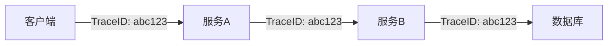

# 日志与追踪关联

## 介绍

在分布式系统中，日志（Logs）和追踪（Traces）是两种关键的观测数据。**日志**记录离散事件（如错误信息），而**追踪**记录请求在服务间的调用链路。将它们关联起来，可以快速定位问题根源。例如，当发现错误日志时，通过关联的追踪ID能立即还原请求的完整上下文。

:::tip 为什么需要关联？
- **日志孤立**：传统日志缺乏请求上下文，难以定位问题。
- **追踪不完整**：追踪只记录调用路径，缺少详细事件日志。
- **关联价值**：结合两者，实现从错误日志到完整请求链路的“一键跳转”。
:::

## 核心概念

### 1. Trace ID 的作用
在OpenTelemetry和Zipkin中，每个分布式请求会生成唯一的`Trace ID`，并透传到所有相关服务。只需在日志中记录此ID，即可实现关联。



### 2. 关联实现方式
- **手动注入**：在日志模板中显式添加`Trace ID`。
- **自动集成**：通过OpenTelemetry的日志SDK自动注入上下文。

## 代码示例

### 示例1：手动注入（Python + OpenTelemetry）
```python
from opentelemetry import trace
import logging

# 获取当前Trace ID
def get_trace_id():
    span = trace.get_current_span()
    return span.get_span_context().trace_id if span else "none"

# 配置日志格式
logging.basicConfig(
    format='%(asctime)s [trace_id=%(trace_id)s] %(message)s',
    level=logging.INFO
)

# 记录日志时添加Trace ID
logger = logging.getLogger(__name__)
logger.info("订单处理失败", extra={"trace_id": get_trace_id()})
```

**输出日志**：
```
2023-10-01 12:00:00 [trace_id=abc123] 订单处理失败
```

### 示例2：自动集成（Java + Micrometer）
```java
import org.slf4j.Logger;
import org.slf4j.LoggerFactory;
import io.micrometer.tracing.Tracer;

@RestController
public class OrderController {
    private static final Logger logger = LoggerFactory.getLogger(OrderController.class);
    private final Tracer tracer;

    // 自动注入Trace ID到日志
    public void processOrder() {
        logger.info("订单处理失败"); // 输出: "2023-10-01 12:00:00 [traceId=abc123] 订单处理失败"
    }
}
```

## 实际案例

### 电商系统故障排查
**场景**：用户支付失败，日志显示“库存不足”，但需要确认是哪次请求触发的。

1. **步骤1**：在日志系统中搜索错误，找到`Trace ID: xyz789`。
2. **步骤2**：在Zipkin中搜索该`Trace ID`，发现请求链路：
   ```
   用户 → 网关 → 订单服务 → 库存服务（失败）
   ```
3. **结论**：库存服务因并发超卖触发错误。

:::note 工具整合建议
- **ELK + Zipkin**：在Kibana中配置`Trace ID`字段链接，点击直接跳转Zipkin。
- **Grafana Tempo**：原生支持日志与追踪的关联查询。
:::

## 总结

| 关键点                | 说明                                                                 |
|-----------------------|----------------------------------------------------------------------|
| **统一标识**          | 确保所有服务和日志使用相同的`Trace ID`                               |
| **工具支持**          | 选择支持关联的可观测性工具栈（如OpenTelemetry + Zipkin + Loki）      |
| **开发规范**          | 在日志模板中强制包含`Trace ID`字段                                   |

## 延伸练习

1. **动手实验**：使用Docker部署Zipkin和OpenTelemetry Collector，尝试关联一个Spring Boot应用的日志与追踪。
2. **思考题**：如果某服务使用异步处理（如消息队列），如何保证`Trace ID`传递？

## 附加资源

- [OpenTelemetry日志规范](https://opentelemetry.io/docs/reference/specification/logs/)
- [Zipkin数据模型](https://zipkin.io/pages/data_model.html)