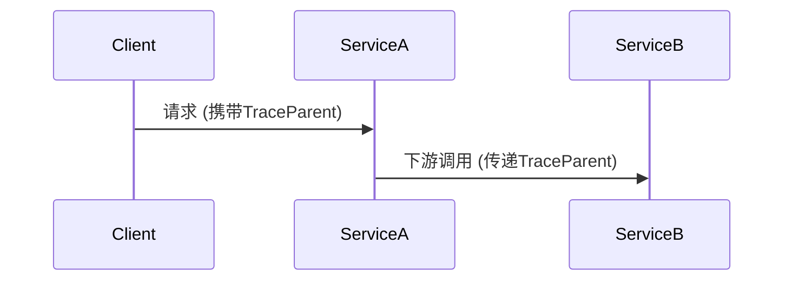

## 介绍

OpenTelemetry（简称OTel）是一个开源的观测性框架，用于生成、收集和管理遥测数据（如追踪、指标和日志）。它与Zipkin兼容，并逐渐成为云原生领域的标准。本章将介绍OpenTelemetry的核心实践，帮助初学者快速集成到现有系统中。

## 核心概念

### 1. 自动与手动埋点
OpenTelemetry支持自动埋点（通过SDK）和手动埋点（代码级控制）。  
**最佳实践**：优先使用自动埋点减少代码侵入性，关键路径补充手动埋点。

```python
# 手动埋点示例（Python）
from opentelemetry import trace
tracer = trace.get_tracer("my.service")

with tracer.start_as_current_span("critical_operation") as span:
    span.set_attribute("user.id", 123)
    # 业务逻辑...
```

### 2. 上下文传播
确保追踪上下文在服务间正确传递：



### 3. 采样策略
根据业务需求配置采样率，避免数据过载：
```yaml
# OpenTelemetry Collector配置示例
processors:
  probabilistic_sampler:
    sampling_percentage: 30
```

:::tip 生产环境建议
- 开发环境：100%采样
- 生产环境：动态采样（如根据错误率调整）
:::

## 实际案例

### 电商系统追踪
以下是一个订单处理流程的追踪示例：

```go
// Go语言示例
func ProcessOrder(ctx context.Context) {
    _, span := tracer.Start(ctx, "ProcessOrder")
    defer span.End()
    
    // 记录业务属性
    span.SetAttributes(
        attribute.String("order.id", "12345"),
        attribute.Int("items.count", 3),
    )
    
    // 调用支付服务（自动传播上下文）
    CallPaymentService(ctx)
}
```

## 性能优化

1. **批量导出**：配置批量处理器减少网络开销
   ```javascript
   // Node.js配置
   const { BatchSpanProcessor } = require('@opentelemetry/sdk-trace-base');
   provider.addSpanProcessor(new BatchSpanProcessor(exporter));
   ```

2. **资源限制**：设置合理的队列大小防止内存溢出
   ```java
   // Java系统属性
   System.setProperty("otel.bsp.max.queue.size", "2048");
   ```

## 总结

关键实践要点：
- 合理组合自动/手动埋点
- 确保上下文完整传播
- 动态调整采样策略
- 优化导出性能

## 延伸学习

1. [OpenTelemetry官方文档](https://opentelemetry.io/docs/)
2. 练习：在本地启动Zipkin，配置OTel导出数据
3. 进阶：比较OTel与Zipkin原生API的差异

:::warning 注意
生产环境部署前，务必测试资源消耗和采样策略的影响！
:::