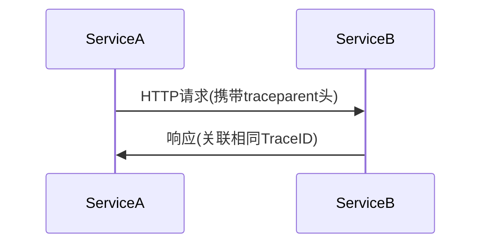

# OpenTelemetry API使用

## 介绍

OpenTelemetry API 是跨语言的标准化工具库，用于在应用程序中生成**遥测数据**（如追踪、指标、日志）。与Zipkin集成后，可以将数据导出到Zipkin的可视化界面进行分析。本节将重点讲解如何在代码中使用OpenTelemetry API手动埋点。

:::note 核心概念
- **TracerProvider**: 创建和管理`Tracer`实例的工厂
- **Tracer**: 生成跨进程的**Span**（追踪单元）
- **Span**: 代表一个独立操作（如HTTP请求、函数调用）
:::

---

## 基础代码示例

### 1. 初始化OpenTelemetry

```javascript
// 初始化TracerProvider（Node.js示例）
const { NodeTracerProvider } = require('@opentelemetry/sdk-trace-node');
const provider = new NodeTracerProvider();

// 注册全局Provider（后续API调用将使用此实例）
provider.register();
```

### 2. 创建Span

```javascript
const { trace } = require('@opentelemetry/api');

// 获取Tracer实例
const tracer = trace.getTracer('my-service-tracer');

// 创建Span（自动成为当前活跃Span）
tracer.startActiveSpan('main-operation', (span) => {
  try {
    // 业务逻辑...
    span.setAttribute('custom.key', 'value');
  } finally {
    span.end(); // 必须显式结束Span
  }
});
```

---

## 关键功能详解

### 跨进程上下文传播

通过`Context`和`Propagation`API实现分布式追踪：



代码实现：

```javascript
// 服务A：注入上下文
const { propagation } = require('@opentelemetry/api');
const headers = {};
propagation.inject(context.active(), headers);
// 将headers附加到HTTP请求

// 服务B：提取上下文
const incomingContext = propagation.extract(context.active(), headers);
tracer.startActiveSpan('serviceB-handler', 
  { attributes: { 'http.method': 'GET' } },
  incomingContext,
  (span) => { /* ... */ }
);
```

### 事件记录

```javascript
span.addEvent('数据库查询开始', {
  'db.query': 'SELECT * FROM users',
  timestamp: Date.now()
});
```

---

## 实战案例：电商订单追踪

模拟订单创建流程的追踪实现：

```javascript
tracer.startActiveSpan('create-order', (orderSpan) => {
  // 记录订单属性
  orderSpan.setAttributes({
    'order.user_id': user.id,
    'order.items_count': items.length
  });

  // 子Span：支付处理
  tracer.startActiveSpan('process-payment', (paymentSpan) => {
    const paymentId = processPayment();
    paymentSpan.setAttribute('payment.id', paymentId);
    paymentSpan.end();
  });

  // 子Span：库存更新
  tracer.startActiveSpan('update-inventory', (inventorySpan) => {
    updateStock(items);
    inventorySpan.addEvent('stock_reduced');
    inventorySpan.end();
  });

  orderSpan.end();
});
```

在Zipkin中的可视化效果：
- 一个`create-order`父Span
- 两个并行子Span（`process-payment`和`update-inventory`）

---

## 最佳实践

:::tip 生产环境建议
1. **采样控制**：通过`Sampler`避免全量采集
   ```javascript
   new AlwaysOnSampler() // 或使用动态采样
   ```
2. **错误处理**：为Span标记错误状态
   ```javascript
   span.setStatus({ code: SpanStatusCode.ERROR });
   span.recordException(error);
   ```
3. **属性命名**：遵循[语义约定](https://opentelemetry.io/docs/reference/specification/trace/semantic_conventions/)
:::

---

## 总结与扩展

### 核心要点
- OpenTelemetry API提供**语言无关**的追踪能力
- 通过`Span`的父子关系构建调用链
- 需要显式调用`end()`完成Span记录

### 后续学习
1. 尝试将数据导出到Zipkin：
   ```javascript
   const { ZipkinExporter } = require('@opentelemetry/exporter-zipkin');
   ```
2. 实验自动埋点（通过Instrumentation库）
3. 阅读[OpenTelemetry JavaScript文档](https://opentelemetry.io/docs/instrumentation/js/)

### 练习任务
1. 为REST API的GET /products端点创建Span
2. 在Span中添加数据库查询耗时属性
3. 实现跨服务的HTTP头传播