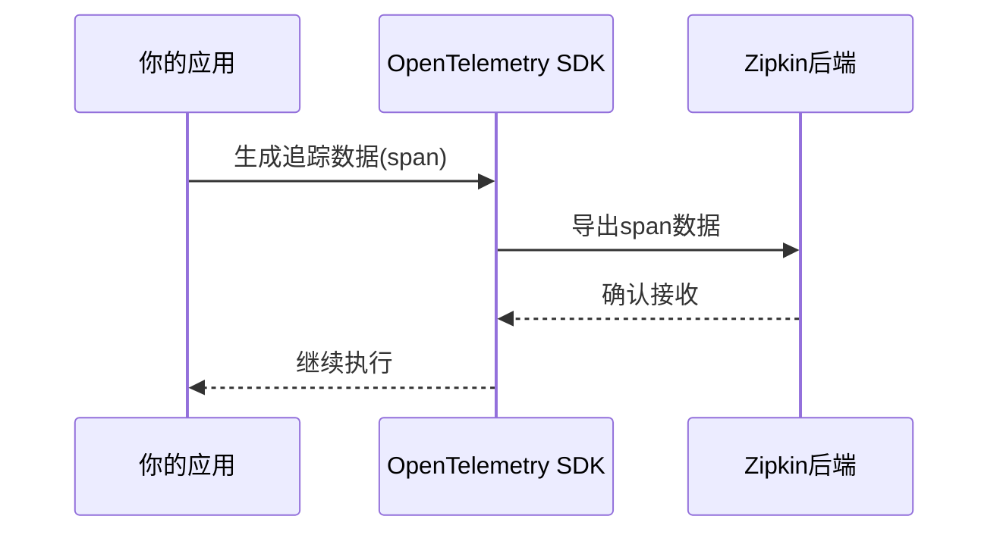

# OpenTelemetry SDK配置

## 介绍

OpenTelemetry SDK是用于生成、收集和导出遥测数据（如追踪、指标和日志）的核心工具包。当与Zipkin集成时，它可以将分布式追踪数据发送到Zipkin后端进行可视化分析。本指南将逐步介绍如何配置OpenTelemetry SDK，并展示实际应用场景。

---

## 基础配置步骤

### 1. 安装依赖
首先，确保已安装OpenTelemetry的核心包和Zipkin导出器。以Node.js为例：

```bash
npm install @opentelemetry/sdk-node \
            @opentelemetry/api \
            @opentelemetry/auto-instrumentations-node \
            @opentelemetry/exporter-zipkin
```

### 2. 初始化SDK
创建一个配置文件（如 `tracing.js`）来设置SDK：

```javascript
const { NodeSDK } = require('@opentelemetry/sdk-node');
const { ZipkinExporter } = require('@opentelemetry/exporter-zipkin');
const { getNodeAutoInstrumentations } = require('@opentelemetry/auto-instrumentations-node');

const sdk = new NodeSDK({
  traceExporter: new ZipkinExporter({
    url: 'http://localhost:9411/api/v2/spans', // Zipkin服务器地址
  }),
  instrumentations: [getNodeAutoInstrumentations()],
});

sdk.start();
```

### 3. 启动应用程序
在应用入口文件顶部导入配置：

```javascript
require('./tracing'); // 加载SDK配置
const express = require('express');
const app = express();
// ...其他代码
```

---

## 关键配置选项

### 采样率控制
通过设置采样率决定收集多少追踪数据：

```javascript
const { AlwaysOnSampler } = require('@opentelemetry/core');

const sdk = new NodeSDK({
  sampler: new AlwaysOnSampler(), // 采样所有请求
  // 或使用概率采样：new ParentBasedSampler({ root: new TraceIdRatioBasedSampler(0.5) })
});
```

### 资源标识
添加服务元数据帮助区分数据来源：

```javascript
const { Resource } = require('@opentelemetry/resources');
const { SemanticResourceAttributes } = require('@opentelemetry/semantic-conventions');

const resource = new Resource({
  [SemanticResourceAttributes.SERVICE_NAME]: 'your-service-name',
  [SemanticResourceAttributes.DEPLOYMENT_ENVIRONMENT]: 'production',
});
```

---

## 实际案例：Express应用集成

以下是将OpenTelemetry SDK与Express框架集成的完整示例：

```javascript
// tracing.js
const { NodeSDK } = require('@opentelemetry/sdk-node');
const { ZipkinExporter } = require('@opentelemetry/exporter-zipkin');
const { getNodeAutoInstrumentations } = require('@opentelemetry/auto-instrumentations-node');

const sdk = new NodeSDK({
  resource: new Resource({ serviceName: 'express-app' }),
  traceExporter: new ZipkinExporter({ url: 'http://zipkin:9411/api/v2/spans' }),
  instrumentations: [getNodeAutoInstrumentations()],
});

sdk.start();

// app.js
const express = require('express');
const app = express();

app.get('/', (req, res) => {
  res.send('Hello with tracing!');
});

app.listen(3000, () => console.log('Server running'));
```

启动应用后，访问 `http://localhost:3000` 的请求会被自动追踪并发送到Zipkin。

---

## 数据流示意图



---

## 总结与练习

### 总结
- OpenTelemetry SDK通过导出器（如ZipkinExporter）与Zipkin集成。
- 采样率和资源标识是重要的配置选项。
- 自动插桩简化了常见框架（如Express）的集成。

### 练习
1. 尝试修改采样率，观察Zipkin中数据量的变化。
2. 为你的服务添加自定义属性（如版本号）。
3. 在本地部署Zipkin并查看导出的追踪数据。

### 附加资源
- [OpenTelemetry JavaScript文档](https://opentelemetry.io/docs/instrumentation/js/)
- [Zipkin数据模型说明](https://zipkin.io/pages/data_model.html)