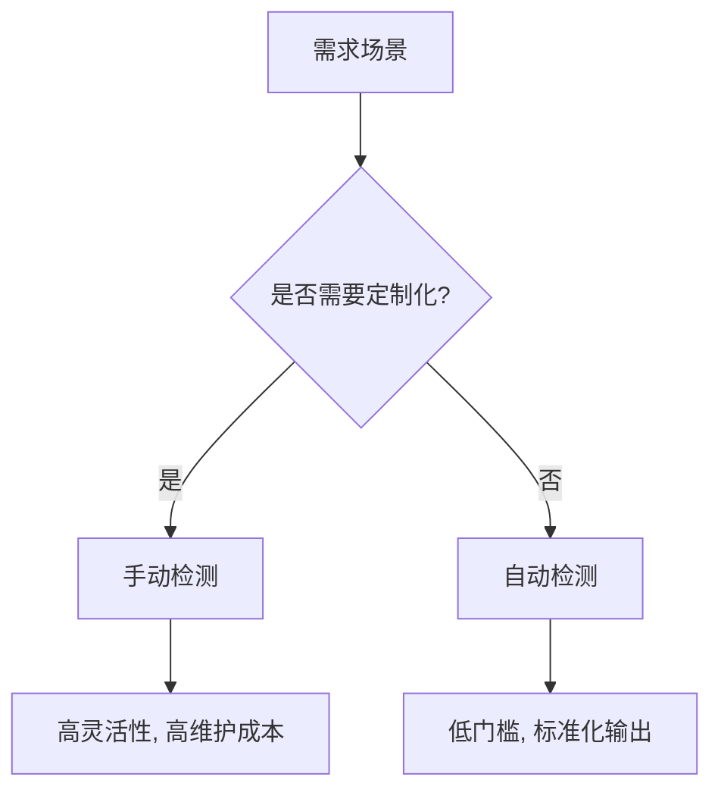

在分布式追踪系统中，**自动检测（Auto-instrumentation）**和**手动检测（Manual Instrumentation）**是两种主要的代码埋点方式。本章将深入探讨它们的原理、实现方法以及如何选择。

## 介绍

**自动检测**通过预定义的库或代理自动收集追踪数据，无需修改业务代码；**手动检测**则需要开发者显式地在代码中添加追踪逻辑。两者的核心目标相同：生成分布式追踪的Span数据，但适用场景和灵活性不同。

---

## 自动检测

### 原理与优势
自动检测利用语言特定的库（如Java Agent、Python Wrappers）在运行时动态注入追踪逻辑。例如：
- **Java**: 通过Bytecode Manipulation（字节码增强）
- **Python**: 通过装饰器或猴子补丁（Monkey Patching）

:::tip 适用场景
- 快速接入现有系统
- 无侵入式改造
- 标准化框架（如Spring、Flask）

:::

### 示例：Java自动检测
以下是一个Spring Boot应用的自动检测配置（无需修改代码）：
```yaml
# application.yml
management:
  zipkin:
    endpoint: http://localhost:9411/api/v2/spans
  tracing:
    sampling:
      probability: 1.0 # 100%采样率
```

启动时添加Java Agent：
```bash
java -javaagent:opentelemetry-javaagent.jar -jar your-app.jar
```

---

## 手动检测

### 原理与优势
手动检测通过API直接创建Span，提供更细粒度的控制。例如：
- 自定义Span名称和标签
- 精确控制Span的开始/结束

:::caution 注意
手动检测需熟悉API，且可能增加代码复杂度。
:::

### 示例：Python手动检测
使用OpenTelemetry API手动创建Span：
```python
from opentelemetry import trace
from opentelemetry.sdk.trace import TracerProvider

provider = TracerProvider()
trace.set_tracer_provider(provider)
tracer = trace.get_tracer(__name__)

with tracer.start_as_current_span("manual_span") as span:
    span.set_attribute("custom.key", "value")
    # 业务逻辑...
```

输出到Zipkin的Span将包含自定义属性 `custom.key`。

---

## 对比与选择



| 维度         | 自动检测                  | 手动检测                  |
|--------------|--------------------------|--------------------------|
| **复杂度**   | 低                       | 高                       |
| **灵活性**   | 有限                     | 完全可控                 |
| **维护成本** | 低（依赖库更新）          | 高（需同步业务逻辑变更） |

---

## 实际案例

### 案例1：电商系统
- **自动检测**：追踪所有HTTP请求（如Spring MVC路由）
- **手动检测**：追踪核心支付逻辑中的数据库调用和外部API

### 案例2：IoT设备
- **手动检测**：在资源受限设备中仅追踪关键传感器数据

---

## 总结

- **自动检测**适合标准化场景，快速实现可观测性。
- **手动检测**适合需要深度定制或性能敏感的场景。

## 延伸练习
1. 尝试在Demo应用中同时启用自动和手动检测，对比生成的Span差异。
2. 为手动检测的Span添加错误状态和日志。

## 附加资源
- [OpenTelemetry Manual Instrumentation Guide](https://opentelemetry.io/docs/instrumentation/)
- [Zipkin Instrumentation Libraries](https://zipkin.io/pages/instrumenting.html)